---
lab:
  title: Power BI Desktop でのデータの準備
  module: Module 2 - Get Data in Power BI
ms.openlocfilehash: deaa403224e029a08c91ed5137693d51ac30fcab
ms.sourcegitcommit: 3520e7d016e94549d408464207c1b91cd47867c2
ms.translationtype: HT
ms.contentlocale: ja-JP
ms.lasthandoff: 03/05/2022
ms.locfileid: "139273725"
---
# **Power BI Desktop でのデータの準備**

**このラボの推定所要時間: 45 分**

このラボでは、Adventure Works 社向けの Power BI Desktop ソリューションの開発を開始します。 これには、ソース データへの接続、データのプレビュー、データ プレビューの技法を使ったソース データの特性と品質の理解が含まれます。

このラボでは、次の作業を行う方法について説明します。

- Power BI Desktop を開く

- Power BI Desktop のオプションを設定する

- ソース データに接続する

- ソースデータをプレビューする

- データ プレビューの技法を使用してデータをよりよく理解する

### **ラボのストーリー**

このラボは、データの準備に始まり、レポートおよびダッシュボードとして発行するまでの完全なストーリーとして設計されたラボ シリーズの 1 つです。 ラボは任意の順序で完了できます。 しかしながら、複数のラボに取り組む場合は、最初の 10 のラボについては、次の順序で行うことをお勧めします。

1. **Power BI Desktop でのデータの準備**

2. Power BI Desktop にデータを読み込む

3. Power BI Desktop でデータをモデル化する

5. Power BI Desktop での DAX 計算の作成、パート 1

6. Power BI Desktop で DAX 計算を作成する (パート 2)

7. Power BI Desktop でレポートを設計する (パート 1)

8. Power BI Desktop でレポートを設計する (パート 2)

9. Power BI ダッシュボードを作成する

10. Power BI Desktop でデータ分析を実行する

11. 行レベルのセキュリティを実行する

## **演習 1: データの準備**

この演習では、8 個の Power BI Desktop クエリを作成します。 6 個のクエリは、SQL Server のデータ、2 個は CSV ファイルのデータをそれぞれソースとします。

### **タスク 1: Power BI Desktop ファイルを保存する**

このタスクでは、まず Power BI Desktop ファイルを保存します。

1. Power BI Desktop を開くには、タスク バーにある Microsoft Power BI Desktop のショートカットをクリックします。

    

1. 「はじめに」ウィンドウを閉じるには、ウィンドウの右上にある「**X**」をクリックします。

    

1. ファイルを保存するには、「**ファイル**」リボン タブをクリックして、バックステージ ビューを開きます。

1. **[保存]** を選択します。

    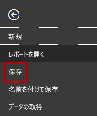

1. **[名前を付けて保存]** ウィンドウで、**D:\PL300\MySolution** フォルダーに移動します。

1. **[ファイル名]** ボックスに「**Sales Analysis**」と入力します。

    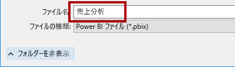

1. **[保存]** をクリックします。

    

    ヒント:左上にある「**保存**」アイコンをクリックしてファイルを保存することもできます。

    

### **タスク 2: Power BI Desktop のオプションを設定する**

このタスクでは、Power BI Desktop オプションを設定します。

1. Power BI Desktop で、**[ファイル]** リボン タブをクリックして Backstage ビューを開きます。

1. 左側の **[オプションと設定]** を選択してから、**[オプション]** を選択します。

    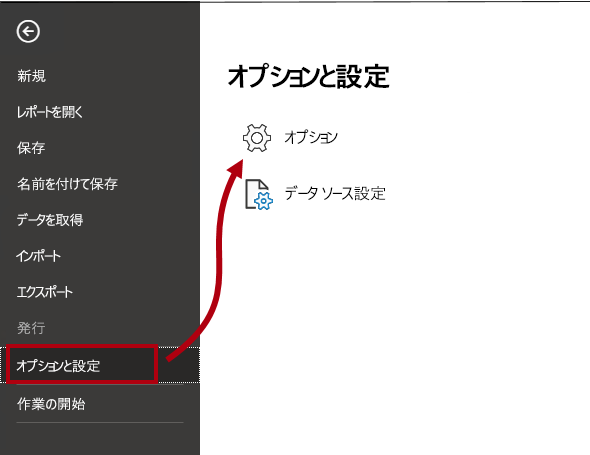

1. **[オプション]** ウィンドウの左側にある **[現在のファイル]** グループで、**[データの読み込み]** を選択します。

    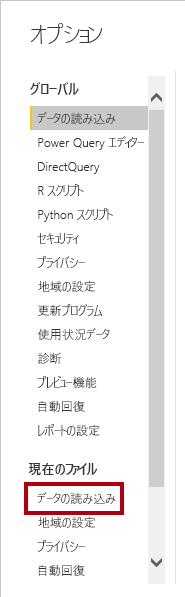

    現在のファイルの **[データの読み込み]** 設定では、モデリング時の既定の動作を決定する設定オプションを使用できます。

1. **リレーションシップ** グループで、既にオンになっている 2 つのオプションをオフにします。

    

    これらの 2 つのオプションを有効にすることは、データ モデルを開発する場合に役立ちますが、ラボ エクスペリエンスをサポートするために以前に無効にしています。 **Power BI Desktop へのデータの読み込み** ラボでリレーションシップを作成すると、それぞれを追加する理由がわかります。

1. **[OK]** をクリックします。

    

1. Power BI Desktop ファイルを保存します。

### **タスク 3: SQL Server からデータを取得する**

このタスクでは、SQL Server テーブルに基づいてクエリを作成します。

1. 「**ホーム**」リボン タブの「**データ**」グループ内から、「**SQL Server**」をクリックします。

    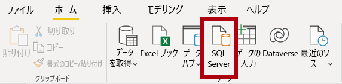

2. **[SQL Server データベース]** ウィンドウの **[サーバー]** ボックスに「**localhost**」と入力します。

    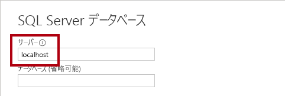

    このラボでは、**localhost** を使用して SQL Server データベースに接続します。 独自のソリューションを作成する場合は、この方法はお勧めしません。 理由は、ゲートウェイ データ ソースが **localhost** を解決できないためです。

3. **[OK]** をクリックします。

    

4. **[ナビゲーター]** ウィンドウで、左側の **AdventureWorksDW2020** データベースを展開します。

    **AdventureWorksDW2020** データベースは **AdventureWorksDW2017** サンプル データベースに基づいています。 コース ラボの学習の目的をサポートするために変更されています。

    

5. **DimEmployee** テーブルを選択します (ただし、チェックはしません)。

    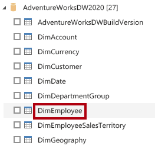

6. 右側のウィンドウで、テーブル データのプレビューに注目します。

    プレビュー データで、列と行のサンプルを確認できます。

7. クエリを作成するには、次の 6 つのテーブルの横のチェックボックスを選択します。

    - DimEmployee

    - DimEmployeeSalesTerritory

    - DimProduct

    - DimReseller

    - DimSalesTerritory

    - FactResellerSales

8. 選択したテーブルのデータに変換を適用するには、**[データの変換]** をクリックします。

    このラボではデータを変換しません。 このラボの目的は、**Power Query エディター** ウィンドウでのデータの探索とプロファイリングに焦点を当てています。

    

### **タスク 4: SQL Server クエリをプレビューする**

このタスクでは、SQL Server クエリのデータをプレビューします。 まず、データに関する関連情報を学習します。 また、列の品質、列の分布、および列プロファイル ツールを使用してデータを理解し、データ品質を評価します。

1. **Power Query エディター** ウィンドウで、左側の **[クエリ]** ペインに注意してください。

    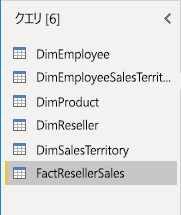

    **クエリ** ウィンドウには、チェックを付けた各テーブルに対して 1 つのクエリが含まれています。

2. 最初のクエリ **[DimEmployee]** を選択します。

    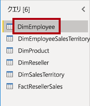

    SQL Server データベースの **DimEmployee** テーブルには、従業員ごとに 1 行が格納されます。 このテーブルの行のサブセットは営業担当者を表し、開発するモデルに関連します。

3. 左下のステータス バーで、テーブルの統計情報があります。テーブルは 33 列、296 行あります。

    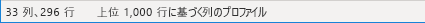

4. データ プレビュー ペインで、水平方向にスクロールして、すべての列を確認します。

5. 最後の 5 列に、**[テーブル]** または **[値]** のリンクが含まれていることに注意してください。

    この 5 列は、データベース内の他のテーブルとのリレーションシップを表しています。 これらはテーブルを結合するために使用できます。 「**Power BI Desktop へのデータの読み込み**」ラボでテーブルを結合します。

6. 列の品質を評価するには、「**表示**」リボン タブの **データ プレビュー** グループ内から、「**列の品質**」をオンにします。

    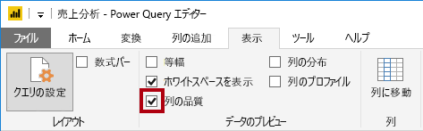

    列の品質機能を使用すると、列にある有効、エラー、または空の値の割合を簡単に判断できます。

7. **[位置]** 列 (最後から 6 列目) で、行の 94% が空 (null) であることに注意してください。

    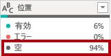

8. 列の分布を評価するには、**[表示]** リボン タブの **[データ プレビュー]** グループ内から、**[列の分布]** をオンにします。

    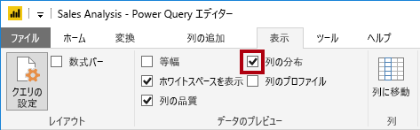

9. **[位置]** 列を再度確認し、4 つの個別の値と 1 つの一意の値があることに注意してください。

10. **EmployeeKey** (先頭) 列の列の分布を確認します。296 個の個別の値と 296 個の一意の値があります。

    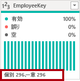

    個別のカウントと一意のカウントが同じ場合は、列に一意の値が含まれていることを意味します。 モデリングの際、一部のモデル テーブルに一意の列を含めることが重要です。 これらの一意の列を使用して、一対多のリレーションシップを作成できます。これは、「**Power BI Desktop でのデータのモデル化、パート 1**」ラボで行います。

11. **[クエリ]** ペインで、**DimEmployeeSalesTerritory** クエリを選択します。

    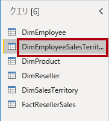

    **[DimEmployeeSalesTerritory]** テーブルには、従業員ごとに 1 行と、その従業員が管理する販売区域の地域が格納されています。 テーブルでは、1 人の従業員に多数のリージョンを関連付けることができます。 一部の従業員は、1 つ、2 つ、またはそれ以上の地域を管理しています。 このデータをモデル化する場合、多対多のリレーションシップを定義する必要があります。これは、「**Power BI Desktop でデータをモデル化する (パート 2)**」ラボで行います。

12. **[クエリ]** ペインで、**[DimProduct]** クエリを選択します。

    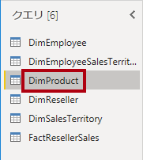

    **[DimProduct]** テーブルには、会社が販売した商品ごとに 1 行が含まれています。

13. 水平方向にスクロールして、最後の列を表示します。

14. **[DimProductSubcategory]** 列に注意してください。

    「**Power BI Desktop でデータを読み込む**」ラボでこのクエリに変換を追加する場合は、**DimProductSubcategory** 列を使用してテーブルを結合します。

15. **[クエリ]** ペインで、**[DimReseller]** クエリを選択します。

    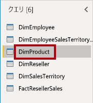

    **DimReseller** テーブルには、リセラーごとに 1 行が含まれています。 リセラーは、Adventure Works 製品の販売、流通、または付加価値の提供を行っています。

16. 列値を表示するには、**[表示]** リボン タブの **[データ プレビュー]** グループ内から、**[列のプロファイル]** をオンにします。

    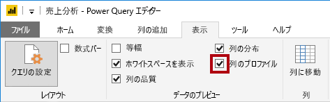

17. **[BusinessType]** 列ヘッダーを選択します。

18. データ プレビュー ウィンドウの下に新しいウィンドウがあります。

19. データ プレビュー ウィンドウで、列の統計および値の分布を確認します。

20. データ品質の問題に注意してください。倉庫についてのラベルが 2 つあります (**Warehouse** とスペルが間違っている **Ware House**)。

    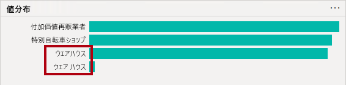

21. **[Ware House]** バーの上にカーソルを置くと、この値を持つ 5 つの行があることに気付きます。

    変換を適用して、「**Power BI Desktop でデータを読み込む**」ラボでこれらの 5 つの行のラベルを再設定します。

22. **[クエリ]** ペインで、**[DimSalesTerritory]** クエリを選択します。

    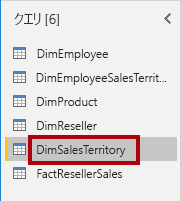

    **[DimSalesTerritory]** テーブルには、**Corporate HQ** (本社) を含む販売地域ごとに 1 行が含まれています。 地域は国に割り当てられ、国はグループに割り当てられています。 「**Power BI Desktop でデータをモデル化する (パート 1)**」ラボで、地域、国、またはグループ レベルでの分析をサポートする階層を作成します。

23. **[クエリ]** ペインで、**[FactResellerSales]** クエリを選択します。

    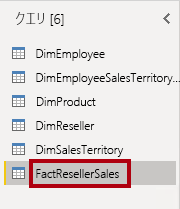

    **FactResellerSales** テーブルには、販売注文明細行ごとに 1 行が含まれており、販売注文には 1 つまたは複数の明細行項目が含まれています。

24. **TotalProductCost** 列の列の品質を確認して、行の 8% が空であることに注意してください。

    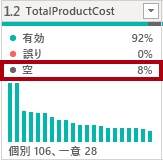

    **TotalProductCost** 列値の不足は、データ品質の問題につながります。 この問題に対処するために、**Power BI Desktop でのデータの読み込み** ラボでは、関連する **DimProduct** テーブルに格納されている製品の標準原価を使用して、欠落した値を埋めるための変換を適用します。

### **タスク 5: CSV ファイルからデータを取得する**

このタスクでは、CSV ファイルに基づいてクエリを作成します。

1. 新しいクエリを追加するには、「**Power Query エディター**」ウィンドウの「**ホーム**」リボン タブにある「**新しいクエリ**」グループ内から、「**新しいソース**」下向き矢印をクリックし、**テキスト/CSV** を選択します。

    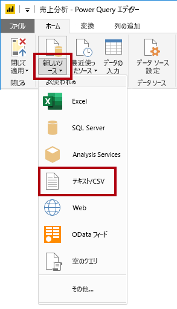

2. **[開く]** ウィンドウで、**D:\PL300\Resources** フォルダーに移動し、**ResellerSalesTargets.csv** ファイルを選択します。

3. **[開く]** をクリックします。

4. **ResellerSalesTargets.csv** ウィンドウで、プレビュー データを確認します。

5. **[OK]** をクリックします。

    

  
‎ 

6. **[クエリ]** ペインで、**ResellerSalesTargets** クエリが追加されていることに注意してください。

    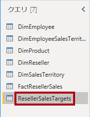

    **ResellerSalesTargets** CSV ファイルには、年あたりの販売員ごとに 1 行が含まれています。 各行に、12 個の月間売上目標 (1,000 単位で表示) が記録されています。 Adventure Works 社の事業年度は 7 月 1 日に始まることに注意してください。

7. 空の値を含む列がない点に注目してください。

    月間売上目標がない場合は、代わりにハイフン文字が格納されています。

8. 列名の左側にある各列ヘッダーのアイコンを確認します。

    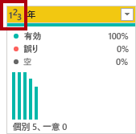

    アイコンは、列のデータ型を表します。 **123** は整数で、**ABC** はテキストです。

    多くの変換を適用して、「**Power BI Desktop でデータを読み込む**」ラボで **Date**、**EmployeeKey**、**TargetAmount** の 3 つの列のみで構成される異なる形状の結果を実現します。

### **タスク 6: CSV ファイルから追加データを取得する**

このタスクでは、別の CSV ファイルに基づいて追加のクエリを作成します。

1. 前のタスクの手順を使用して、**D:\PL300\Resources\ColorFormats.csv** ファイルに基づいてクエリを作成します。

    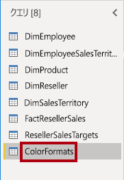

    **ColorFormats** CSV ファイルには、商品の色ごとに 1 行が含まれています。 各行には、背景とフォントの色を書式設定するための 16 進コードが記録されます。 このデータは、「**Power BI Desktop でデータを読み込む**」ラボで **DimProduct** クエリ データと統合します。

### **タスク 7: 完了**

このタスクでは、ラボを完了します。

1. 「**表示**」リボン タブの「**データ プレビュー**」グループ内から、次の 3 つのデータ プレビュー オプションをオフにします。

    - 列の品質

    - 列の分布

    - 列のプロファイル

    

2. Power BI Desktop ファイルを保存するには、「**Power Query エディター**」ウィンドウの **ファイル** バックステージ ビューで「**保存**」を選択します。

    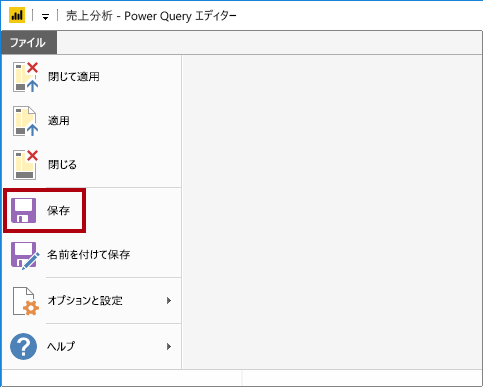

3. クエリの適用を確認するメッセージが表示されたら、**[後で適用]** をクリックします。

    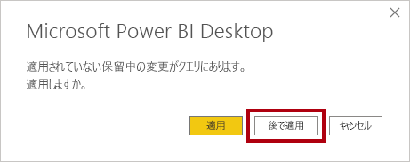

    クエリを適用すると、データがデータ モデルに読み込まれます。 このための準備は、それより先に適用が必要な変換の数が多いために完了していません。

4. 次のラボを開始する場合は、Power BI Desktop を開いたままにしておきます。

    **Power BI Desktop へのデータの読み込み** ラボでは、クエリにさまざまな変換を適用し、クエリを適用してデータ モデルに読み込みます。
