---
lab:
  title: Power BI Desktop にデータを読み込む
  module: Module 3 - Clean, Transform, and Load Data in Power BI
ms.openlocfilehash: 8a19b8b1b243cc4c04bee3375f161098287dbf9d
ms.sourcegitcommit: 3520e7d016e94549d408464207c1b91cd47867c2
ms.translationtype: HT
ms.contentlocale: ja-JP
ms.lasthandoff: 03/05/2022
ms.locfileid: "139273834"
---
# <a name="load-data-in-power-bi-desktop"></a>**Power BI Desktop でデータを読み込む**

**このラボの推定所要時間: 45 分**

このラボでは、前のラボで作成した各クエリに変換を適用します。 その後、クエリを適用し、それぞれテーブルとしてデータ モデルに読み込みます。

このラボでは、次の作業を行う方法について説明します。

- さまざまな変換を適用する

- クエリを適用してデータ モデルに読み込む

### <a name="lab-story"></a>**ラボのストーリー**

このラボは、データの準備に始まり、レポートおよびダッシュボードとして発行するまでの完全なストーリーとして設計されたラボ シリーズの 1 つです。 ラボは任意の順序で完了できます。 しかしながら、複数のラボに取り組む場合は、最初の 10 のラボについては、次の順序で行うことをお勧めします。

1. Power BI Desktop でのデータの準備

2. **Power BI Desktop でデータを読み込む**

3. Power BI Desktop でデータをモデル化する


5. Power BI Desktop での DAX 計算の作成、パート 1

6. Power BI Desktop で DAX 計算を作成する (パート 2)

7. Power BI Desktop でレポートを設計する (パート 1)

8. Power BI Desktop でレポートを設計する (パート 2)

9. Power BI ダッシュボードを作成する

10. Power BI Desktop でデータ分析を実行する

11. 行レベルのセキュリティを実行する

## <a name="exercise-1-load-data"></a>**演習 1: データを読み込む**

この演習では、前のラボで作成した各クエリに変換を適用します。

### <a name="task-1-get-started"></a>**タスク 1: 開始する**

このタスクではこのラボ用の環境を設定します。

*重要:前のラボから続行している場合 (かつそのラボを正常に完了した場合) は、このタスクを実行しないで、次のタスクから続けてください。"*

1. Power BI Desktop を開くには、タスク バーにある Microsoft Power BI Desktop のショートカットをクリックします。

    

1. 「はじめに」ウィンドウを閉じるには、ウィンドウの左上にある「**X**」をクリックします。

    

1. スターター Power BI Desktop ファイルを開くには、「**ファイル**」リボン タブをクリックして、バックステージ ビューを開きます。

1. **[レポートを開く]** を選択します。

    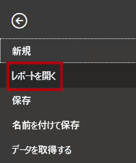

1. 「**レポートを参照**」をクリックします。

    

1. **[開く]** ウィンドウで、**D:\PL300\Labs\02-load-data-with-power-query-in-power-bi-desktop\Starter** フォルダーに移動します。

1. **Sales Analysis** ファイルを選択します。

1. **[開く]** をクリックします。

    

1. 情報ウィンドウが開いている場合はすべて閉じます。

1. リボンの下の黄色の警告メッセージに注目してください。

    "このメッセージは、クエリが、モデル テーブルとしての読み込みに適用されていないことを警告しています。*クエリは、このラボの後半で適用します。"*

1. 警告メッセージを閉じるには、黄色い警告メッセージの右側にある「**X**」をクリックします。

    

1. ファイルのコピーを作成するには、「**ファイル**」リボン タブをクリックして、バックステージ ビューを開きます。

1. **[名前を付けて保存]** を選択します。

    

1. 変更を適用するかどうかを確認するメッセージが表示されたら、「**後で適用**」をクリックします。

    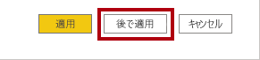

1. **[名前を付けて保存]** ウィンドウで、**D:\PL300\MySolution** フォルダーに移動します。

1. **[保存]** をクリックします。

    

1. **Power Query エディター** ウィンドウを開くには、「**ホーム**」リボン タブの「**クエリ**」グループで、「**データの変換**」アイコンをクリックします。

    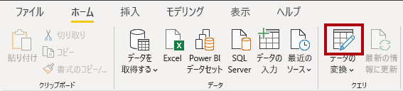

### <a name="task-2-configure-the-salesperson-query"></a>**タスク 2: Salesperson クエリを構成する**

このタスクでは、**Salesperson** クエリを構成します。

1. 「**Power Query エディター**」ウィンドウの「**クエリ**」ウィンドウで、「**DimEmployee**」クエリを選択します。

    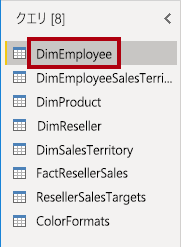

2. クエリの名前を変更するには、(右側にある) **[クエリの設定]** ペインで、**[名前]** ボックスのテキストを **Salesperson** に置き換え、**Enter** キーを押します。

    "クエリ名によって、モデル テーブルの名前が決まります。*簡潔で、わかりやすい名前を定義することをお勧めします。"*

3. **[クエリ]** ペインで、クエリ名が更新されていることを確認します。

    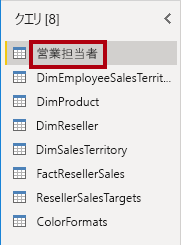

    "次に、クエリ行をフィルター処理し、営業担当者である従業員のみを取得します。"

4. 特定の列を見つけるには、**[ホーム]** リボン タブの **[列の管理]** グループ内から、**[列の選択]** の下矢印をクリックし、**[列に移動]** を選択します。

    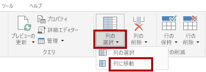

    *ヒント:この手法は、クエリに多数の列が含まれている場合に便利です。列の数が少ない場合は、水平方向にスクロールするだけで目的の列を見つけることができます。"*

5. **[列に移動]** ウィンドウで、一覧を列名で並べ替えるには、**[AZ]** 並べ替えボタンをクリックし、**[名前]** を選択します。

    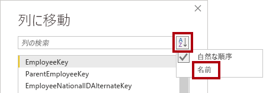

6. **SalesPersonFlag** 列を選択してから、**[OK]** をクリックします。

7. クエリをフィルター処理するには、**SalesPersonFlag** 列ヘッダーで下矢印をクリックし、**[FALSE]** チェック ボックスをオフにします。

    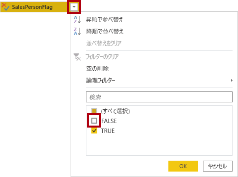

8. **[OK]** をクリックします。

    

9. **[クエリの設定]** ペインの **[適用したステップ]** 一覧で、**[フィルターされた行]** ステップが追加されていることに注目してください。

    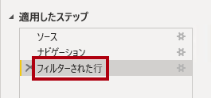

    "作成した変換ごとに、追加のステップ ロジックが生成されます。*ステップを編集または削除することができます。クエリ変換のその段階でクエリ結果をプレビューするステップを選択することもできます。"*

10. 列を削除するには、「**ホーム**」リボン タブの「**列の管理**」グループ内から「**列の選択**」アイコンをクリックします。

    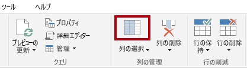

11. 「**列の選択**」ウィンドウで、すべての列のチェックを外す場合は、「 **(すべての列を選択)** 」の項目をオフにします。

    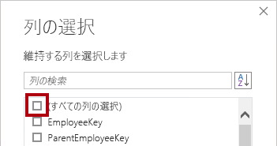

12. 列を含めるには、次の 6 つの列を確認します。

    - EmployeeKey

    - EmployeeNationalIDAlternateKey

    - FirstName

    - LastName

    - Title

    - EmailAddress

13. **[OK]** をクリックします。

    

14. 「**適用されるステップ**」リストで、別のクエリ手順が追加されていることに注目してください。

    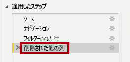

15. 1 つの名前列を作成するには、まず、**FirstName** 列ヘッダーを選択します。

16. **Ctrl** キーを押しながら、**LastName** 列を選択します。

    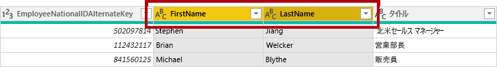

17. 選択列ヘッダーのいずれかを右クリックし、コンテキスト メニューの「**列のマージ**」を選択します。

    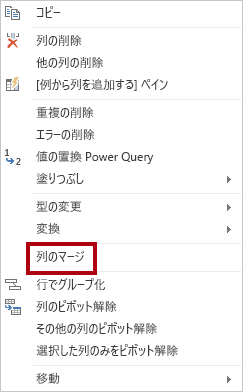

    "多くの一般的な変換を適用することができます。そのためには、列ヘッダーを右クリックし、コンテキスト メニューから選択します。*ただし、リボンではより多くの変換を使用できます。"*

18. 「**列の結合**」ウィンドウの「**区切り記号**」ボックスの一覧で、「**スペース**」を選択します。

19. 「**新しい列名**」ボックスで、テキストを **Salesperson** に置き換えます。

    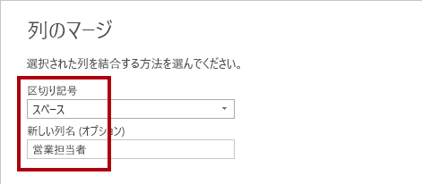

20. **[OK]** をクリックします。

    

21. **EmployeeNationalIDAlternateKey** 列の名前を変更するには、**EmployeeNationalIDAlternateKey** 列ヘッダーをダブルクリックします。

22. テキストを **EmployeeID** に置き換えてから、**Enter** キーを押します。

    *重要:列の名前を変更するように指示されたら、説明のとおりに名前を変更することが重要です。"*

23. 前の手順を使用して、**EmailAddress** 列の名前を **UPN** に変更します。

    "UPN は、User Principal Name の頭字語です。*この列の値は、「**Power BI Desktop でデータをモデル化する (パート 2)** 」ラボで行レベルのセキュリティを構成するときに使用されます。"*

24. 左下のステータス バーで、クエリに 5 列と 18 行が含まれているかどうかを確認します。

    

    *重要:クエリで正しい結果が得られない場合は、先に進まないことが重要です。そうしないと、後のラボを完了することはできません。クエリの列または行が一致しない場合は、このタスクの手順に戻って問題を修正してください。"*

### <a name="task-3-configure-the-salespersonregion-query"></a>**タスク 3: SalespersonRegion クエリを構成する**

このタスクでは、**SalespersonRegion** クエリを構成します。

1. **[クエリ]** ペインで、**DimEmployeeSalesTerritory** クエリを選択します。

    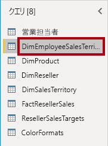

2. 「**クエリの設定**」ウィンドウで、クエリの名前を **SalespersonRegion** に変更します。

3. 最後の 2 つの列を削除するために、まず **DimEmployee** 列ヘッダーを選択します。

4. **Ctrl** キーを押しながら、**DimSalesTerritory** 列ヘッダーを選択します。

5. 選択した列ヘッダーのいずれかを右クリックし、コンテキスト メニューで「**列を削除**」を選択します。

    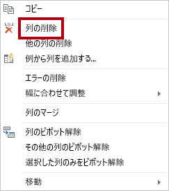

6. ステータス バーで、クエリに 2列と 39 行があることを確認します。

    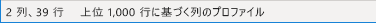

### <a name="task-4-configure-the-product-query"></a>**タスク 4: Product クエリを構成する**

このタスクでは **Product** クエリを構成します。

*重要:詳細な手順が既に提供されている場合、ラボの手順ではより簡潔な手順が提供されます。詳細な説明が必要な場合は、前のタスクの手順に戻って参照してください。"*

1. **DimProduct** クエリを選択します。

    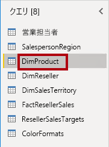

2. クエリの名前を「**Product**」に変更します。

3. **FinishedGoodsFlag** 列を見つけ、列をフィルタリングして、完成品 (つまり、TRUE) である製品を取得します。

4. 以下を除くすべての列を削除します。

    - ProductKey

    - EnglishProductName

    - StandardCost

    - Color

    - DimProductSubcategory

5. **DimProductSubcategory** 列は関連テーブルを表していることに注意してください (**Value** リンクが含まれています)。

6. **DimProductSubcategory** 列ヘッダーの列名の右側にある展開ボタンをクリックします。

    

7. すべての列をオフにするには、**[(すべての列の選択)]** 項目をオフにします。

8. **EnglishProductSubcategoryName** および **DimProductCategory** 列を確認します。

    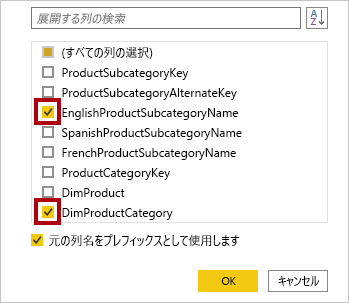

    "これら 2 つの列を選択すると、変換が適用されて **DimProductSubcategory** テーブルに結合され、これらの列が含まれます。***DimProductCategory** 列は、実際にはデータ ソース内の別の関連テーブルです。"*

9. **[元の列名をプレフィックスとして使用します]** チェックボックスをオフにします。

    

    "クエリ列名は常に一意である必要があります。*このチェックボックスをオンにすると、各列の前に展開された列名が追加されます (この場合は **DimProductSubcategory**)。選択した列名が **Product** クエリの列名と競合しないことがわかっているため、オプションは選択解除されています。"*

10. **[OK]** をクリックします。

    

11. 変換の結果、2 つの列が追加され、**DimProductSubcategory** 列が削除されたことがわかります。

12. **DimProductCategory** 列を展開し、**EnglishProductCategoryName** 列のみを導入します。

13. 次の 4 つの列の名前を変更します。

    - **EnglishProductName** を **Product** に

    - **StandardCost** を **Standard Cost** に (スペースを含む)

    - **EnglishProductSubcategoryName** を **Subcategory** に

    - **EnglishProductCategoryName** を **Category** に

14. ステータス バーで、クエリに 6 つの列と 397 行があることを確認します。

    

### <a name="task-5-configure-the-reseller-query"></a>**タスク 5: Reseller クエリを構成する**

このタスクでは、**Reseller** クエリを構成します。

1. **DimReseller** クエリを選択します。

    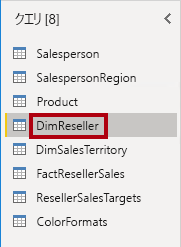

2. クエリの名前を「**Reseller**」に変更します。

3. 以下を除くすべての列を削除します。

    - ResellerKey

    - BusinessType

    - ResellerName

    - DimGeography

4. **DimGeography** 列を展開し、次の 3 つの列のみを含めます。

    - City

    - StateProvinceName

    - EnglishCountryRegionName

    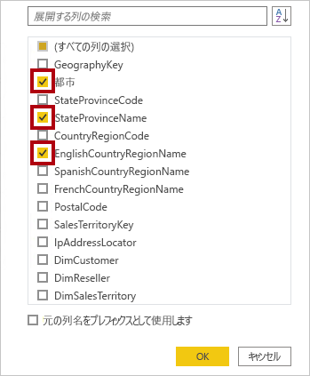

5. **Business Type** 列ヘッダーで、下向き矢印をクリックし、個別の列の値を確認し、warehouse のスペルが正しくないことを確認します。

    

  
‎ 

6. **Business Type** 列ヘッダーを右クリックして、「**値の置換**」を選択します。

    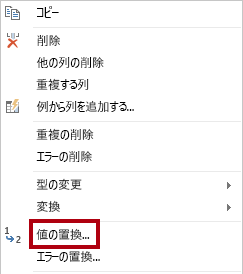

7. **[値の置換]** ウィンドウで、次の値を構成します。

    - **[検索する値]** ボックスに「**Ware House**」と入力します

    - **[置換後]** ボックスに「**Warehouse**」と入力します

    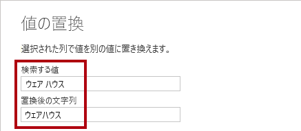

8. **[OK]** をクリックします。

    

9. 次の 4 つの列の名前を変更します。

    - **BusinessType** を **Business Type** に (スペースを含む)

    - **ResellerName** を **Reseller** に

    - **StateProvinceName** を **State-Province** に

    - **EnglishCountryRegionName** を **Country-Region** に

10. ステータス バーで、クエリに 6 列と 701 行が含まれているかどうかを確認します。

    

### <a name="task-6-configure-the-region-query"></a>**タスク 6: Region クエリを構成する**

このタスクでは、**Region** クエリを構成します。

1. **DimSalesTerritory** クエリを選択します。

    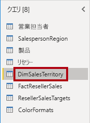

2. クエリの名前を「**Region**」に変更します。

3. **SalesTerritoryAlternateKey** 列にフィルターを適用して、値 0 (ゼロ) を削除します。

    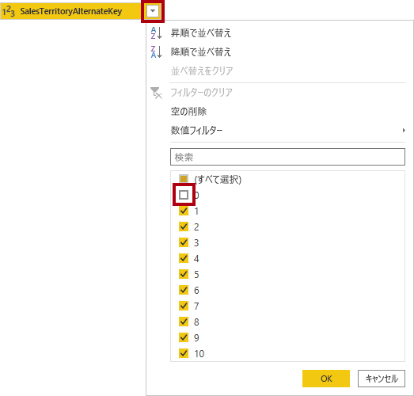

4. 以下を除くすべての列を削除します。

    - SalesTerritoryKey

    - SalesTerritoryRegion

    - SalesTerritoryCountry

    - SalesTerritoryGroup

5. 次の 3 つの列の名前を変更します。

    - **SalesTerritoryRegion** を **Region** に

    - **SalesTerritoryCountry** を **Country** に

    - **SalesTerritoryGroup** を **Group** に

6. ステータス バーで、クエリに 4 列と 10 行があることを確認します。

    

### <a name="task-7-configure-the-sales-query"></a>**タスク 7: Sales クエリを構成する**

このタスクでは、**Sales** クエリを構成します。

1. **FactResellerSales** クエリを選択します。

    

2. クエリの名前を「**Sales**」に変更します。

3. 以下を除くすべての列を削除します。

    - SalesOrderNumber

    - OrderDate

    - ProductKey

    - ResellerKey

    - EmployeeKey

    - SalesTerritoryKey

    - OrderQuantity

    - UnitPrice

    - TotalProductCost

    - SalesAmount

    - DimProduct

    "「**Power BI Desktop でデータを準備する**」ラボで、**FactResellerSales** 行のごく一部で **TotalProductCost** 値が不足していたことを思い出してください。*不足している値の修正を支援するために、製品の標準原価列を取得するための **DimProduct** 列が含まれています。"*

4. **DimProduct** 列を展開し、すべての列のチェックを外してから **StandardCost** 列のみを含めます。

5. カスタム列を作成するには、「**列を追加**」リボン タブの「**全般**」グループから、「**カスタム列**」をクリックします。

    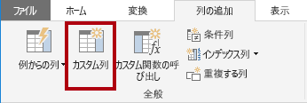

6. 「**カスタム列**」ウィンドウの「**新しい列名**」ボックスで、テキストを **Cost** に置き換えます。

    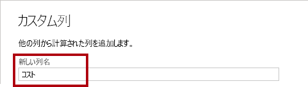

7. 「**カスタム列の式**」ボックスに、次の式 (等号記号の後) を入力します。

8. 利便性のために、式は、**D:\PL300\Labs\02-load-data-with-power-query-in-power-bi-desktop\Assets\Snippets.txt** ファイルからコピーできます。"


   **Power Query**
   ```
   if [TotalProductCost] = null then [OrderQuantity] * [StandardCost] else [TotalProductCost]
   ```


"この式を使用すると、**TotalProductCost** 値が欠落しているかどうかをテストできます。*そうであれば、**OrderQuantity** 値に **StandardCost** 値を掛けて値を生成します。それ以外の場合は、既存の **TotalProductCost** 値を使用します。"*

9. **[OK]** をクリックします。

    

10. 次の 2 つの列を削除します。

    - TotalProductCost

    - StandardCost

11. 次の 3 つの列の名前を変更します。

    - **OrderQuantity** を **Quantity** に

    - **UnitPrice** を **Unit Price** に (スペースを含む)

    - **SalesAmount** を **Sales** に

12. 列のデータ型を変更するには、列名の左側にある **Quantity** 列ヘッダーで「**1.2**」アイコンをクリックし、「**整数**」を選択します。

    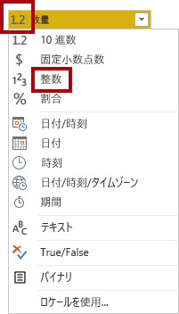

    "正しいデータ型を構成することが重要です。*列に数値が含まれていて、数学計算を実行する予定がある場合は、正しい型を選択することも重要です。"*

13. 次の 3 つの列のデータ型を「**固定小数点数**」に変更します。

    - Unit Price

    - Sales

    - Cost

    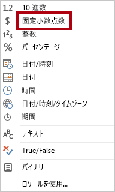

    "固定小数点数データ型には完全な有効桁数の値が格納されるため、10 進数よりも多くの格納領域が必要です。*財務値、またはレート (為替レートなど) には、固定小数点数型を使用することが重要です。"*

14. ステータス バーで、クエリに 10 列と 999 以上の行があることを確認します。

    

    *各クエリのプレビュー データとして最大 1000 行が読み込まれます。*

### <a name="task-8-configure-the-targets-query"></a>**タスク 8: Targets クエリを構成する**

このタスクでは、**Targets** クエリを構成します。

1. **ResellerSalesTargets** クエリを選択します。

    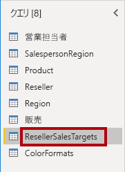

2. クエリの名前を「**Targets**」に変更します。

3. 12 か月の列 (**M01**-**M12**) のピボットを解除するには、まず **Year** および **EmployeeID** の列ヘッダーを複数選択します。

    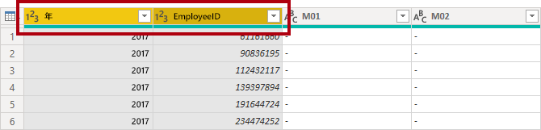

4. 選択した列ヘッダーのいずれかを右クリックし、コンテキスト メニューで「**他の列のピボット解除**」を選択します。

    

5. 列名が **Attribute** 列に表示され、値が **Value** 列に表示されることに注意してください。

6. **Value** 列にフィルターを適用して、ハイフン (-) 値を削除します。

    *ゼロ (0) を表すために、ソース CSV ファイルでハイフン文字が使用されていたことを思い出してください。*

7. 次の 2 つの列の名前を変更します。

    - **Attribute** から **MonthNumber** (2 つの単語の間にスペースはありません。後で削除されます)

    - **Value** を **Target** に

    "次に、変換を適用して日付列を作成します。*日付は、**Year** および **MonthNumber** 列から取得されます。列を作成するには、 **[例からの列]** 機能を使用します。"*

8. **MonthNumber** 列の値を準備するには、**MonthNumber** 列ヘッダーを右クリックしてから、「**値の置換**」を選択します。

    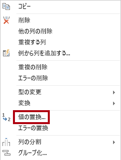

9. 「**値の置換**」ウィンドウの「**検索する値**」ボックスに、「**M**」と入力します。

    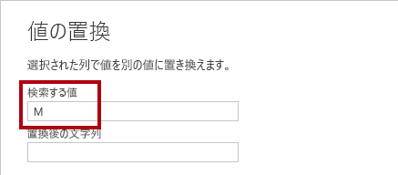

10. **[OK]** をクリックします。

11. **MonthNumber** 列のデータ型を **[整数]** に変更します。

    

12. 「**列を追加**」リボンタブの「**全般**」グループ内から、「**例からの列**」アイコンをクリックします。

    

13. 最初の行は年 **2017** と月番号 **7** であることに注意してください。

14. **Column1** 列の最初のグリッド セルに、「**7/1/2017**」と入力してから、**Enter** キーを押します。

    "この仮想マシンでは米国の地域設定を使用しているため、この日付は実際には "July 1, 2017" になります。"

15. グリッド セルは予測値を使用して更新されることに注目してください。

    "この機能では、**Year** と **MonthNumber** 列の値を組み合わせることを正確に予測しています。"

16. クエリ グリッドの上に表示される数式にも注目してください。

    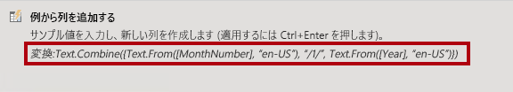

17. 新しい列の名前を変更するには、**Merged** 列ヘッダーをダブルクリックします。

18. 列の名前を **TargetMonth** に変更します。

    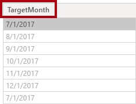

19. 新しい列を追加するには、「**OK**」をクリックします。

    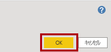

20. 次の列を削除します。

    - Year

    - MonthNumber

21. 次の列のデータ型を変更します。

    - **Target** を固定小数点数に

    - **TargetMonth** を日付に

22. **Target** 値に 1000 を掛けるには、**Target** 列ヘッダーを選択し、「**変換**」リボン タブの「**数値の列**」グループ内で「**標準**」をクリックし、「**乗算**」を選択します。

    *ターゲット値は千単位で格納されていることを思い出してください。*

    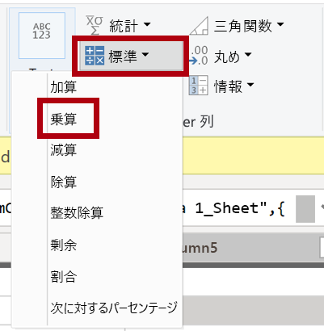

23. **[乗算]** ウィンドウの **[値]** ボックスに「**1000**」と入力します。

    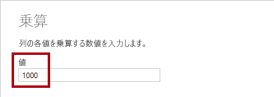

24. **[OK]** をクリックします。

    

25. ステータスバーで、クエリに 3 つの列と 809 行があることを確認します。

    

### <a name="task-9-configure-the-colorformats-query"></a>**タスク 9: ColorFormats クエリを構成する**

このタスクでは、**ColorFormats** クエリを構成します。

1. **ColorFormats** クエリを選択します。

    

2. 最初の行に列名が含まれていることに注目してください。

3. 「**ホーム**」リボン タブの「**変換**」グループ内で、「**先頭行をヘッダーとして使用**」をクリックします。

    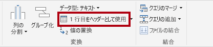

4. ステータスバーで、クエリに 3 列と 10 行があることを確認します。

    

### <a name="task-10-update-the-product-query"></a>**タスク 10: Product クエリを更新する**

このタスクでは、**ColorFormats** クエリをマージして、**Product** クエリを更新します。

1. **Product** クエリを選択します。

    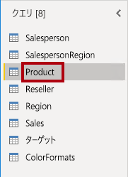

2. **ColorFormats** クエリをマージするには、「**ホーム**」リボン タブの「**結合**」グループ内から、「**クエリのマージ**」をクリックします。

    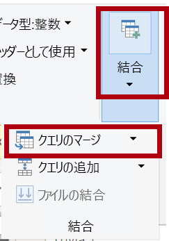

    "クエリをマージすることで、異なるデータ ソース (SQL Server と CSV ファイル) のデータを統合できます。"

3. 「**マージ**」ウィンドウの **Product** クエリ グリッドで、**Color** 列ヘッダーを選択します。

    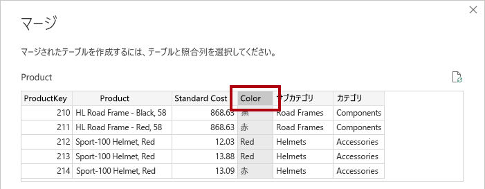

4. **Product** クエリ グリッドの下のドロップダウン リストで、**ColorFormats** クエリを選択します。

    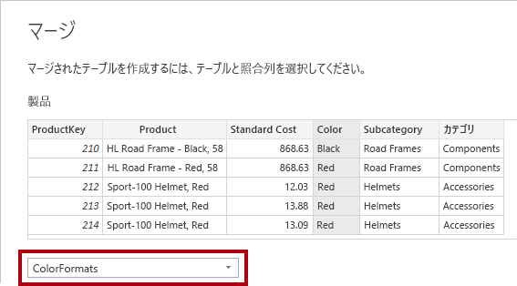

5. **ColorFormats** クエリ グリッドで、**Color** 列ヘッダーを選択します。

6. 「**プライバシー レベル**」ウィンドウが開いたら、2 つのデータ ソースそれぞれに対して、対応するドロップダウン リストで、「**組織**」を選択します。

    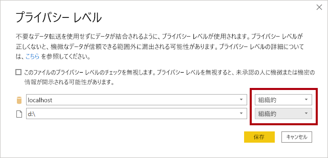

    "データ ソースのプライバシー レベルを構成して、ソース間でデータを共有できるかどうかを決定できます。*各データ ソースを **[組織]** に設定すると、必要に応じてデータを共有できます。プライベート データ ソースを他のデータ ソースと共有することはできません。これは、プライベート データを共有できないという意味ではありません。つまり、Power Query エンジンではソース間でデータを共有できません。"*

7. **[保存]** をクリックします。

    

8. **[マージ]** ウィンドウで、既定の **[結合の種類]** (左外部の選択を維持する) を使用し、 **[OK]** をクリックします。

    

9. **ColorFormats** 列を展開して、次の 2 つの列を含めます。

    - 背景色の書式

    - フォントの色の書式

    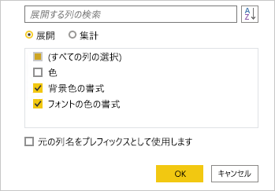

10. ステータス バーで、クエリに 8 つの列と 397 の行があることを確認します。

    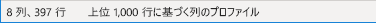

### <a name="task-11-update-the-colorformats-query"></a>**タスク 11: ColorFormats クエリを更新する**

このタスクでは、**ColorFormats** を更新して読み込みを無効にします。

1. **ColorFormats** クエリを選択します。

    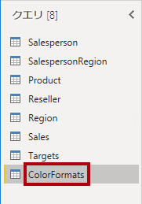

2. **[クエリの設定]** ペインで、**[すべてのプロパティ]** リンクをクリックします。

    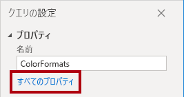

3. 「**クエリのプロパティ**」ウィンドウで、「**レポートへの読み込みを有効にする**」チェックボックスをオフにします。

    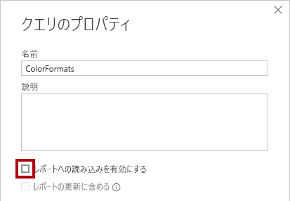

    読み込みを無効にすると、データ モデルにテーブルとして読み込まれません。 このようにするのは、クエリが、データ モデルに読み込み可能な **Product** クエリとマージされているためです。

4. **[OK]** をクリックします。

    

### <a name="task-12-finish-up"></a>**タスク 12: 完了**

このタスクでは、ラボを完了します。

1. 次のように適切な名前が付けられた 8 つのクエリがあることを確認します。

    - Salesperson

    - SalespersonRegion

    - Product

    - Reseller

    - Region

    - Sales

    - Targets

    - ColorFormats  (データモデルに読み込まれません)

2. データ モデルを読み込むには、 **[ファイル]** Backstage ビューで **[閉じて適用]** を選択します。

    

    *これで、読み込みが有効なすべてのクエリが、データ モデルに読み込まれるようになりました。*

3. 「**フィールド**」ウィンドウ (右側) で、データ モデルに読み込まれた 7 つのテーブルに注目します。

    

4. Power BI Desktop ファイルを保存します。

5. 次のラボを開始する場合は、Power BI Desktop を開いたままにしておきます。

    "データ モデルのテーブルとリレーションシップは、「**Power BI Desktop でデータをモデル化する (パート 1)** 」ラボで構成します。"
