---
lab:
  title: Power BI Desktop での DAX 計算の作成、パート 1
  module: Module 5 - Create Model Calculations using DAX in Power BI
ms.openlocfilehash: 27cbc5c39cdc89c2a54422bbe3468cd13c553ddc
ms.sourcegitcommit: 3520e7d016e94549d408464207c1b91cd47867c2
ms.translationtype: HT
ms.contentlocale: ja-JP
ms.lasthandoff: 03/05/2022
ms.locfileid: "139273716"
---
# <a name="create-dax-calculations-in-power-bi-desktop-part-1"></a>**Power BI Desktop で DAX 計算を作成する (パート 1)**

**このラボの推定所要時間: 45 分**

このラボでは、Data Analysis Expressions (DAX) を使用して、計算テーブル、計算列、およびシンプルなメジャーを作成します。

このラボでは、次の作業を行う方法について説明します。

- 計算テーブルを作成する

- 計算列を作成する

- メジャーを作成する

### <a name="lab-story"></a>**ラボのストーリー**

このラボは、データの準備に始まり、レポートおよびダッシュボードとして発行するまでの完全なストーリーとして設計されたラボ シリーズの 1 つです。 ラボは任意の順序で完了できます。 しかしながら、複数のラボに取り組む場合は、最初の 10 のラボについては、次の順序で行うことをお勧めします。

1. Power BI Desktop でのデータの準備

2. Power BI Desktop にデータを読み込む

3. Power BI Desktop でデータをモデル化する

5. **Power BI Desktop で DAX 計算を作成する (パート 1)**

6. Power BI Desktop で DAX 計算を作成する (パート 2)

7. Power BI Desktop でレポートを設計する (パート 1)

8. Power BI Desktop でレポートを設計する (パート 2)

9. Power BI ダッシュボードを作成する

10. Power BI Desktop でデータ分析を実行する

11. 行レベルのセキュリティを実行する

## <a name="exercise-1-create-calculated-tables"></a>**演習 1:計算テーブルを作成する**

この演習では、2 つの計算テーブルを作成します。 1 つ目は、**Sales** テーブルとの間の直接的なリレーションシップを実現する、**Salesperson** テーブルです。 2 つ目は、**Date** テーブルです。

### <a name="task-1-get-started"></a>**タスク 1: 開始する**

このタスクではこのラボ用の環境を設定します。

*重要:前のラボから続行している場合 (かつそのラボを正常に完了した場合) は、このタスクを実行しないで、次のタスクから続けてください。"*

1. Power BI Desktop を開くには、タスク バーにある Microsoft Power BI Desktop のショートカットをクリックします。

    

1. 「はじめに」ウィンドウを閉じるには、ウィンドウの左上にある「**X**」をクリックします。

    

1. スターター Power BI Desktop ファイルを開くには、「**ファイル**」リボン タブをクリックして、バックステージ ビューを開きます。

1. **[レポートを開く]** を選択します。

    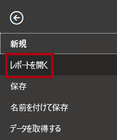

1. 「**レポートを参照**」をクリックします。

    

1. **[開く]** ウィンドウで、**D:\PL300\Labs\05-create-dax-calculations-in-power-bi-desktop\Starter** フォルダーに移動します。

1. **Sales Analysis** ファイルを選択します。

1. **[開く]** をクリックします。

    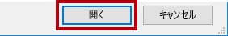

1. 情報ウィンドウが開いている場合はすべて閉じます。

1. ファイルのコピーを作成するには、「**ファイル**」リボン タブをクリックして、バックステージ ビューを開きます。

1. **[名前を付けて保存]** を選択します。

    

1. 変更を適用するかどうかを確認するメッセージが表示されたら、「**適用**」をクリックします。

    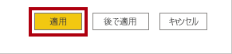

1. **[名前を付けて保存]** ウィンドウで、**D:\PL300\MySolution** フォルダーに移動します。

1. **[保存]** をクリックします。

    

### <a name="task-2-create-the-salesperson-table"></a>**タスク 2: Salesperson テーブルを作成する**

このタスクでは、**Salesperson** テーブル (**Sales** との直接的なリレーションシップ) を作成します。

1. Power BI Desktop のレポート ビューで、**[モデリング]** リボンの **[計算]** グループの中から、**[新しいテーブル]** をクリックします。

    

2. 数式バー (計算の作成または編集時に、リボンのすぐ下に表示されます) に、「**Salesperson =**」と入力して **Shift + Enter** キーを押し、「**'Salesperson (Performance)'**」と入力して **Enter** キーを押します。

    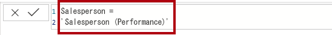

    "利便性のために、このラボのすべての DAX 定義は、**D:\PL300\Labs\05-create-dax-calculations-in-power-bi-desktop\Assets\Snippets.txt** にあるスニペット ファイルからコピーできます。"

    "計算テーブルを作成するには、最初にテーブル名を入力し、その後に等号 (=) と、テーブルが返される DAX 式を入力します。*データ モデル内に既に存在しているテーブル名は使用できないことに注意してください。"*

    "数式バーでは、有効な DAX 式の入力がサポートされています。*オートコンプリート、Intellisense、色分けなどの機能が用意されているため、すばやく正確に数式を入力できます。"*

    "このテーブル定義では、**Salesperson (Performance)** テーブルのコピーが作成されます。*コピーされるのはデータのみで、表示や書式設定などのモデル プロパティはコピーされません。"*

    *ヒント:数式が長くて複雑な場合は特に、直感的で読みやすい形式で数式をレイアウトするために、「空白」 (改行やタブなど) を入力することをお勧めします。復帰を入力するには、**Shift + Enter** キーを押します。"空白" は省略できます。"*

3. **[フィールド]** ペインで、テーブル アイコンが青色の網掛けになっていることがわかります (計算テーブルを示します)。

    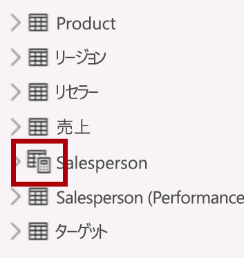

    "計算テーブルは、テーブルが返される DAX 式を使用して定義します。*計算テーブルは、値を具体化して格納するため、データ モデルのサイズが大きくなることを理解しておくことが重要です。新しい (将来の) 日付値がテーブルに読み込まれるこのデータ モデルの場合のように、数式の依存関係が更新されるたびに再計算されます。"*

    "Power Query に由来するテーブルとは異なり、計算テーブルを使用して外部データ ソースからデータを読み込むことはできません。*既にデータ モデルに読み込まれている内容に基づいてのみ変換できます。"*

4. モデル ビューに切り替えます。

5. **Salesperson** テーブルが使用可能であることを確認してください (非表示になっている可能性があります。その場合は水平方向にスクロールして見つけてください)。

6. **Salesperson \| EmployeeKey** 列から **Sales \| EmployeeKey** 列へのリレーションシップを作成します。

7. **Salesperson (Performance)** テーブルと **Sales** テーブルの間の非アクティブなリレーションシップを右クリックし、**[削除]** を選択します。

    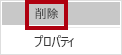

8. 削除するかどうかを確認するメッセージが表示されたら、**[削除]** をクリックします。

    

9. **Salesperson** テーブルで、次の列を複数選択し、非表示にします (**Is Hidden** プロパティを **[はい]** に設定します)。

    - EmployeeID

    - EmployeeKey

    - UPN

10. モデル ダイアグラムで、**Salesperson** テーブルを選択します。

11. **[プロパティ]** ペインの **[説明]** ボックスに、次のように入力します。**売上に関連する営業担当者**

    "ユーザーがカーソルをテーブルまたはフィールドの上に置くと、説明が **[フィールド]** ウィンドウにヒントとして表示されることを思い出すかもしれません。"

12. **Salesperson (Performance)** テーブルに対しては、次の説明を設定します。**地域に関連する営業担当者**

    "これで、販売員を分析するときに、データ モデルによって 2 つの代替手段が提供されるようになりました。***Salesperson** テーブルを使用すると、販売員による売上を分析できます。一方、**Salesperson (Performance)** テーブルでは、販売員に割り当てられた販売地域での売上を分析できます。"*

### <a name="task-3-create-the-date-table"></a>**タスク 3: Date テーブルを作成する**

このタスクでは、**Date** テーブルを作成します。

1. データ ビューに切り替えます。

    

2. **[ホーム]** リボン タブの **[計算]** グループの中から、**[新しいテーブル]** をクリックします。

    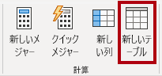

3. 数式バーに次のように入力します。


    **DAX**


    ```
    Date =  
    CALENDARAUTO(6)
    ```


    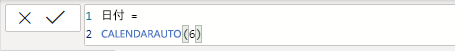

    
    "CALENDARAUTO() 関数では、日付値で構成される単一列のテーブルが返されます。 *"自動的な" 動作により、すべてのデータ モデルの日付列がスキャンされ、データ モデルに格納されている最も古い日付値と最も新しい日付値が決定されます。次に、この範囲内の各日付に対して 1 つの行が作成されます。範囲をいずれかの方向に拡張して、すべての年のデータが格納されるようにします。"*

    "この関数は、1 年の最後の月数である 1 つの省略可能な引数を受け取ることができます。*省略した場合、その値は 12 になります。12 月が年度の最終月であるという意味です。この場合は "6" が入力されています。6 月が年度の最終月であるという意味です。"*

4. 日付値の列に注目してください。

    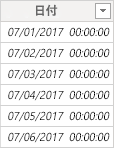

    *表示される日付は、米国の地域設定を使用して書式設定されています (mm/dd/yyyy)。*

5. 左下隅のステータス バーに、テーブルの統計情報が表示されているのがわかります。1826 行のデータが生成されていることを確認します。これは 5 年間全体のデータを表します。

    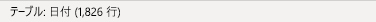

### <a name="task-4-create-calculated-columns"></a>**タスク 4:** **計算列を作成する**

このタスクでは、別の期間によるフィルター処理とグループ化を有効にする列を追加します。 また、計算列を作成して、他の列の並べ替え順序の制御も行います。

"利便性のために、このラボのすべての DAX 定義は、**D:\PL300\Labs\05-create-dax-calculations-in-power-bi-desktop\Assets\Snippets.txt** にあるスニペット ファイルからコピーできます。"

1. **[テーブル ツール]** コンテキスト リボンの **[計算]** グループ内から、**[新しい列]** をクリックします。

    

2. 数式バーに次のように入力 (またはスニペット ファイルからコピー) して、**Enter** キーを押します。


    **DAX**


    ```
    Year =
    "FY" & YEAR('Date'[Date]) + IF(MONTH('Date'[Date]) > 6, 1)
    ```


    "計算列を作成するには、最初に列名を入力し、続けて等号 (=) と、単一値の結果が返される DAX 式を入力します。*テーブル内に既に存在している列名は使用できません。"*

    "この数式では日付の年の値が使用されますが、月が 6 月よりも後の場合は、年の値に 1 が加算されます。*このようにして、Adventure Works 社の会計年度が計算されます。"*

3. 新しい列が追加されたことを確認します。

    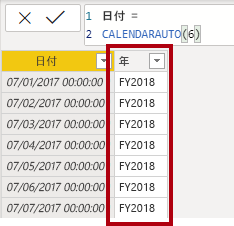

4. スニペットのファイル定義を使用して、**Date** テーブルに対して次の 2 つの計算列を作成します。

    - Quarter

    - Month

    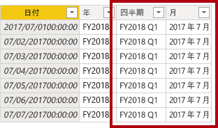

5. 計算を確認するために、レポート ビューに切り替えます。

6. 新しいレポート ページを作成するために、左下にあるプラス アイコンをクリックします。

    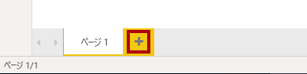

7. 新しいレポート ページに行列の視覚エフェクトを追加するには、**[視覚化]** ペインで、行列の視覚エフェクトの種類を選択します。

    *ヒント:各アイコンの上にカーソルを置くと、視覚エフェクトの種類について説明するヒントが表示されます。"*

    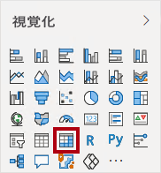

8. 「**フィールド**」ウィンドウの **Date** テーブル内から「**年**」フィールドを「**行**」ウェル/領域にドラッグします。

    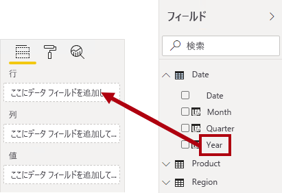

9. 「**月**」フィールドを「**年**」フィールドのすぐ下にある「**行**」ウェル/領域にドラッグします。

    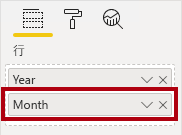

10. マトリックス ビジュアルの右上 (またはビジュアルの場所によっては下部) にある、分岐した二重矢印アイコンをクリックします (すべての年を 1 レベル下に展開します)。

    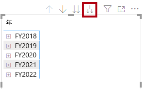

11. 年が月に展開され、月が時系列順ではなくアルファベット順に並べ替えられていることがわかります。

    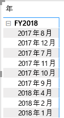

    *既定では、テキスト値はアルファベット順に、数値は昇順に、日付は最も古いものから最も新しいものの順に並べ替えられます。*

12. **Month** フィールドの並べ替え順序をカスタマイズするために、データ ビューに切り替えます。

13. **Date** テーブルに **MonthKey** 列を追加します。


    **DAX**


    ```
    MonthKey =
    (YEAR('Date'[Date]) * 100) + MONTH('Date'[Date])
    ```


    *この数式により、年と月の各組み合わせに対する数値が計算されます。*

14. データ ビューで、新しい列に数値が含まれていることを確認します (例: 2017 年 7 月に対して 201707、など)。

    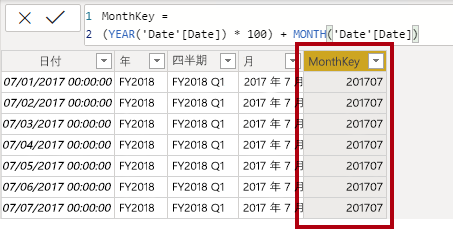

15. もう一度レポート ビューに切り替えます。

16. **[フィールド]** ペインで、**[Month]** フィールドが選択されていることを確認します (選択されている場合は、背景が濃い灰色になります)。

17. **[列ツール]** コンテキスト リボンで、**[並べ替え]** グループ内から **[列で並べ替え]** をクリックして、**[MonthKey]** を選択します。

    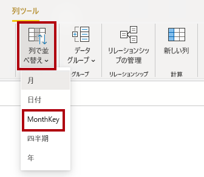

18. 行列の視覚エフェクト内で、月が時系列順に並べ替えられるようになったことがわかります。

    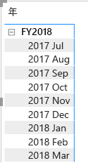

### <a name="task-5-complete-the-date-table"></a>**タスク 5:** **Date テーブルを完成させる**

このタスクでは、列を非表示にして階層を作成することにより、**Date** テーブルの設計を完了します。 その後、**Sales** テーブルと **Targets** テーブルに対するリレーションシップを作成します。

1. モデル ビューに切り替えます。

2. **Date** テーブルで、**MonthKey** 列を非表示にします (**Is Hidden** を **[はい]** に設定します)。

3. 右側の「**フィールド**」画面で **Date** テーブルを選択し、**Year** 列で右クリックし、「**階層の作成**」を選択します。 

4. 新しく作成した階層を右クリックして「**名前を変更**」をクリックし、「**Fiscal**」という名前に変更します。 
5. 次の 2 つの残りのフィールドを Fiscal 階層に追加します。これを行うには、「フィールド」画面でこれらを選択してから右クリックし、 **[階層に追加]**  ->  **[Fiscal]** の順に選択します。
    
    - Quarter

    - Month

    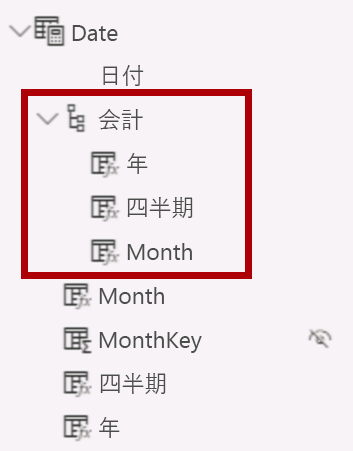

6. 次の 2 つのモデル リレーションシップを作成します。

    - **Date \| Date** から **Sales \| OrderDate** へ

    - **Date \| Date** から **Targets \| TargetMonth** へ

7. 次の 2 つの列を非表示にします。

    - Sales \| OrderDate

    - Targets \| TargetMonth

### <a name="task-6-mark-the-date-table"></a>**タスク 6: Date テーブルをマークする**

このタスクでは、**Date** テーブルを日付テーブルとしてマークします。

1. レポート ビューに切り替えます。

2. **[フィールド]** ペインで、**Date** テーブル (**Date** フィールドではありません) を選択します。

3. **[テーブル ツール]** コンテキスト リボンの **[カレンダー]** グループ内から、**[日付テーブルとしてマーク]** をクリックして、**[日付テーブルとしてマーク]** を選択します。

    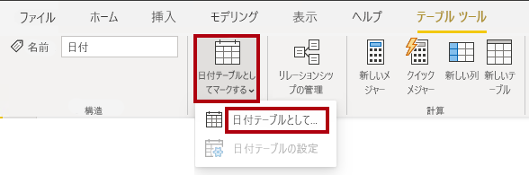

4. **[日付テーブルとしてマーク]** ウィンドウの **[日付列]** ドロップダウン リストから、**[日付]** を選択します。

    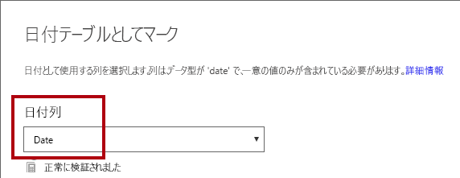

5. **[OK]** をクリックします。

    

6. Power BI Desktop ファイルを保存します。

    "これで、このテーブルによって日付 (タイム) が定義されていることが Power BI Desktop に認識されるようになりました。*タイム インテリジェンスの計算を利用する場合に重要です。タイム インテリジェンス計算については、「**Power BI Desktop で DAX 計算を作成する (パート 2)** 」ラボで扱います。"*

    "データ ソースに日付テーブルがない場合は、日付テーブルに対してこの設計方法が適しています。*データ ウェアハウスをお持ちの場合は、データ モデルで日付ロジックを「再定義」するのではなく、日付ディメンション テーブルから日付データをロードするのが適切です。"*

## <a name="exercise-2-create-measures"></a>**演習 2:メジャーを作成する**

この演習では、いくつかのメジャーを作成して書式設定します。

### <a name="task-1-create-simple-measures"></a>**タスク 1:シンプルなメジャーを作成する**

このタスクでは、単純なメジャーを作成します。 単純なメジャーは、単一の列の値を集計するか、テーブルの行をカウントします。

1. レポート ビューの **[ページ 2]** の **[フィールド]** ペインで、**Sales \| Unit Price** フィールドを行列の視覚エフェクトにドラッグします。

    "このラボでは、フィールドを参照するために簡略表記を使用します。*次のようになります。**Sales \| Unit Price**。この例では、**Sales** はテーブル名、**Unit Price** はフィールド名です。"*

    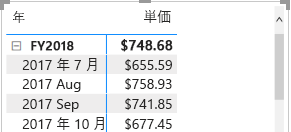

    "「**Power BI Desktop でのデータのモデル化 (パート 2)** 」ラボでは、**Unit Price** 列を **Average** で要約するように設定しました。*行列の視覚エフェクトに表示される結果は、月単位の平均単価 (単価値の合計を単価の数で割ったもの) です。"*

2. ビジュアル フィールド ウィンドウ (「**視覚化**」ウィンドウの下) の「**値**」フィールドのウェル/領域に、「**Unit Price**」が一覧表示されていることに注目してください。

    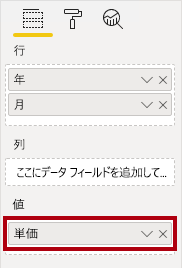

3. **[Unit Price]** の下向き矢印をクリックして、使用可能なメニュー オプションを確認します。

    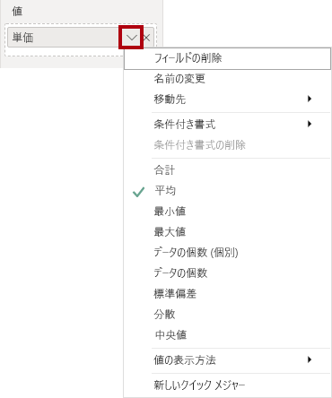

    "表示可能な数値列を使用すると、レポートの作成者は、レポートの設計時に列の値をどのように集計するか (またはしないか) を決定できます。*これにより、不適切な報告が発生する可能性があります。ただし、一部のデータ モデル作成者は、物事を偶然に任せたくないので、これらの列を非表示にし、メジャーで定義された集計ロジックを公開することを選択します。これは、このラボで採用するアプローチです。"*

4. メジャーを作成するには、**[フィールド]** ペインで **Sales** テーブルを右クリックして、**[新しいメジャー]** を選択します。

    

5. 数式バーに、次のメジャーの定義を追加します。


    **DAX**


    ```
    Avg Price =  
    ‎AVERAGE(Sales[Unit Price])
    ```


6. 「**Avg Price**」メジャーをマトリックス ビジュアルに追加します。

7. **Unit Price** 列と同じ結果が生成されることがわかります (ただし、書式設定は異なります)。

8. **[値]** で、**[Avg Price]** フィールドのコンテキスト メニューを開き、集計手法を変更できないことを確認します。

    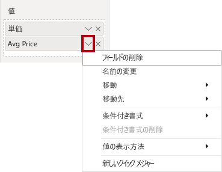

    "メジャーの集計動作を変更することはできません。"

9. スニペットのファイル定義を使用して、**Sales** テーブルに対して次の 5 つのメジャーを作成します。

    - Median Price

    - Min Price

    - Max Price

    - Orders

    - Order Lines

    "**Orders** メジャーで使用される DISTINCTCOUNT() 関数では、各注文が 1 回だけカウントされます (重複は無視されます)。***Order Lines** メジャーで使用される COUNTROWS() 関数は、テーブルに対して動作します。"*

    "この場合、注文数は、**SalesOrderNumber** 列の一意の値をカウントすることによって計算されますが、注文の行の数は、単純にテーブルの行の数になります (各行が 1 つの注文の 1 行になります)。"

10. モデル ビューに切り替えて、価格の 4 つのメジャーを複数選択します。**Avg Price**、**Max Price**、**Median Price**、および **Min Price** です。

11. 複数選択したメジャーに対して、次の要件を構成します。

    - 書式を小数点以下 2 桁に設定する

    - **Pricing** という名前の表示フォルダーに割り当てる

    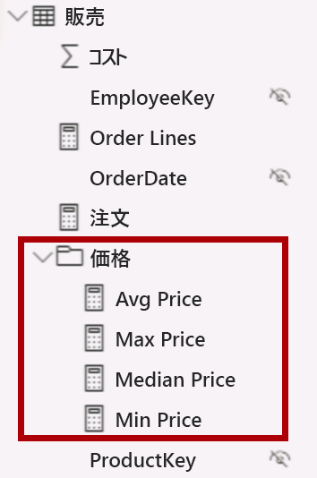

12. **Unit Price** 列を非表示にします。

    "これで、レポート作成者が **Unit Price** 列を使用できなくなりました。*モデルに追加した価格メジャーを使用する必要があります。この設計方法では、レポート作成者が不適切に (たとえば、価格を合計して) 価格を集計することができなくなります。"*

13. 「**Order Lines**」メジャーと「**Orders**」メジャーを複数選択し、次の要件を設定します。

    - 桁区切り記号を使用するように書式を設定する

    - **Counts** という名前の表示フォルダーに割り当てる

    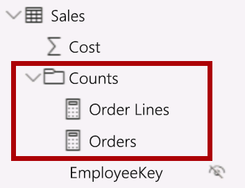

14. レポート ビューにある、マトリックス ビジュアルの「**値**」ウェル/領域で、「**Unit Price**」フィールドの「**X**」をクリックして削除します。

    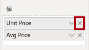

15. ページの幅と高さに合わせて、行列の視覚エフェクトのサイズを大きくします。

16. マトリックス ビジュアルに次の 5 つのメジャーを追加します。

    - Median Price

    - Min Price

    - Max Price

    - Orders

    - Order Lines

17. 結果が適切に表示され、正しく書式設定されていることを確認します。

    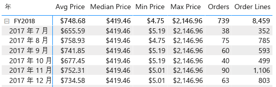


### <a name="task-2-finish-up"></a>**タスク 2: 完了**

このタスクでは、ラボを完了します。

1. Power BI Desktop ファイルを保存します。

2. 次のラボを開始する場合は、Power BI Desktop を開いたままにしておきます。

    "「**Power BI Desktop で DAX 計算を作成する (パート 2)** 」ラボでは、DAX を使用して、より高度な計算でデータ モデルを強化します。"
