---
lab:
  title: Power BI Desktop でレポートを設計する (パート 1)
  module: Module 7 - Create Reports
ms.openlocfilehash: 9aa794d25d2eb2ec611315a7ec6ac472e9a3a141
ms.sourcegitcommit: 3520e7d016e94549d408464207c1b91cd47867c2
ms.translationtype: HT
ms.contentlocale: ja-JP
ms.lasthandoff: 03/05/2022
ms.locfileid: "139273832"
---
# **Power BI Desktop でレポートを設計する (パート 1)**

**このラボの推定所要時間: 45 分**

このラボでは、3 ページのレポートを作成します。 次に、Power BI にそれを発行し、そこでレポートを開いて操作します。

このラボでは、次の作業を行う方法について説明します。

- レポートをデザインする

- 視覚化のフィールドと書式プロパティを構成する

### **ラボのストーリー**

このラボは、データの準備に始まり、レポートおよびダッシュボードとして発行するまでの完全なストーリーとして設計されたラボ シリーズの 1 つです。 ラボは任意の順序で完了できます。 しかしながら、複数のラボに取り組む場合は、最初の 10 のラボについては、次の順序で行うことをお勧めします。

1. Power BI Desktop でのデータの準備

2. Power BI Desktop にデータを読み込む

3. Power BI Desktop でデータをモデル化する

5. Power BI Desktop での DAX 計算の作成、パート 1

6. Power BI Desktop で DAX 計算を作成する (パート 2)

7. **Power BI Desktop でレポートを設計する (パート 1)**

8. Power BI Desktop でレポートを設計する (パート 2)

9. Power BI ダッシュボードを作成する

10. Power BI Desktop でデータ分析を実行する

11. 行レベルのセキュリティを実行する

## **演習 1: レポートを作成する**

この演習では、**売上レポート** という名前の 3 ページのレポートを作成します。

### **タスク 1: 開始する - サインイン**

このタスクでは、Power BI にサインインしてこのラボ用の環境を設定します。

*重要:既に Power BI にサインインしている場合は、次のタスクから続行します。"*

1. Microsoft Edge を開くには、タスク バーの Microsoft Edge プログラムのショートカットをクリックします。

    

1. Microsoft Edge ブラウザー ウィンドウで、**https://powerbi.com** に移動します。

    *ヒント:Microsoft Edge のお気に入りバーで、Power BI サービスのお気に入りを使用することもできます。"*

1. 「**サインイン**」 (右上隅) をクリックします。

    

1. 提供されたアカウントの詳細を入力します (**Resources** を確認します)。

1. パスワードの更新を求めるメッセージが表示されたら、提供されたパスワードを再入力し、新しいパスワードを入力して確認します。

    *重要:新しいパスワードは必ず記録しておいてください。"*

1. サインイン プロセスを完了します。

1. Microsoft Edge からサインインを維持するかどうかを確認するメッセージが表示されたら、「**はい**」をクリックします。

1. Microsoft Edge ブラウザー ウィンドウを開いたままにします。

### **タスク 2: 開始する - 地図と塗り分け地図の画像を有効にする**

このタスクでは、Power BI 管理ポータルで [統合の設定] を更新することにより、ラボ用の環境で地図と塗り分け地図の画像を有効にします。 

1. Power BI 管理ポータルを開くには、ブラウザーの右上にある **[設定]** アイコンをクリックします。

    

1. **[管理ポータル]** を選択します。

    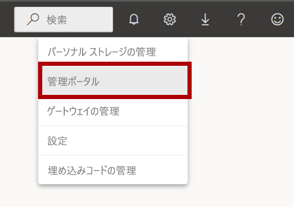

1. ページを下にスクロールして [統合の設定] に移動します。 矢印をクリックして、[地図と塗り分け地図の画像] オプションを展開します。

    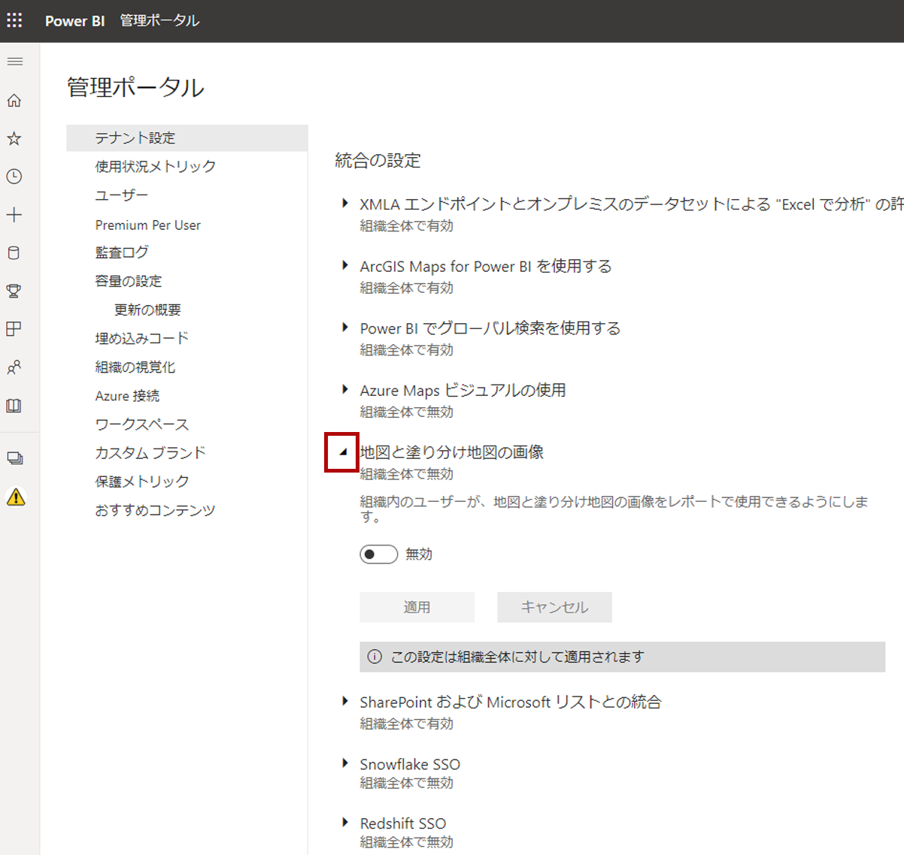

1. [地図と塗り分け地図の画像] オプションを **[有効]** に設定します。

1. **[適用]** をクリックして変更を適用します。 

    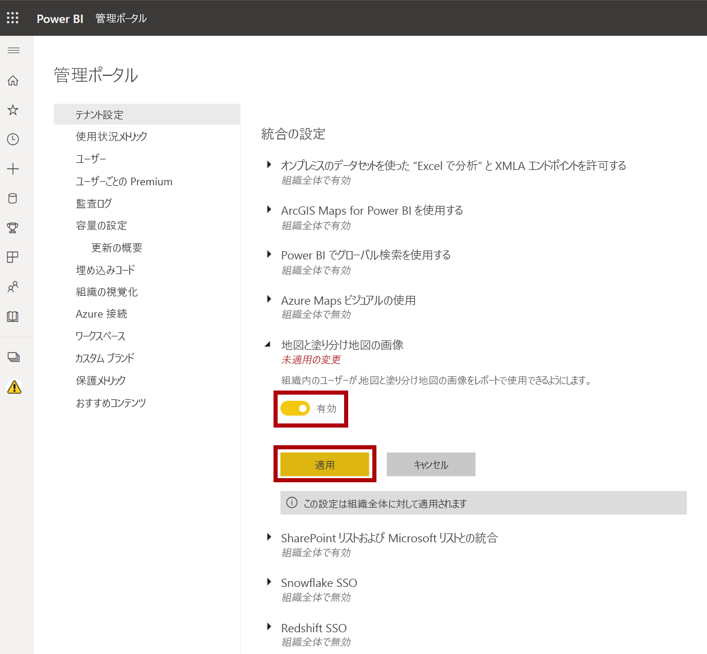

1. ブラウザーの右上に、[テナント設定] の変更が 15 分以内に適用されることを示すメッセージが表示されます。 

    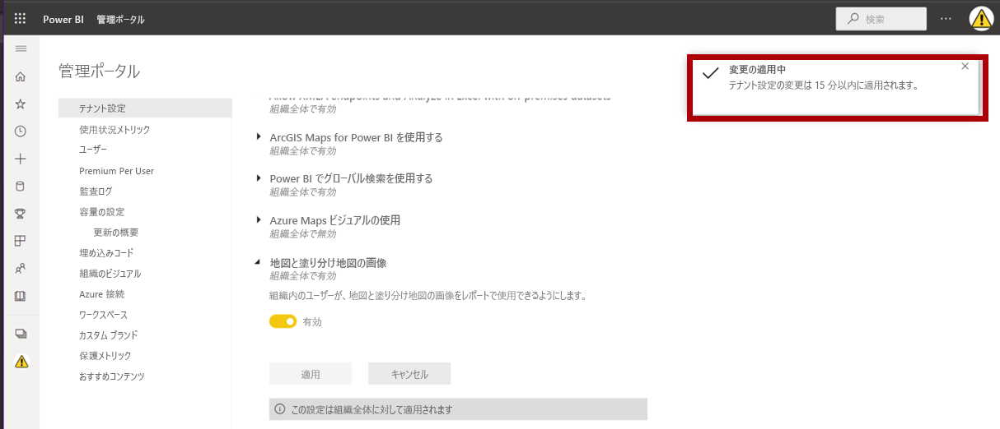

1. Microsoft Edge ブラウザー ウィンドウを開いたままにします。

### **タスク 3: 開始する - レポートを開く**

このタスクでは、スターター レポートを開いてこのラボ用の環境を設定します。

*重要:前のラボから続行している場合 (かつそのラボを正常に完了した場合) は、このタスクを実行しないで、次のタスクから続けてください。"*

1. Power BI Desktop を開くには、タスク バーにある Microsoft Power BI Desktop のショートカットをクリックします。

    

2. 「はじめに」ウィンドウを閉じるには、ウィンドウの左上にある「**X**」をクリックします。

    

3. Power BI サービスにサインインするには、右上の「**サインイン**」をクリックします。

    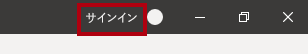

4. Power BI サービスへのサインインに使用したのと同じアカウントを使用して、サインイン プロセスを完了します。

5. スターター Power BI Desktop ファイルを開くには、「**ファイル**」リボン タブをクリックして、バックステージ ビューを開きます。

6. **[レポートを開く]** を選択します。

    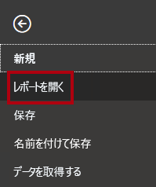

7. 「**レポートを参照**」をクリックします。

    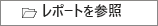

8. **[開く]** ウィンドウで、**D:\PL300\Labs\07-design-report-in-power-bi-desktop\Starter** フォルダーに移動します。

9. **Sales Analysis** ファイルを選択します。

10. **[開く]** をクリックします。

    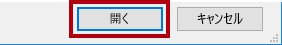

11. 情報ウィンドウが開いている場合はすべて閉じます。

12. ファイルのコピーを作成するには、「**ファイル**」リボン タブをクリックして、バックステージ ビューを開きます。

13. **[名前を付けて保存]** を選択します。

    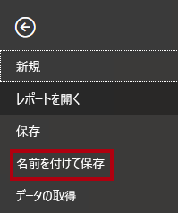

14. 変更を適用するかどうかを確認するメッセージが表示されたら、「**適用**」をクリックします。

    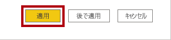

15. **[名前を付けて保存]** ウィンドウで、**D:\PL300\MySolution** フォルダーに移動します。

16. **[保存]** をクリックします。

    

### **タスク 4: ページ 1 をデザインする**

このタスクでは、最初のレポート ページをデザインします。 設計が完了すると、ページは次のようになります。

1. Power BI Desktop でページの名前を変更するには、左下の「**ページ 1**」を右クリックし、「**名前の変更**」を選択します。

    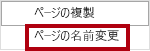

    *ヒント:ページ名をダブルクリックして名前を変更することもできます。"*

2. ページの名前を「**Overview**」に変更して、**Eenter** キーを押します。

    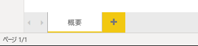

3. 画像を追加するには、**[挿入]** リボン タブで、**[要素]** グループ内の **[画像]** をクリックします。

    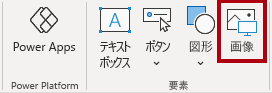

4. **[開く]** ウィンドウで、**D:\PL300\Resources** フォルダーに移動します。

5. **AdventureWorksLogo.jpg** ファイルを選択し、**[開く]** をクリックします。

    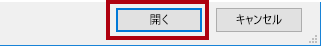

6. 画像をドラッグして左上隅に配置し、ガイド マーカーをドラッグしてサイズを変更します。

    

7. スライサーを追加するには、まずレポート ページの空いている領域をクリックして画像を選択解除します。
8. **[フィールド]** ペインで、**Date \| Year** フィールドを選択します (階層の **Year** レベルではありません)。
    
    "このラボでは、フィールドを参照するために簡略表記を使用します。*次のようになります。**Date \| Year**。この例では、**Date** はテーブル名、**Year** はフィールド名です。"*

9. 年の値のテーブルがレポート ページに追加されていることに注意してください。

10. 視覚化をテーブルからスライサーに変換するには、**[視覚化]** ペインで **[スライサー]** を選択します。

    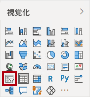

11. スライサーを一覧からドロップダウンに変換するには、スライサーの右上にある下向き矢印をクリックして、**[ドロップダウン]** を選択します。

    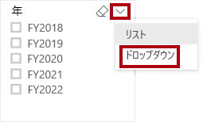

12. イメージの下に配置され、イメージと同じ幅になるようにスライサーのサイズと位置を変更します。

    

13. **Year** スライサーで、ドロップダウン リストを開き、**FY2020** を選択してドロップダウン リストを折りたたみます。

    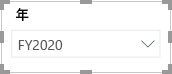

    "レポート ページは、**FY2020** 年でフィルター処理されるようになりました。"

14. レポート ページの空いている領域をクリックして、スライサーの選択を解除します。

15. **Region \| Region** フィールドを基にして、2 番目のスライサーを作成します (階層の **Region** レベルではありません)。

16. スライサーをリストのままにして、**Year** スライサーでスライサーのサイズを変更し、配置します。

    

17. スライサーの書式を設定するには、**[視覚化]** ペインの下にある **[書式]** ペインを開きます。

    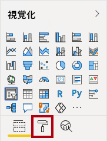

18. **[選択範囲のコントロール]** グループを展開します。

    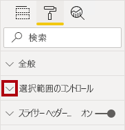

19. 「 **「すべて選択」オプションを表示**」を「**オン**」に設定します。

    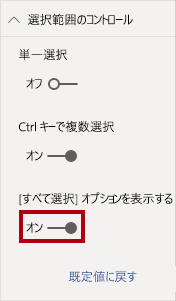

20. **Region** スライサーで、最初の項目が **[すべて選択]** になっていることを確認します。

    "この項目を選択すると、すべての項目が選択されるか、すべての項目が選択解除されます。*これにより、レポート ユーザーが必要なスライサー項目を設定しやすくなります。"*

21. レポート ページの空いている領域をクリックして、スライサーの選択を解除します。

22. ページにグラフを追加するには、**[視覚化]** ペインで、**[折れ線グラフおよび積み上げ縦棒グラフ]** 視覚化の種類をクリックします。

    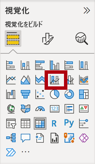

23. ビジュアルをロゴの右側に配置し、レポート ページの幅と等しくなるようにサイズを変更します。

    

24. 次のフィールドをビジュアルにドラッグ アンド ドロップします。

    - Date \| Month

    - Sales \| Sales

25. ビジュアル フィールド ウィンドウで (「**フィールド**」ウィンドウではなく ビジュアル フィールド ウィンドウは「**視覚化**」ウィンドウの下にあります)、フィールドが「**共有軸**」および「**列の値**」ウェル/領域に割り当てられていることに注目してください。

    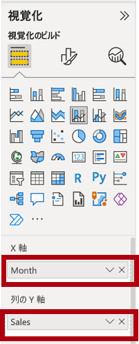

    "ビジュアルをビジュアルにドラッグすると、既定のウェル/領域に追加されます。*精度を高めるには、次に行うように、フィールドをウェル/領域に直接ドラッグできます。"*

26. **[フィールド]** ペインから、**Sales \| Profit Margin** を **[線の値]** ウェル/領域にドラッグします。

    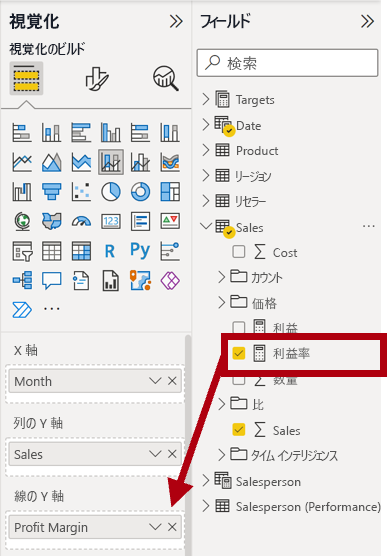

27. 視覚化に 11 か月しかないことに注意してください。

    "1 年の最後の月である 2020 年 6 月は、売上が (まだ) ありません。*既定で、売上が空の月は視覚化によって除去されています。次に、すべての月が表示されるように視覚化を構成します。"*

28. ビジュアル フィールド ウィンドウの「**共有軸**」ウェル/領域で、「**Month**」フィールドの下向き矢印をクリックし、「**データのないアイテムを表示**」を選択します。

    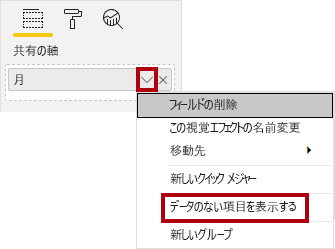

29. **2020 June** の月が表示されるようになったことに注意してください。

30. レポート ページの空いている領域をクリックして、グラフの選択を解除します。

31. ページにグラフを追加するには、**[視覚化]** ペインで、**[マップ]** 視覚化の種類をクリックします。

    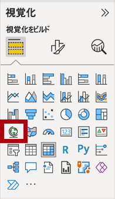

32. ビジュアルのサイズを変更して縦棒/折れ線グラフの下に配置し、上のグラフの幅の半分になるようにします。

    

33. 次のフィールドをビジュアル ウェル/領域に追加します。

    - 場所: **Region \| Country**

    - 凡例: **Product \| Category**

    - サイズ:**Sales \| Sales**

34. レポート ページの空いている領域をクリックして、グラフの選択を解除します。

35. ページにグラフを追加するには、**[視覚化]** ペインで、**[積み上げ横棒グラフ]** 視覚化の種類をクリックします。

    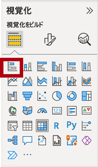

36. ビジュアルのサイズを変更し、残りのレポート ページ領域を埋めるように配置します。

    

37. 次のフィールドをビジュアル ウェル/領域に追加します。

    - 軸: **Product \| Category**

    - 値: **Sales \| Quantity**

38. 視覚化の書式を設定するには、**[書式]** ペインを開きます。

    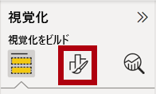

39. 「**データの色**」グループを展開し、「**既定の色**」プロパティを適切な色に設定します (縦棒グラフや折れ線グラフを補完する色)。

40. **[データ ラベル]** プロパティを **[オン]** に設定します。

    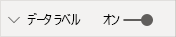

41. Power BI Desktop ファイルを保存します。

    *最初のページのデザインが完了しました。*

### **タスク 5: ページ 2 をデザインする**

このタスクでは、2 番目のレポート ページをデザインします。 設計が完了すると、ページは次のようになります。

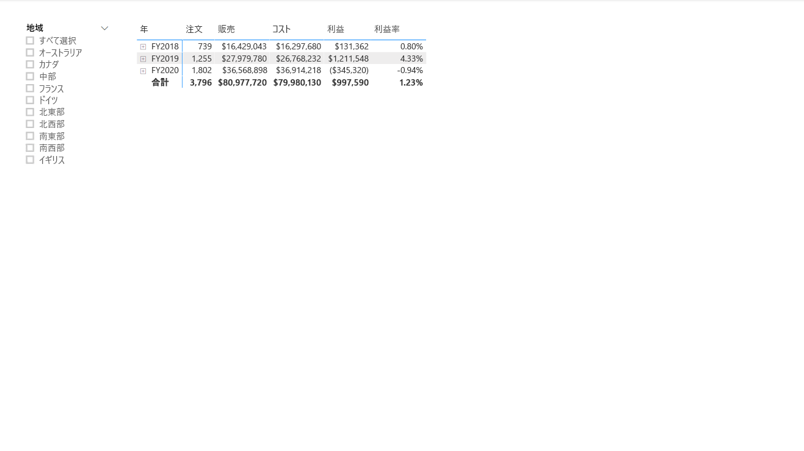

*重要:ラボに詳細な手順が既に用意されている場合は、ラボの手順により簡潔な手順が提供されます。詳細な手順が必要な場合は、このラボの他のタスクを参照してください。"*

1. 新しいページを作成するには、左下にあるプラス アイコンをクリックします。

    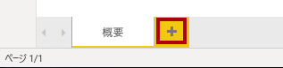

2. ページの名前を「**Profit**」に変更します。

    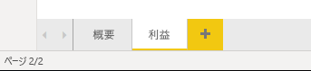

  
‎ 

3. **Region \| Region** フィールドに基づくスライサーを追加します。

4. 「**書式設定**」ウィンドウを使用して、(「**選択コントロール**」グループの) “すべて選択” オプションを有効にします。

5. スライサーのサイズを変更してレポート ページの左側に配置し、ページの高さの約半分になるようにします。

    

6. マトリックス ビジュアルを追加し、サイズを変更して配置して、レポート ページの残りの領域を埋めます

    

7. **Date \| Fiscal** 階層を、マトリックスの **[行]** ウェル/領域に追加します。

    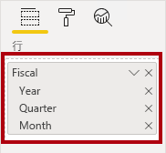

8. 次の 5 つの **Sales** テーブル フィールドを「**値**」ウェル/領域に追加します。

    - Orders (**Counts** フォルダーから)

    - Sales

    - Cost

    - Profit

    - 利益率

    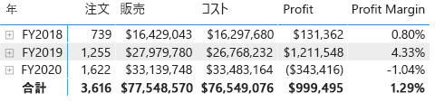

9. 「**フィルター**」ウィンドウ (「**視覚化**」ウィンドウの左側) で、「**このページでフィルター**」ウェル/領域を確認します (下にスクロールする必要がある場合があります)。

    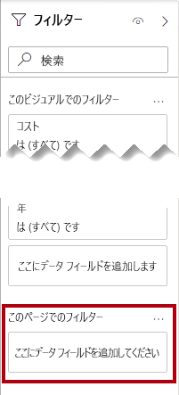

10. **[フィールド]** ペインから **Product \| Category** フィールドを **[このページでのフィルター]** ウェル/領域にドラッグします。

11. フィルター カード内の右上にある矢印をクリックして、カードを折りたたみます。

    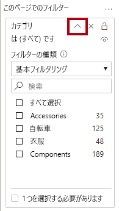

    " **[フィルター]** ペインにフィールドを追加すると、スライサーと同じ結果を得ることができます。*1 つの違いは、レポート ページのスペースを取らない点です。もう 1 つの違いは、より洗練されたフィルター処理要件を達成するように構成できることです。"*

12. 「**このページのフィルター**」ウェル/領域に、次の各「**Product**」テーブル フィールドを追加し、それぞれを折りたたみ、「**カテゴリ**」カードの真下にします。

    - Subcategory

    - Product

    - Color

    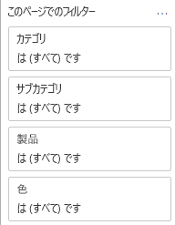

13. Power BI Desktop ファイルを保存します。

    *2 番目のページのデザインが完了しました。*

### **タスク 6 :ページ 3 をデザインする**

このタスクでは、3 番目 (そして最後の) レポート ページをデザインします。 設計が完了すると、ページは次のようになります。

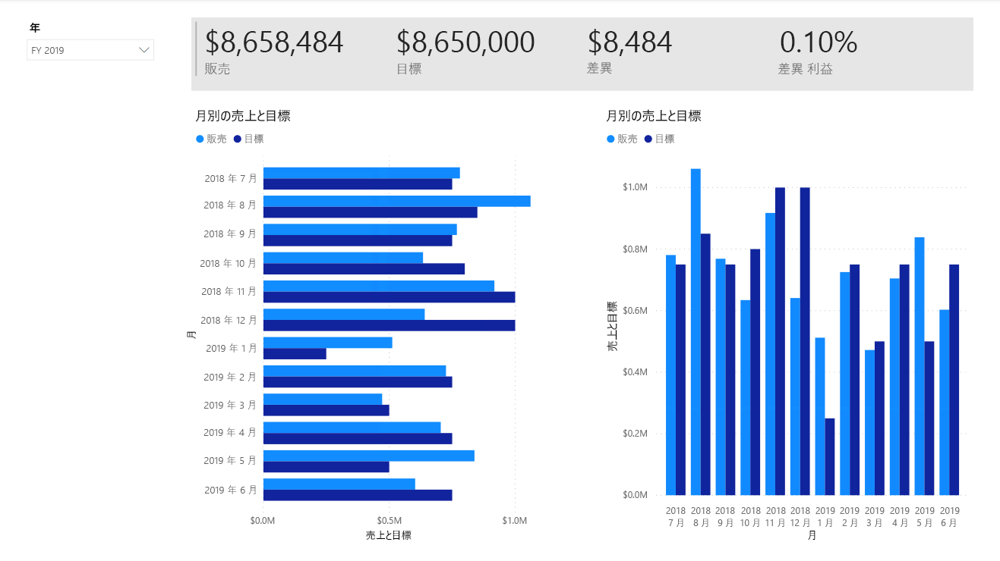

1. 新しいページを作成し、名前を「**My Performance**」に変更します。

1. 行レベルのセキュリティ フィルターのパフォーマンスをシミュレートするには、**Salesperson (Performance) \| Salesperson** フィールドを、[フィルター] ペインの [ページ レベル フィルター] にドラッグします。
    
    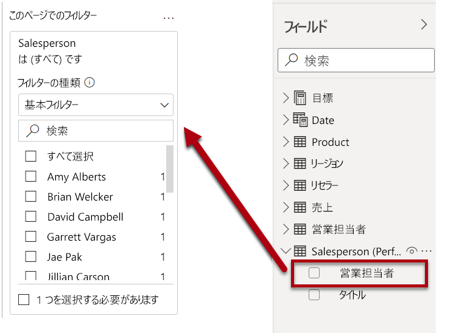 

1. 「**Michael Blythe**」を選択します。 「**マイ パフォーマンス**」レポート ページの日付は、Michael Blythe のみのデータを表示するためにフィルター処理されています。

1. **Date \| Year** フィールドに基づくドロップダウン スライサーを追加し、サイズと位置を変更してページの左上隅に配置します。

    

1. スライサーで、**FY2019** によってフィルター処理するようにページを設定します。

    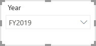

1. **[複数の行カード]** 視覚化を追加し、スライサーの右側でページの残りの幅を埋めるようにサイズと位置を変更します。

    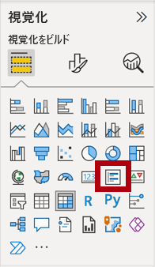

    

1. 視覚化に次の 4 つのフィールドを追加します。

    - Sales \| Sales

    - Targets \| Target

    - Targets \| Variance

    - Targets \| Variance Margin

1. 視覚化の書式を設定します。

    - **[データ ラベル]** グループで、**[テキスト サイズ]** プロパティを **28 pt** に増やします

    - **[背景]** グループで、**[色]** を明るい灰色に設定します

    

1. **クラスター棒グラフ** ビジュアルを追加し、複数行カード ビジュアルの下に位置し、ページの残りの高さと、複数行カード ビジュアルの幅の半分になるようにサイズを変更します。

    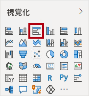

    

1. 次のフィールドをビジュアル ウェル/領域に追加します。

    - 軸: **Date \| Month**

    - 値: **Sales \| Sales** と **Targets \| Target**

    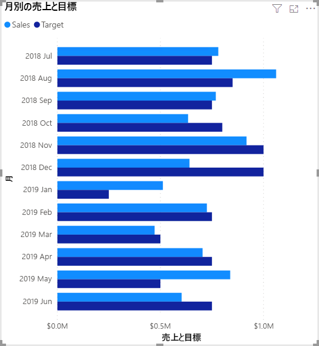

1. 視覚化のコピーを作成するには、**Ctrl + C** キーを押してから、**Ctrl + V** キーを押します。

1. 新しいビジュアルを元のビジュアルの右側に配置します。

    

1. 視覚エフェクトの種類を変更するには、**[視覚化]** ペインで **[集合縦棒グラフ]** を選択します。

    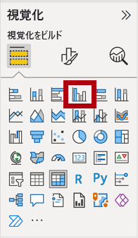

    "同じデータを 2 つの異なる視覚化の種類で表したものを見ることができるようになりました。*これはページ レイアウトの使い方としてはあまりよくありませんが、**Power BI Desktop でのレポートの設計、パート 2** ラボでは、ビジュアルを重ね合わせることで改善します。ページにボタンを追加して、2 つの視覚化のどちらを表示するかをレポートのユーザーが決定できるようにします。"*

    *3 番目 (最後) のページのデザインが完了しました。*

### **タスク 7: レポートを発行する**

このタスクでは、レポートを発行します。

1. **[概要]** ページを選択します。

2. Power BI Desktop ファイルを保存します。

3. **[ホーム]** リボン タブで、**[共有]** グループの **[発行]** をクリックします。

    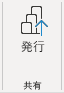

4. 「**Power BI に発行**」ウィンドウで、「**マイ ワークスペース**」が選択されていることを確認します。

5. レポートを発行するには、**[選択]** をクリックします。

    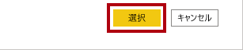

6. 発行が成功したら、**[了解]** をクリックします。

    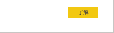

7. Power BI Desktop を開いたままにします。

    *次の演習では、Power BI サービスでレポートを探索します。*

## **演習 2: レポートを探索する**

この演習では、Power BI に発行されたレポートを探索します。

### **タスク 1: レポートを探索する**

このタスクでは、Power BI に発行されたレポートを探索します。

1. Microsoft Edge ブラウザー ウィンドウの Power BI サービスの「**ナビゲーション**」ウィンドウ (左側、折りたたまれている場合があります) で、「**マイ ワークスペース**」を展開します。

    

2. **販売分析** レポートとデータセットに注目して、ワークスペースの内容を確認します。

    *Power BI Desktop ファイルを発行したときに、データ モデルはデータセットとして発行されました。*

    "表示されない場合は、**F5** キーを押してブラウザーを再度読み込んでから、もう一度ワークスペースを展開します。"

    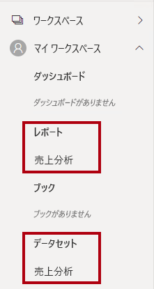

3. レポートを開くには、**販売分析** レポートをクリックします。

4. 左側の「**ページ**」ウィンドウで、「**概要**」ページを選択します。 

5. **Regions** スライサーで、**Ctrl** キーを押しながら複数の地域を選択します。

6. 縦棒と折れ線のグラフで、任意の月の列を選択して、ページをクロスフィルター処理します。

7. **Ctrl** キーを押しながら、追加の月を選択します。

    *既定で、クロスフィルター処理によってページ上の他のすべての視覚化がフィルター処理されます。*

8. 横棒グラフがフィルター処理されて強調表示されており、横棒の太字部分がフィルター処理された月を表していることに注意してください。

9. 棒グラフ ビジュアルの上にカーソルを置き、右上のフィルター アイコンにカーソルを合わせます。

    

    *フィルター アイコンを使用すると、他の視覚化からのスライサーとクロスフィルターも含めて、視覚化に適用されているすべてのフィルターがわかります。*

10. 横棒をポイントし、ヒントの情報を確認します。

11. クロスフィルターを取り消すには、縦棒と折れ線のグラフで、視覚化の空いている領域をクリックします。

12. マップ ビジュアルの上にカーソルを移動し、右上の「**フォーカス モード**」アイコンをクリックします。

    

    *フォーカス設定モードでは、視覚化が全ページ サイズに拡大されます。*

13. 棒グラフの別のセグメントにカーソルを合わせると、ヒントが表示されます。

14. レポートのページに戻るには、左上にある **[レポートに戻る]** をクリックします。

    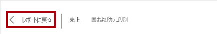

15. もう一度マップ ビジュアルの上にカーソルを移動し、右上の省略記号 (..) をクリックして、メニュー オプションに注目します。

    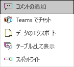

16. **[Chat in Teams]\(Teams でチャット\)** 以外のオプションを 1 つずつ試します。

17. 左側の **[ページ]** ペインで、**Profit** ページを選択します。

    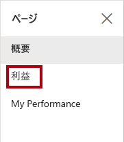

18. **Region** スライサーは、「**概要**」ページの **Region** スライサーとは異なる選択を行うことに注目してください。

    "スライサーが同期されていません。*「**Power BI Desktop でレポートをデザインする (パート 2)** 」ラボで、レポートのデザインを変更して、ページ間で同期されるようにします。"*

19. **[フィルター]** ペイン (右側にあります) でフィルター カードを展開し、フィルターをいくつか適用します。

    " **[フィルター]** ペインでは、スライサーとしてページに収まりきらない可能性があるほど多くのフィルターを定義できます。"

20. マトリックス視覚化で、プラス (+) ボタンを使用して **Fiscal** 階層の詳細を表示します。

21. **My Performance** ページを選択します。

    

22. メニュー バーの右上にある **[表示]** をクリックして、**[全画面]** を選択します。

    

23. スライサーを変更し、ページをクロスフィルター処理して、ページを操作します。

24. ウィンドウの最下部には、ページの変更、ページ間での前後への移動、または全画面表示モードを終了するためのコマンドがあります。

25. 左側のアイコンをクリックして、全画面表示モードを終了します。

    

### **タスク 2: 完了**

このタスクでは、ラボを完了します。

1. ワークスペースに戻るには、ウィンドウのウェブ ページのバナーで、「**マイ ワークスペース**」をクリックします。

    

2. Microsoft Edge ブラウザー ウィンドウを開いたままにします。

    "「**Power BI Desktop でレポートをデザインする (パート 2)** 」ラボでは、高度な機能を使用してレポートのデザインを強化します。"
