---
lab:
  title: Power BI Desktop でレポートを設計する (パート 2)
  module: Module 7 - Create Reports
ms.openlocfilehash: 13dbd8523318739a7e005f1023ab2ae8b32ce8a1
ms.sourcegitcommit: 3520e7d016e94549d408464207c1b91cd47867c2
ms.translationtype: HT
ms.contentlocale: ja-JP
ms.lasthandoff: 03/05/2022
ms.locfileid: "139273822"
---
# **Power BI Desktop でレポートを設計する (パート 2)**

**このラボの推定所要時間: 45 分**

このラボでは、高度なデザイン機能を使用して、**販売分析** を強化します。

このラボでは、次の作業を行う方法について説明します。

- スライサーを同期する

- ドリルスルー ページの作成

- 条件付き書式の適用

- ブックマークの作成と使用

### **ラボのストーリー**

このラボは、データの準備に始まり、レポートおよびダッシュボードとして発行するまでの完全なストーリーとして設計されたラボ シリーズの 1 つです。 ラボは任意の順序で完了できます。 しかしながら、複数のラボに取り組む場合は、最初の 10 のラボについては、次の順序で行うことをお勧めします。

1. Power BI Desktop でのデータの準備

2. Power BI Desktop にデータを読み込む

3. Power BI Desktop でデータをモデル化する

5. Power BI Desktop での DAX 計算の作成、パート 1

6. Power BI Desktop で DAX 計算を作成する (パート 2)

7. Power BI Desktop でレポートを設計する (パート 1)

8. **Power BI Desktop でレポートを設計する (パート 2)**

9. Power BI ダッシュボードを作成する

10. Power BI Desktop でデータ分析を実行する

11. 行レベルのセキュリティを実行する

## **演習 1: スライサーの同期を構成する**

この演習では、レポート ページ スライサーを同期します。

### タスク 1: 開始する - サインイン

このタスクでは、Power BI にサインインしてこのラボ用の環境を設定します。

*重要:既に Power BI にサインインしている場合は、次のタスクから続行します。"*

1. Microsoft Edge を開くには、タスク バーの Microsoft Edge プログラムのショートカットをクリックします。

    

1. Microsoft Edge ブラウザー ウィンドウで、**https://powerbi.com** に移動します。

    *ヒント:Microsoft Edge のお気に入りバーで、Power BI サービスのお気に入りを使用することもできます。"*

1. 「**サインイン**」 (右上隅) をクリックします。

    

1. 提供されたアカウントの詳細を入力します。

1. パスワードの更新を求めるメッセージが表示されたら、提供されたパスワードを再入力し、新しいパスワードを入力して確認します。

    *重要:新しいパスワードは必ず記録しておいてください。"*

1. サインイン プロセスを完了します。

1. Microsoft Edge からサインインを維持するかどうかを確認するメッセージが表示されたら、「**はい**」をクリックします。

1. Microsoft Edge ブラウザー ウィンドウの Power BI サービスの **[ナビゲーション]** ペインで、**[マイ ワークスペース]** を展開します。

    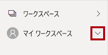

1. Microsoft Edge ブラウザー ウィンドウを開いたままにします。

### タスク 2: 開始する - レポートを開く

このタスクでは、スターター レポートを開いてこのラボ用の環境を設定します。

*重要:前のラボから継続している (および、そのラボを正常に完了した) 場合は、このタスクを完了させず、次のタスクから続行してください。*

1. Power BI Desktop を開くには、タスク バーにある Microsoft Power BI Desktop のショートカットをクリックします。

    

2. 「はじめに」ウィンドウを閉じるには、ウィンドウの左上にある「**X**」をクリックします。

    

3. Power BI サービスにサインインするには、右上の「**サインイン**」をクリックします。

    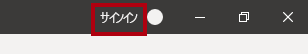

4. Power BI サービスへのサインインに使用したのと同じアカウントを使用して、サインイン プロセスを完了します。

5. スターター Power BI Desktop ファイルを開くには、「**ファイル**」リボン タブをクリックして、バックステージ ビューを開きます。

6. **[レポートを開く]** を選択します。

    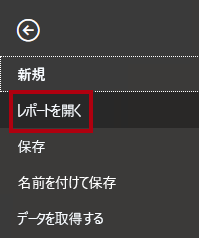

7. 「**レポートを参照**」をクリックします。

    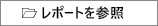

8. **[開く]** ウィンドウで、**D:\PL300\Labs\08-design-report-in-power-bi-desktop-enhanced\Starter** フォルダーに移動します。

9. **Sales Analysis** ファイルを選択します。

10. **[開く]** をクリックします。

    

11. 情報ウィンドウが開いている場合はすべて閉じます。

12. ファイルのコピーを作成するには、「**ファイル**」リボン タブをクリックして、バックステージ ビューを開きます。

13. **[名前を付けて保存]** を選択します。

    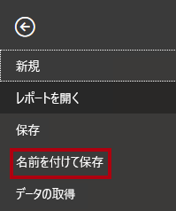

14. 変更を適用するかどうかを確認するメッセージが表示されたら、「**適用**」をクリックします。

    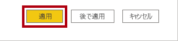

15. **[名前を付けて保存]** ウィンドウで、**D:\PL300\MySolution** フォルダーに移動します。

16. **[保存]** をクリックします。

    

### **タスク 3: スライサーを同期する**

このタスクでは、「**Year**」と「**Region**」スライサーを同期します。

"「**Power BI Desktop でレポートを設計する (パート 1)** 」のラボで作成したレポートの開発を継続します。"

1. Power BI Desktop の **[概要]** ページで、**[年]** スライサーを **FY2018** に設定します。

2. **[My Performance]** ページに移動すると、**[Year]** スライサーの値が異なっていることがわかります。

    "スライサーが同期されていないと、データが誤って表示され、レポート ユーザーのフラストレーションにつながる可能性があります。*ここで、レポート スライサーを同期します。"*

3. **[概要]** ページに戻り、**[年]** スライサーを選択します。

4. **[表示]** リボン タブの **[ペインを表示する]** グループ内の **[スライサーの同期]** をクリックします。

    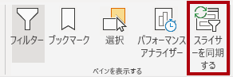

5. **[スライサーの同期]** ペイン (**[視覚化]** ペインの左側) の 2 番目の列 (同期中を表します) で、**[Overview]** ページと **[My Performance]** ページのチェックボックスをオンにします。

    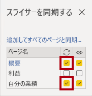

6. **[Overview]** ページで、**[Region]** スライサーを選択します。

7. スライサーを **[Overview]** ページおよび **[Profit]** ページと同期します。

    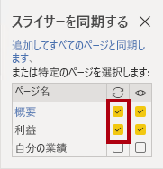

8. さまざまなフィルター オプションを選択してスライサーの同期をテストし、同期されたスライサーが同じ選択でフィルター処理されることを確認します。

9. **[スライサーの同期]** ページを閉じるには、ペインの右上にある **[X]** をクリックします。

    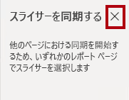

## **演習 2:ドリルスルーを構成する**

この演習では、新しいページを作成し、ドリル スルー ページとして構成します。 設計が完了すると、ページは次のようになります。

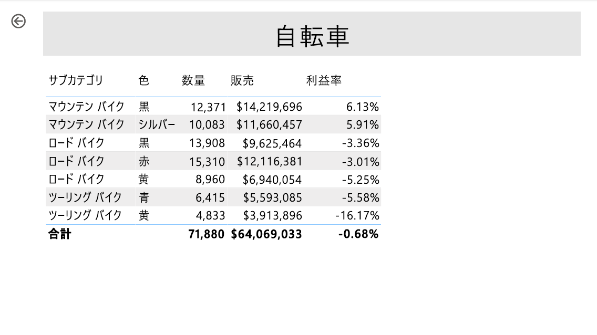

### **タスク 1: ドリルスルー ページを作成する**

このタスクでは、新しいページを作成し、ドリル スルー ページとして構成します。

1. 「**Product Details**」という名前の新しいレポート ページを追加します。

    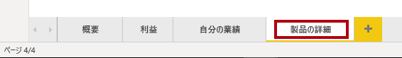

2. **[Product Details]** ページ タブを右クリックし、**[ページを非表示にする]** を選択します。

    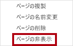

    "レポート ユーザーがドリルスルー ページに直接アクセスすることはできません。*他のページのビジュアルからアクセスする必要があります。このラボの最後の演習では、このページにドリルスルーする方法を学習します。"*

3. **[視覚化]** ペインの下にある **[ドリルスルー]** セクションで、**Product \| Category** フィールドを **[Add Drill-Through Fields Here]\(ドリルスルー フィールドをここに追加します\)** ボックスに追加します。

    "このラボでは、フィールドを参照するために簡略表記を使用します。*次のようになります。**Product \| Category**。この例では、**Product** はテーブル名、**Category** はフィールド名です。"*

    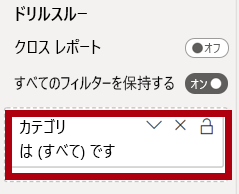

4. ドリルスルー ページをテストするには、ドリルスルー フィルター カードで **[Bikes]** を選択します。

    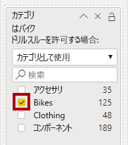

5. レポート ページの左上にある矢印ボタンにお気付きでしょうか。

    

    "フィールドがドリル スルー ウェルまたは領域に追加されると、ボタンが自動的に追加されます。*これを使うと、レポート ユーザーがドリルスルー元のページに戻ることができます。"*

6. ページに **カード** ビジュアルを追加し、サイズを変更して、ボタンの右側に配置し、ページの残りの幅を埋めるようにします。

    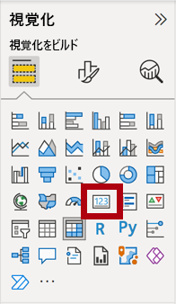

    

7. カードのビジュアルに **Product \| Category** フィールドをドラッグします。

8. 視覚化の書式オプションを構成してから、**[カテゴリ ラベル]** プロパティを **[オフ]** にします。

    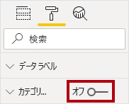

9. **[背景色]** プロパティを灰色の薄い網掛けに設定します。

10. ページに「**テーブル**」ビジュアルを追加し、サイズを変更して、カード ビジュアルの下に配置し、ページ上の残りの領域を埋めます。

    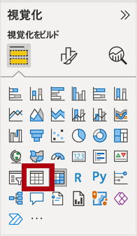

    

11. 視覚化に次のフィールドを追加します。

    - Product \| Subcategory

    - Product \| Color

    - Sales \| Quantity

    - Sales \| Sales

    - Sales \| Profit Margin

12. ビジュアルの書式オプションを構成し、**[グリッド]** セクションで、**[文字のサイズ]** プロパティを **[20pt]** に設定します。

    "ドリル スルー ページの設計はほぼ完了です。*次の演習では、条件付き書式を使用してページを拡張します。"*

## **演習 3: 条件付き書式を追加する**

この演習では、条件付き書式を使用してドリル スルー ページを拡張します。 設計が完了すると、ページは次のようになります。

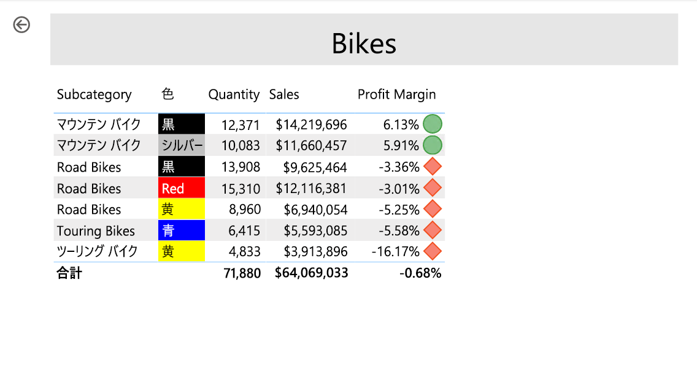

### **タスク 1: 条件付き書式を追加する**

このタスクでは、条件付き書式を使用してドリル スルー ページを拡張します。

1. テーブル視覚化を選択します。

2. [視覚化] ペインで、 **[Profit Margin]** 値の上の下矢印をクリックして、次に **Conditional Formatting\| Icons** を選択します。

    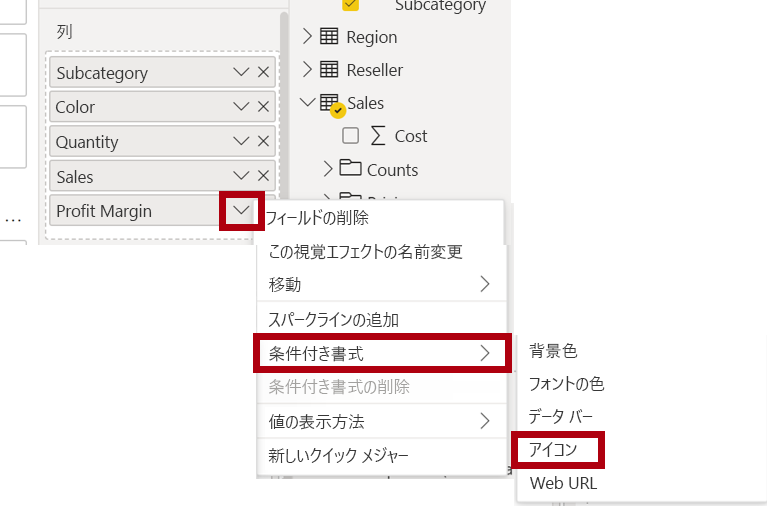

3. 「**アイコン - Profit Margin**」ウィンドウの「**アイコン レイアウト**」ドロップダウン リストで、「**データの右**」を選択します。

    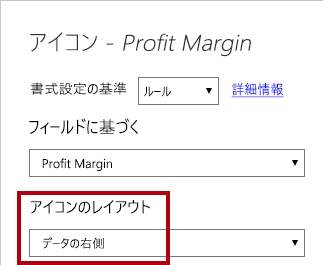

4. 中央のルールを削除するには、黄色の三角形の左側にある **[X]** をクリックします。

    

5. 次のように、最初のルール (赤色のひし形) を構成します。

    - 2 つ目のコントロールで値を削除します

    - 3 つ目のコントロールで **[番号]** を選択します

    - 5 つ目のコントロールに「**0**」と入力します

    - 6 つ目のコントロールで **[番号]** を選択します

6. 次のように、2 つ目のルール (緑色の円) を構成します。

    - 2 つ目のコントロールに「**0**」と入力します

    - 3 つ目のコントロールで **[番号]** を選択します

    - 5 つ目のコントロールで値を削除します

    - 6 つ目のコントロールで **[番号]** を選択します

    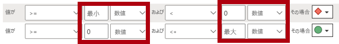

    "ルールは次のように解釈できます。利益率の値が 0 未満の場合は赤いひし形を表示します。それ以外の場合は、値が 0 以上の場合は、緑の円を表示します。"

7. **[OK]** をクリックします。

    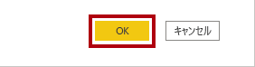

8. テーブル視覚化で、正しいアイコンが表示されていることを確認します。

    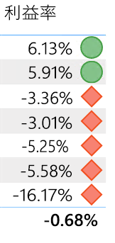

9. **[色]** フィールドの背景色の条件付き書式を構成します。

10. 「**背景色 - 色**」ウィンドウの「**書式設定**」ドロップダウン リストで、「**フィールド値**」を選択します。

    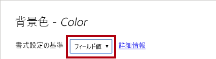

11. **[フィールドに基づく]** ドロップダウン リストで、**Product \| Formatting \| Background Color Format** を選択します。

    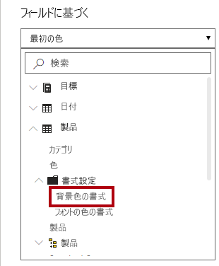

12. **[OK]** をクリックします。

    

13. 前の手順を繰り返し、**Product \| Formatting \| Font Color Format** フィールドを使用して、 **[Color]** フィールドのフォント色の条件付き書式を設定します

    "背景とフォントの色は、「**Power BI Desktop でのデータの準備**」のラボの **ColorFormats.csv** ファイルから取得し、「**Power BI Desktop にデータを読み込む**」のラボの **Product** クエリに統合したことを思い出すかもしれません。"

## **演習 4: ブックマークとボタンを追加する**

この演習では、「**マイ パフォーマンス**」ページをボタンで拡張し、レポート ユーザーが表示するビジュアル タイプを選択できるようにします。 設計が完了すると、ページは次のようになります。

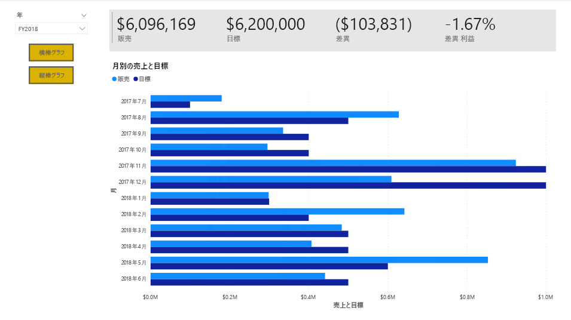

### **タスク 1: ブックマークを追加する**

このタスクでは、月ごとの販売/目標ビジュアルを表示する 2 つのブックマークを追加します。

1. **[My Performance]\(マイ パフォーマンス\)** ページに移動します。

2. **[表示]** リボン タブの **[ペインを表示する]** グループ内の **[ブックマーク]** をクリックします。

    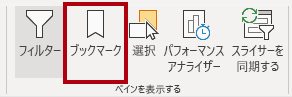

3. **[表示]** リボン タブの **[ペインを表示する]** グループ内の **[選択]** をクリックします。

    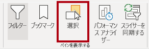

4. **[選択]** ペインで、**[Sales and Target by Month]\(月別売上高と目標\)** 項目の横にある視覚化を非表示にするには、目のアイコンをクリックします。

    

5. **[ブックマーク]** ペインで **[追加]** をクリックします。

    

6. ブックマークの名前を変更するには、ブックマークをダブルクリックします。

7. 表示されているグラフが横棒グラフの場合は、ブックマークの名前を「**Bar Chart ON**」に変更します。それ以外の場合は、ブックマークの名前を「**Column Chart ON**」に変更します。

8. ブックマークを編集するには、**[ブックマーク]** ペインでブックマークにカーソルを合わせて省略記号をクリックしてから **[データ]** を選択します。

    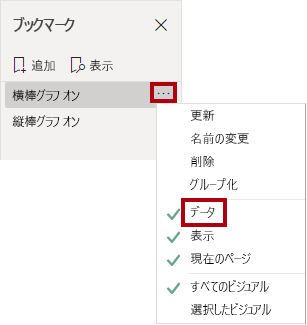

    " **[データ]** オプションを無効にすると、ブックマークで現在のフィルターの状態が使用されなくなります。*これが重要である理由は、そのようにしないと、現在 **[Year]** スライサーによって適用されているフィルターがブックマークによって永久にロックされるからです。"*

9. ブックマークを更新するには、省略記号をもう一度クリックし、「**更新**」を選択します。

    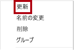

    *次の手順では、2 つ目のブックマークを作成および構成して、2 つ目の視覚化を表示します。*

10. **[選択]** ペインで、2 つの **[Sales and Target by Month]\(月別売上高と目標\)** 項目の表示を切り替えます。

    *つまり、表示されている視覚化を非表示にし、非表示の視覚化を表示します。*

    

11. 2 つ目のブックマークを作成し、適切な名前を付けます (「**Column Chart ON**」または「**Bar Chart ON**」)。

    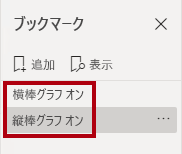

12. 2 つ目のブックマークを構成してフィルターを無視し (**[データ]** オプションをオフ)、ブックマークを更新します。

13. 「**選択**」ウィンドウで、両方のビジュアルを表示するには、非表示のビジュアルを表示するだけです。

14. 両方の視覚化のサイズと位置を変更して、マルチカード視覚化の下のページ全体に表示し、互いに完全に重なり合うようにします。

    *ヒント:隠れているビジュアルを選択するには、 **[選択]** ペインで選択します。"*

    

15. **[ブックマーク]** ペインで各ブックマークを選択します。1 つの視覚化のみが表示されることに注目してください。

    *デザインの次の段階は、ページに 2 つのボタンを追加することです。これで、レポート ユーザーはブックマークを選択できるようになります。*

### **タスク 2: ボタンを追加する**

このタスクでは、2 つのボタンを追加し、それぞれにブックマーク アクションを割り当てます。

1. **[挿入]** リボンの **[要素]** グループ内の **[ボタン]** をクリックし、**[空白]** を選択します。

    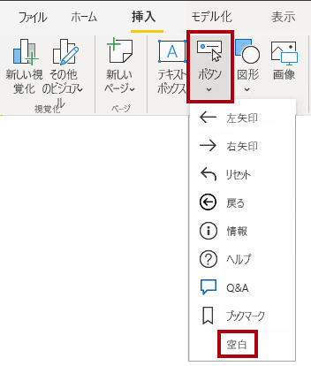

2. **Year** スライサーの真下にボタンを配置します。

3. ボタンを選択し、 **[ボタンの書式設定]** ペインで、 **[ボタン テキスト]** プロパティを **[オン]** にします。

    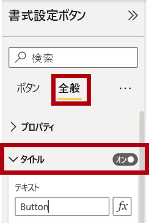

4. **[ボタン テキスト]** セクションを展開し、**[ボタン テキスト]** ボックスに「**Bar Chart**」と入力します。

5. **[背景]** セクションを展開してから、補完的な色を使用して背景色を設定します。

6. **[アクション]** プロパティを **[オン]** に変更します (リストの一番下近くにあります)。

    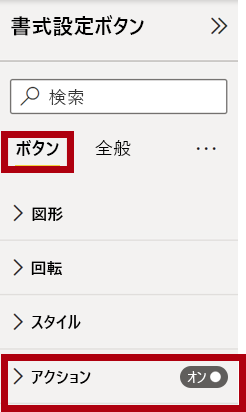

7. **[アクション]** セクションを展開し、**[種類]** ドロップダウン リストを **[ブックマーク]** に設定します。

8. **[ブックマーク]** ドロップダウン リストで、**[Bar Chart ON]\(横棒グラフ オン\)** を選択します。

    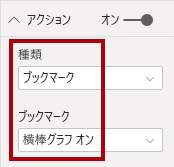

9. コピーと貼り付けを使用してボタンのコピーを作成し、次のように新しいボタンを構成します。

    *ヒント:コピーと貼り付けのショートカット コマンドは、**Ctrl+C** キーに続いて **Ctrl+V** キーです。"*

    - **[ボタン テキスト]** プロパティを **[縦棒グラフ]** に設定します

    - **[アクション]** セクションで、**[ブックマーク]** ドロップダウン リストを **[Column Chart ON]\(横棒グラフ オン\)** に設定します

    *これで、Sales Analysis レポートのデザインが完成しました。*

### **タスク 3: レポートを発行する**

このタスクでは、レポートを発行します。

1. **[概要]** ページを選択します。

2. **[年]** スライサーで、**[FY2020]** を選択します。

3. **[地域]** スライサーで、**[すべて選択]** を選択します。

4. Power BI Desktop ファイルを保存します。

    *Power BI サービスに発行する前に必ず、ファイルを保存する必要があります。*

5. **[ホーム]** リボン タブで、**[共有]** グループの **[発行]** をクリックします。

    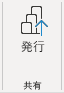

6. 「**Power BI に発行**」ウィンドウで、「**マイ ワークスペース**」が選択されていることを確認します。

7. レポートを発行するには、**[選択]** をクリックします。

    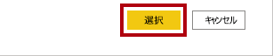

8. データセットを置き換えるメッセージが表示されたら、「**置換**」をクリックします。

9. 発行が成功したら、**[了解]** をクリックします。

    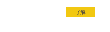

10. Power BI Desktop を閉じます。

    *次の演習では、Power BI サービスでレポートを探索します。*

## **演習 5: レポートを探索する**

この演習では、Power BI サービスのレポートを探索します。

### **タスク 1: レポートを探索する**

このタスクでは、Power BI サービスのレポートを探索します。

1. Microsoft Edge ブラウザー ウィンドウの Power BI サービスの「**ナビゲーション**」ウィンドウで、**販売分析** レポートをクリックします。

2. ドリルスルー レポートをテストするには、 **[概要]** ページの **[Quantity by Category]\(カテゴリ別数量\)** ビジュアルで **[Clothing]** バーを右クリックし、 **[ドリルスルー] \| [製品の詳細]** を選択します。

    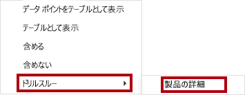

3. **[製品の詳細]** ページが **[Clothing]\(衣類\)** 用であることに注目してください。

4. ソース ページに戻るには、ページの左上隅の矢印ボタンをクリックします。

5. **My Performance** ページを選択します。

6. 各ボタンをクリックすると、別のビジュアルが表示されることに注目してください。

### **タスク 2: 完了**

このタスクでは、ラボを完了します。

1. ワークスペースに戻るには、ウィンドウのウェブ ページのバナーで、「**マイ ワークスペース**」をクリックします。

    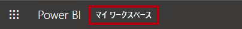

2. Microsoft Edge ブラウザー ウィンドウを開いたままにします。
