---
lab:
  title: Power BI ダッシュボードを作成する
  module: Module 8 - Create Dashboards
ms.openlocfilehash: 777dc5fb86f71c926a347c736896834fdf2baed2
ms.sourcegitcommit: 3520e7d016e94549d408464207c1b91cd47867c2
ms.translationtype: HT
ms.contentlocale: ja-JP
ms.lasthandoff: 03/05/2022
ms.locfileid: "139273811"
---
# **Power BI ダッシュボードを作成する**

**このラボの推定所要時間: 45 分**

このラボでは、**売上モニタリング** ダッシュボードを作成します。

このラボでは、次の作業を行う方法について説明します。

- ダッシュボードに視覚化をピン留めする

- Q&A を使用してダッシュボード タイルを作成する

### **ラボのストーリー**

このラボは、データの準備に始まり、レポートおよびダッシュボードとして発行するまでの完全なストーリーとして設計されたラボ シリーズの 1 つです。 ラボは任意の順序で完了できます。 しかしながら、複数のラボに取り組む場合は、最初の 10 のラボについては、次の順序で行うことをお勧めします。

1. Power BI Desktop でのデータの準備

2. Power BI Desktop にデータを読み込む

3. Power BI Desktop でデータをモデル化する

5. Power BI Desktop での DAX 計算の作成、パート 1

6. Power BI Desktop で DAX 計算を作成する (パート 2)

7. Power BI Desktop でレポートを設計する (パート 1)

8. Power BI Desktop でレポートを設計する (パート 2)

9. **Power BI ダッシュボードを作成する**

10. Power BI Desktop でデータ分析を実行する

11. 行レベルのセキュリティを実行する

## **演習 1: ダッシュボードを作成する**

この演習では、**売上モニタリング** ダッシュボードを作成します。 完成したダッシュボードは次のようになります。

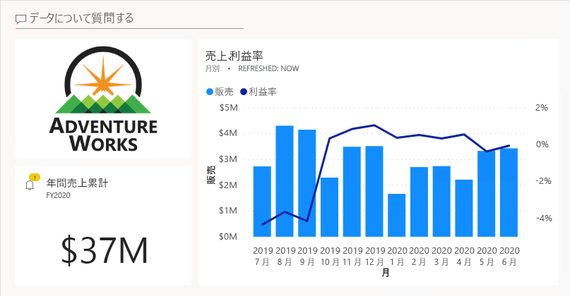

### **タスク 1: 開始する - サインイン**

このタスクでは、Power BI にサインインしてこのラボ用の環境を設定します。

*重要:前のラボで既に Power BI にサインインしている場合は、次のタスクから続行します。"*

1. Microsoft Edge を開くには、タスク バーの Microsoft Edge プログラムのショートカットをクリックします。

    

2. Microsoft Edge ブラウザー ウィンドウで、**https://powerbi.com** に移動します。

    *ヒント:Microsoft Edge のお気に入りバーで、Power BI サービスのお気に入りを使用することもできます。"*

3. 「**サインイン**」 (右上隅) をクリックします。

    

4. 提供されたアカウントの詳細を入力します。

5. パスワードの更新を求めるメッセージが表示されたら、提供されたパスワードを再入力し、新しいパスワードを入力して確認します。

    *重要:新しいパスワードは必ず記録しておいてください。"*

6. サインイン プロセスを完了します。

7. Microsoft Edge からサインインを維持するかどうかを確認するメッセージが表示されたら、「**はい**」をクリックします。

8. Microsoft Edge ブラウザー ウィンドウの Power BI サービスの **[ナビゲーション]** ペインで、**[マイ ワークスペース]** を展開します。

    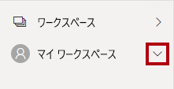

9. Microsoft Edge ブラウザー ウィンドウを開いたままにします。

### **タスク 2: 開始する - レポートを開く**

このタスクでは、スターター レポートを開いてこのラボ用の環境を設定します。

*重要:前のラボから継続している (および、そのラボを正常に完了した) 場合は、このタスクを完了させず、次のタスクから続行してください。*

1. Power BI Desktop を開くには、タスク バーにある Microsoft Power BI Desktop のショートカットをクリックします。

    

2. 「はじめに」ウィンドウを閉じるには、ウィンドウの左上にある「**X**」をクリックします。

    

3. Power BI Desktop が Power BI サービスにサインインしていない場合は、右上の「**サインイン**」をクリックします。

    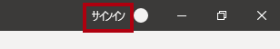

4. Power BI サービスへのサインインに使用したのと同じアカウントを使用して、サインイン プロセスを完了します。

5. スターター Power BI Desktop ファイルを開くには、「**ファイル**」リボン タブをクリックして、バックステージ ビューを開きます。

6. **[レポートを開く]** を選択します。

    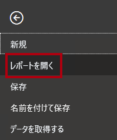

7. 「**レポートを参照**」をクリックします。

    

8. **[開く]** ウィンドウで、**D:\PL300\Labs\09-create-power-bi-dashboard\Starter** フォルダーに移動します。

9. **Sales Analysis** ファイルを選択します。

10. **[開く]** をクリックします。

    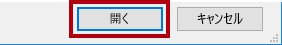

11. 情報ウィンドウが開いている場合はすべて閉じます。

12. ファイルのコピーを作成するには、「**ファイル**」リボン タブをクリックして、バックステージ ビューを開きます。

13. **[名前を付けて保存]** を選択します。

    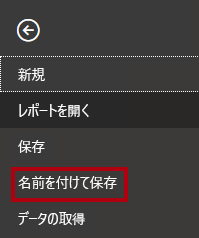

14. 変更を適用するかどうかを確認するメッセージが表示されたら、「**適用**」をクリックします。

    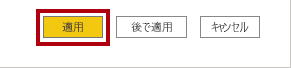

15. **[名前を付けて保存]** ウィンドウで、**D:\PL300\MySolution** フォルダーに移動します。

16. **[保存]** をクリックします。

    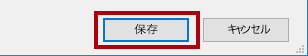

### **タスク 3: 開始する - レポートを発行する**

このタスクでは、データセットを作成してこのラボ用の環境を設定します。

*重要:「**Power BI Desktop でレポートを設計する (パート 2)** 」のラボでレポートを既に発行している場合は、次のタスクから続行してください。"*

1. Microsoft Edge ブラウザー ウィンドウの Power BI サービスの「**ナビゲーション**」ウィンドウで、「**マイ ワークスペース**」を展開します。

    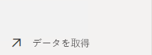

2. 「**ファイル**」タイルで、「**取得**」をクリックします。

    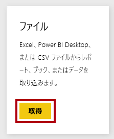

3. 「**ローカル ファイル**」タイルをクリックします。

    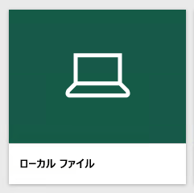

4. **[開く]** ウィンドウで、**D:\PL300\Labs\08-design-report-in-power-bi-desktop-enhanced\Solution** フォルダーに移動します。

5. **Sales Analysis.pbix** ファイルを選択し、「**開く**」をクリックします。

6. データセットを置き換えるメッセージが表示されたら、「**置換**」をクリックします。

### **タスク 4: ダッシュボードを作成する**

このタスクでは、**売上モニタリング** ダッシュボードを作成します。 レポートからビジュアルをピン留めし、画像データの URI に基づいてタイルを追加し、Q&A を使用してタイルを作成します。

1. Microsoft Edge ブラウザー ウィンドウで、Power BI サービス内の **[販売分析]** レポートを開きます。

2. **[概要]** ページで、**[年]** スライサーを **FY2020** に設定します。

    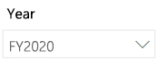

3. **[リージョン]** スライサーを **[すべて選択]** に設定します。

    *視覚化をダッシュボードにピン留めすると、現在のフィルター コンテキストが使用されます。ピン留めした後は、フィルター コンテキストを変更できません。時間ベースのフィルターの場合、相対日付スライサー (または、相対時間ベースの質問を使用した Q&A) を使用することをお勧めします。"*

4. ダッシュボードを作成して視覚化をピン留めするには、**[Sales and Profit Margin by Month]\(月別の売上と利益率\)** (列/行) 視覚化にカーソルを合わせます。

5. 右上隅にあるプッシュピンをクリックします。

    

6. **[ダッシュボードにピン留めする]** ウィンドウで、**[ダッシュボード名]** ボックスに「**Sales Monitoring**」(売上モニタリング) と入力します。

    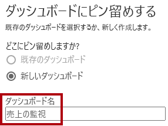

7. **[ピン留めする]** をクリックします。

    

8. **ナビゲーション** ペインを開き、**[Sales Monitoring](売上モニタリング)** ダッシュボードを開きます。

    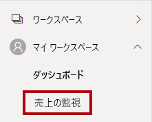

9. ダッシュボードに 1 つのタイルがあることがわかります。

    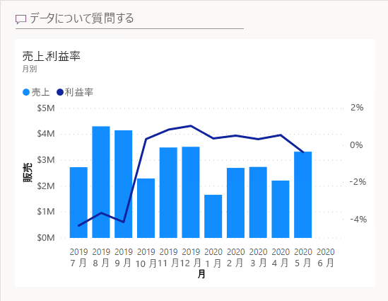

10. 質問に基づいてタイルを追加するには、ダッシュボードの左上にある **[データについて質問する]** をクリックします。

    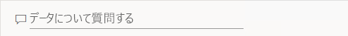

    "Q&A 機能を使用して質問することができ、Power BI はビジュアルを使用して応答します。"

11. 青色のボックスの Q&A ボックスの下にある、おすすめの質問のいずれかをクリックします。

12. 応答を確認します。

13. Q&A ボックスからすべてのテキストを削除します。

14. Q&A ボックスに、次のように入力します。**Sales YTD** (売上 YTD)

    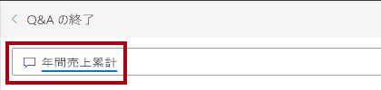

15. **(空白)** の応答に注目します。

    

    "「**Power BI Desktop で DAX 計算を作成する (パート 2)** 」のラボで **[Sales YTD]** メジャーを追加したことが思い出されるかもしれません。"*このメジャーはタイム インテリジェンス式であり、結果を生成するには **Date** テーブルにフィルターを適用する必要があります。"*

16. 質問を **in year FY2020** (FY2020 年度の) で拡張します。

    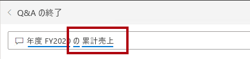

17. 応答が **$33M** になったことに注意してください。

    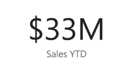

18. 応答をダッシュボードにピン留めするには、右上隅にある **[ビジュアルをピン留めする]** をクリックします。

    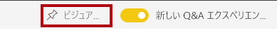

19. ダッシュボードにタイルをピン留めするように求めるメッセージが表示されたら、**[ピン留めする]** をクリックします。

    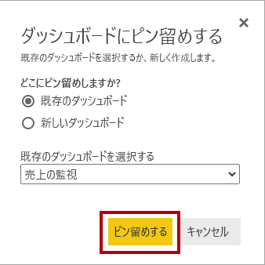

20. ダッシュボードに戻るには、左上隅にある **[Exit Q&amp;A](Q&A の終了)** をクリックします。

    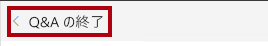

21. 会社のロゴを追加するには、メニュー バーの「**編集**」をクリックし、「**タイルの追加**」をクリックします。

    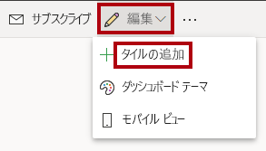

    *この手法を使用してダッシュボード タイルを追加すると、Web コンテンツ、画像、リッチな書式設定のテキスト ボックス、ビデオ (YouTube または Vimeo リンクを使用) などのメディアを使用してダッシュボードを装飾できます。*

22. 右側にある「**タイルの追加**」ウィンドウで「**画像**」タイルを選択します。

    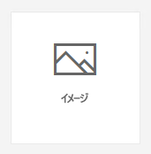

23. **[次へ]** をクリックします。

    

24. **[画像タイルの追加]** ペインの **[URL]** ボックスに、**D:\PL300\Resources\AdventureWorksLogo_DataURL.txt** ファイルにある完全な URL を入力します。

    *その URL を使用して画像を埋め込むことも、データ URL を使用してコンテンツをインラインで埋め込むこともできます。*

25. ペインの下部で **[適用]** をクリックします。

    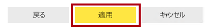

26. ロゴ タイルのサイズを変更するには、右下隅をドラッグし、タイルのサイズを 1 単位の幅、2 単位の高さに変更します。

    "タイルのサイズは、四角形のシェイプに制限されます。*四角形のシェイプの倍数にのみサイズ変更することができます。"*

27. ロゴが左上に、**[Sales YTD]\(売上 YTD\)** タイルがその下に、**[Sales, Profit Margin]\(売上、利益率\)** タイルが右側に表示されるようにタイルを整頓します。

    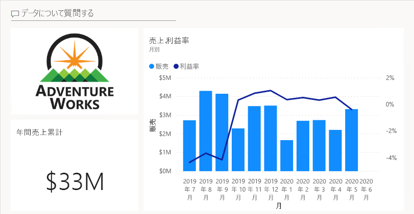

### **タスク 5: タイルの詳細を編集する**

このタスクでは、2 つのタイルの詳細を編集します。

1. **[Sales YTD](売上 YTD)** タイルにカーソルを合わせ、タイルの右上にある省略記号をクリックして、**[詳細の編集]** を選択します。

    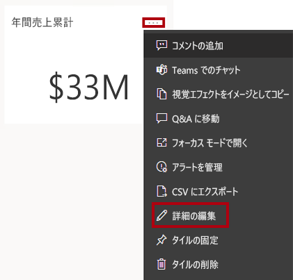

2. (右側にある) **[タイルの詳細]** ペインで、**[サブタイトル]** ボックスに「**FY2020**」と入力します。

    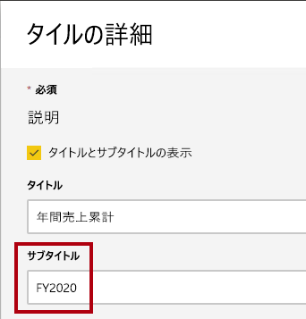

3. **[Apply]** をクリックします。

    

4. **[Sales YTD](売上 YTD)** タイルにサブタイトルが表示されていることに注意してください。

    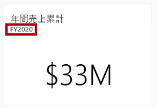

5. **[Sales, Profit Margin](売上、利益率)** タイルのタイル詳細を編集します。

6. **[タイルの詳細]** ペインの **[機能]** セクションで、**[最終更新日時の表示]** をオンにします。

    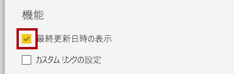

7. **[Apply]** をクリックします。

    

8. タイルに最終更新日時 (Power BI Desktop でデータ モデルを読み込むときに行ったもの) が表示されていることに注意してください。

    "次の演習で、データセットを最新の情報に更新します。*これは通常、スケジュールされた更新を使用して行う必要があります。その場合、Power BI ではゲートウェイを使用して SQL Server データベースに接続します。ただし、教室のセットアップの制約により、ゲートウェイはありません。そのため、Power BI Desktop を開き、手動データ更新を実行してから、ファイルをワークスペースにアップロードします。"*

## **演習 2:データセットを最新の情報に更新する**

この演習では、最初に 2020 年 6 月の受注データを **AdventureWorksDW2020** データベースに読み込みます。 次に、Power BI Desktop ファイルを開き、データ更新を実行し、ワークスペースにファイルをアップロードします。

### **タスク 1: ラボ データベースを更新する**

このタスクでは、PowerShell スクリプトを実行して、**AdventureWorksDW2020** データベースのデータを更新します。

1. エクスプローラーで、**D:\PL300\Setup** フォルダー内の **UpdateDatabase-2-AddSales.ps1** ファイルを右クリックし、 **[PowerShell で実行]** を選択します。

    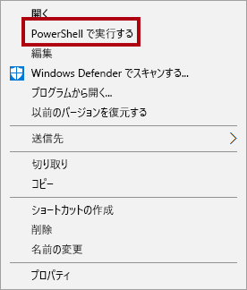

2. 実行ポリシーを変更するよう求められた場合は、**A** キーを押します。

3. キーを押して閉じるように求められたら、**Enter** をもう一度押します。

    "**AdventureWorksDW2020** データベースに、2020 年 6 月に行われた販売注文が含まれるようになりました。"

### **タスク 2: Power BI Desktop ファイルを最新の情報に更新する**

このタスクでは、**Sales Analysis** Power BI Desktop ファイルを開き、データの更新を実行し、そのファイルを「**販売分析**」ワークスペースにアップロードします。

1. メジャーを作成するには、「**フィールド**」ウィンドウで「**Sales**」テーブルを右クリックし、「**データの更新**」を選択します。

    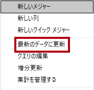

2. 更新が完了したら、Power BI Desktop ファイルを保存します。

3. ファイルをワークスペースに発行するには、**[ホーム]** リボン タブの **[共有]** グループ内から、**[発行]** をクリックします。

    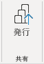

4. データセットの置換を求めるプロンプトが表示されたら、**[置換]** をクリックします。

    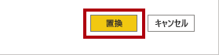

    *Power BI サービス内のデータセットには、2020 年 6 月の売上データが含まれるようになりました。*

5. Power BI Desktop を閉じます。

## **演習 3: ダッシュボードを確認する**

この演習では、ダッシュボードを確認して、更新された売上を確認し、アラートがトリガーされたことを確認します。

### **タスク 1: ダッシュボードを確認する**

このタスクでは、ダッシュボードを確認して、更新された売上を確認し、アラートがトリガーされたことを確認します。

1. Microsoft Edge ブラウザー ウィンドウで、Power BI サービスの **[Sales Monitoring]\(売上モニタリング\)** ダッシュボードを確認します。

2. **[Sales, Profit Margin](売上、利益率)** タイルのサブタイトルで、データが **今** 更新されたことに注目します。

3. **2020 年 6 月** の列があることにも注目してください。

    "2020 年 6 月のデータがない場合は、**F5** キーを押して Web ブラウザーをもう一度読み込む必要があります。"

    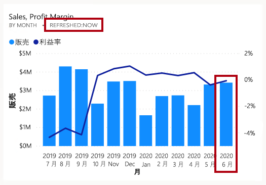

    " **[Sales YTD]** タイル上のアラートもトリガーされます。"*しばらくすると、現在の売上が構成済みのしきい値を超えたことがアラートによって通知されます。"*

4. **[Sales YTD](売上 YTD)** タイルが **$37M** に更新されていることに注目してください。

5. **[Sales YTD](売上 YTD)** タイルにアラート通知アイコンが表示されていることを確認します。

    "通知が表示されない場合は、**F5** を押してブラウザーをもう一度読み込む必要があります。*それでも通知が表示されない場合は、もう少し待ってください。"*

    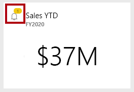

    *アラート通知がダッシュボード タイルに表示され、電子メールで配信したり、Apple Watch などのモバイル アプリに通知をプッシュしたりすることができます。*

6. ウェブ ページの右上隅にある「**通知**」アイコンをクリックします。

    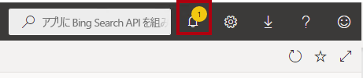

7. **[すべての通知]** ペインで、アラート通知の詳細を確認します。

8. ウィンドウを閉じるには、「**閉じる**」をクリックします。
