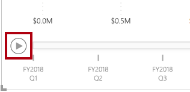
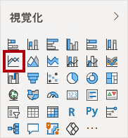
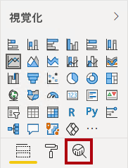
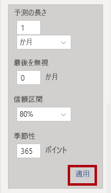

---
lab:
  title: Power BI でデータ分析を実行する
  module: 8 - Perform Data Analysis in Power BI
---

# **Power BI でデータ分析を実行する**

**このラボの推定所要時間: 45 分**

このラボでは、**Sales Exploration** レポートを作成します。

このラボでは、次の作業を行う方法について説明します。

- アニメーション化した散布図の作成
- ビジュアルを使用した値の予測

### **ラボのストーリー**

このラボは、データの準備に始まり、レポートおよびダッシュボードとして発行するまでの完全なストーリーとして設計されたラボ シリーズの 1 つです。 ラボは任意の順序で完了できます。 ただし、複数のラボに取り組む場合は、次の順序で行うことをお勧めします。

1. Power BI Desktop でのデータの準備
1. Power BI Desktop にデータを読み込む
1. Power BI Desktop でデータをモデル化する
1. Power BI Desktop で DAX 計算を作成する
1. Power BI Desktop で高度な DAX 計算を作成する
1. Power BI Desktop でレポートをデザインする
1. Power BI Desktop でレポートを強化する
1. **Power BI でデータ分析を実行する**
1. Power BI ダッシュボードを作成する
1. 行レベルのセキュリティを実行する

## **演習 1: レポートを作成する**

この演習では、**Sales Exploration** レポートを作成します。

### **タスク 1: 開始する - サインイン**

このタスクでは、Power BI にサインインして、ラボの環境を設定します。

*注: Power BI に既にサインインしている場合は、次のタスクに進みます。*

1. Microsoft Edge を開くには、タスク バーにある Microsoft Edge プログラム ショートカットを選択します。

     

1. Microsoft Edge ブラウザー ウィンドウで、**https://app.powerbi.com** に移動します。

    *ヒント:Microsoft Edge のお気に入りバーで、Power BI サービスのお気に入りを使用することもできます。"*

1. 組織の (または提供された) 資格情報を使用してサインイン プロセスを完了します。 Microsoft Edge からサインインを維持するように求められた場合は、**[はい]** を選択します。

1. Microsoft Edge ブラウザー ウィンドウの Power BI サービスの **[ナビゲーション]** ペインで、**[マイ ワークスペース]** を展開します。 Microsoft Edge ブラウザー ウィンドウを開いたままにします。

     

### **タスク 2: 開始する – データセットを作成する**

このタスクでは、データセットを作成してラボの環境を設定します。 ''データセットを既に発行している場合は、次のタスクに進んでください。''**

1. Microsoft Edge ブラウザー ウィンドウで、Power BI サービスの **[マイ ワークスペース]** に移動します。

1. **[アップロード] > [参照]** の順に選択します。

1. **D:\PL300\Labs\08-perform-data-analysis-in-power-bi-desktop\Starter** フォルダーに移動します。

1. **Sales Analysis.pbix** ファイルを選択し、**[開く]** を選択します。

    ''データセットの置換を求めるメッセージが表示されたら、 **[置き換える]** を選択します。''**

''この方法で、レポートとデータセットを作成します。この演習では、データセットを使用して新しいレポートを作成するだけです。この同じプロセスは、新しいものをアップロードするのではなく、別のレポートの既存のデータセットで実行できます。また、レポートを使用していない場合は、ワークスペースのベスト プラクティスとして、不要なファイルを削除することをお勧めします。''**

### **タスク 3: レポートを作成する**

このタスクでは、前回のタスクで作成した Power BI データセットへのライブ接続を作成し、新しい **Sales Exploration** レポートを作成します。

1. Power BI Desktop を開きます。

    

    *重要:(前のラボで) Power BI Desktop を既に開いている場合は、そのインスタンスを閉じます。"*

    ''ヒント: 既定では、Power BI Desktop の前に [はじめに] ダイアログ ボックスが開きます。サインインしてから、ポップアップを閉じることができます。''**

1. [ホーム] リボンで、 **[データの取得] > [Power BI データセット]** の順に選択します。

1. **[データ ハブ]** ウィンドウの **[マイ ワークスペース]** で **Sales Analysis** データセットを選んでから、 **[接続]** を選択するか、ダブルクリックしてデータセットを読み込みます。

1. **[ファイル] > [保存]** の順に移動し、ファイルに **Sales Exploration** という名前を付けて **D:\PL300\MySolution** フォルダーに保存します。

*次に、2 つのレポート ページを作成し、各ページで異なるビジュアルを操作して、データの分析および調査を行います。*

## **演習 2:散布図を作成する**

この演習では、アニメーション化できる散布図を作成します。

### **タスク 1: アニメーション化される散布図を作成する**

このタスクでは、アニメーション化できる散布図を作成します。

1. **ページ 1** の名前を**散布図**に変更します。

1. レポート ページに**散布図**ビジュアルを追加してから、ページ全体に表示されるように再配置およびサイズ変更します。
    
    " **[再生軸]** ウェルまたは領域にフィールドを追加すると、チャートをアニメーション化できます。"**

     

     

1. 次のフィールドをビジュアル ウェル/領域に追加します。
    
    "このラボでは、フィールドを参照するために簡略表記を使用します。**Reseller** **\|** **Business Type** のようになります。この例では、**Reseller** はテーブル名、**Business Type** はフィールド名です。"**

     - X 軸: **Sales \| Sales**
     - Y 軸: **Sales \| Profit Margin**
     - 凡例: **Reseller \| Business Type**
     - サイズ:**Sales \| Quantity**
     - 再生軸: **Date \| Quarter**

1. **[フィルター]** ペインで、**Product \| Category** フィールドを **[このページでのフィルター]** ウェルまたは領域に追加します。

1. フィルター カードで、**Bikes** でフィルター処理します。

1. グラフをアニメーション化するには、左下隅にある **[再生]** を選択します。

    

1. **FY2018 Q1** から **FY2020 Q4** までのアニメーション サイクル全体を確認します。
    
    "散布図では、メジャーの値を同時に把握できます。この場合、注文数量、売上収益、および利益率です。"**
    
    "各バブルが、販売店の業種を表します。*バブル サイズの変化は、注文量の増減を反映しています。水平方向の移動は売上収益の増加または減少を表し、垂直方向の移動は収益性の上昇または低下を表します。"*

1. アニメーションが停止したら、いずれかのバブルを選択すると、時系列での追跡が表示されます。

1. バブルの上にカーソルを合わせると、その時点での、その種類の Reseller のメジャー値を示すヒントが表示されます。

1. **[フィルター]** ペインで、**Clothing** のみでフィルター処理を行うと、結果が大きく異なることに注目してください。

1. Power BI Desktop ファイルを保存します。

## **演習 3: 予測を作成する**

この演習では、予測を作成して、売上収益の将来の可能性を判断します。

### **タスク 1: 予測を作成する**

このタスクでは、予測を作成して、売上収益の将来の可能性を判断します。

1. 新しいページを追加して、ページの名前を**予測**に変更します。

1. レポート ページに**折れ線グラフ** ビジュアルを追加してから、ページ全体に表示されるように配置してサイズを変更します。

     

     

1. 次のフィールドをビジュアル ウェル/領域に追加します。

     - X 軸: **Date \| Date**
     - Y 軸: **Sales \| Sales**

1. **[フィルター]** ペインで、**Date \| Year** フィールドを **[このページでのフィルター]** ウェルまたは領域に追加します。

1. フィルター カードで、**FY2019** および **FY2020** の 2 年でフィルター処理します。
    
    ''タイム ラインで予測する場合は、正確で安定した予測を生成するために、少なくとも 2 サイクル (年) のデータが必要になります。''**

1. また、**Product \| Category** フィールドを **[このページでのフィルター]** ウェルまたは領域に追加して、**Bikes** でフィルター処理します。

1. 予測を追加するには、**[視覚化]** ペインの下にある **[分析]** ペインを選択します。

     

8. **[予測]** セクションを展開します。
    
    " **[予測]** セクションが使用できない場合は、ビジュアルが正しく構成されていないことが原因の可能性があります。予測は、軸に date 型のフィールドが 1 つあり、存在する値フィールドは 1 つだけという、2 つの条件が満たされている場合にのみ使用できます。"**

1. **[予測]** オプションを **[オン]** にします。

1. 次の予測プロパティを構成してから、 **[適用]** を選択します。

    - 単位: **月**
    - 予測の長さ: **1 か月**
    - 季節性: **365**
    - 信頼区間: **80%**

    

1. 折れ線ビジュアルで、予測が履歴データを超過して 1 か月延長されていることに注目してください。
    
    "灰色の領域は、信頼度を表します。*信頼度が広いほど、安定性が低くなるため、予想はより精度が低くなります。"*
    
    "サイクルの長さ (この例では、年) がわかっている場合は、季節性ポイントを入力する必要があります。*週 (7)、または月 (30) の場合もあります。"*

1. **[フィルター]** ペインで、**Clothing** のみでフィルター処理を行うと、結果が異なることに注意してください。

### **タスク 2: 完了**

このタスクでは、Power BI Desktop でラボを完了します。

1. **散布図**ページを選択します。

1. Power BI Desktop ファイルを保存します。

1. ファイルを **[マイ ワークスペース]** に発行するには、 **[ホーム]** リボン タブの **[共有]** グループ内から、 **[発行]** を選択してから、 **[選択]** を選んで発行します。

    

1.  Power BI Desktop を閉じます。
