---
lab:
  title: Power BI Desktop でデータ分析を実行する
  module: Module 9 - Identify Patterns and Trends
ms.openlocfilehash: 42ec8ac1a9fd160fe2181ae8d966d85d04b9b82d
ms.sourcegitcommit: 9ea1e7e21b9b3c718030c94b1693d153a2010ec7
ms.translationtype: HT
ms.contentlocale: ja-JP
ms.lasthandoff: 07/07/2022
ms.locfileid: "147015331"
---
# **Power BI Desktop でデータ分析を実行する**

**このラボの推定所要時間: 45 分**

このラボでは、**販売調査** レポートを作成します。

このラボでは、次の作業を行う方法について説明します。

- アニメーション化した散布図の作成

- ビジュアルを使用した値の予測

### **ラボのストーリー**

このラボは、データの準備に始まり、レポートおよびダッシュボードとして発行するまでの完全なストーリーとして設計されたラボ シリーズの 1 つです。 ラボは任意の順序で完了できます。 ただし、複数のラボに取り組む場合は、次の順序で行うことをお勧めします。

1. Power BI Desktop でのデータの準備

2. Power BI Desktop にデータを読み込む

3. Power BI Desktop でデータをモデル化する

5. Power BI Desktop での DAX 計算の作成、パート 1

6. Power BI Desktop で DAX 計算を作成する (パート 2)

7. Power BI Desktop でレポートを設計する (パート 1)

8. Power BI Desktop でレポートを設計する (パート 2)

9. Power BI ダッシュボードを作成する

10. **Power BI Desktop でデータ分析を実行する**

11. 行レベルのセキュリティを実行する

## **演習 1: レポートを作成する**

この演習では、**Sales Exploration** レポートを作成します。

### **タスク 1: 開始する - サインイン**

このタスクでは、Power BI にサインインしてこのラボ用の環境を設定します。

*重要:前のラボで既に Power BI にサインインしている場合は、次のタスクから続行します。"*

1. Microsoft Edge を開くには、タスク バーの Microsoft Edge プログラムのショートカットをクリックします。

    

1. Microsoft Edge ブラウザー ウィンドウで、**https://powerbi.microsoft.com** に移動します。

    *ヒント:Microsoft Edge のお気に入りバーで、Power BI サービスのお気に入りを使用することもできます。"*

1. **[サインイン]** (右上隅) をクリックします。

    

1. 提供されたアカウントの詳細を入力します。

1. パスワードの更新を求めるメッセージが表示されたら、提供されたパスワードを再入力し、新しいパスワードを入力して確認します。

    *重要:新しいパスワードは必ず記録しておいてください。"*

1. サインイン プロセスを完了します。

1. Microsoft Edge からサインインを維持するかどうかを確認するメッセージが表示されたら、**[はい]** をクリックします。

1. Microsoft Edge ブラウザー ウィンドウの Power BI サービスの **[ナビゲーション]** ペインで、**[マイ ワークスペース]** を展開します。

    

1. Microsoft Edge ブラウザー ウィンドウを開いたままにします。

### **タスク 2: 開始する – データセットを作成する**

このタスクでは、データセットを作成してこのラボ用の環境を設定します。

"重要: **[Power BI ダッシュボードを作成する]** ラボで既にデータセットを発行している場合は、次のタスクから続行します。"

1. Microsoft Edge ブラウザー ウィンドウの Power BI サービスの **[ナビゲーション]** ウィンドウで、下部にある **[データの取得]** をクリックします。

    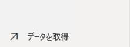

2. **[ファイル]** タイルで、**[取得]** をクリックします。

    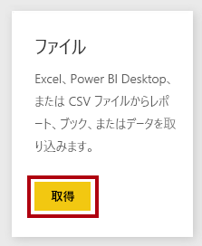

3. **[ローカル ファイル]** タイルをクリックします。

    

4. **[開く]** ウィンドウで、**D:\PL300\Labs\08-create-power-bi-dashboard\Solution** フォルダーに移動します。

5. "**Sales Analysis.pbix**" ファイルを選択し、**[開く]** をクリックします。

6. データセットを置き換えるメッセージが表示されたら、 **[置き換える]** をクリックします。

### **タスク 3: レポートを作成する**

このタスクでは、**Sales Exploration** レポートを作成します。

1. Power BI Desktop を開くには、タスク バーにある Microsoft Power BI Desktop のショートカットをクリックします。

    *重要:(前のラボで) Power BI Desktop を既に開いている場合は、そのインスタンスを閉じます。"*

    

2. [はじめに] ウィンドウを閉じるには、ウィンドウの左上にある **[X]** をクリックします。

    

3. Power BI Desktop が Power BI サービスにサインインしていない場合は、右上の **[サインイン]** をクリックします。

    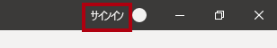

4. Power BI サービスへのサインインに使用したのと同じアカウントを使用して、サインイン プロセスを完了します。

5. ファイルを保存するには、**[ファイル]** リボン タブをクリックして、バックステージ ビューを開きます。

6. **[保存]** を選択します。

    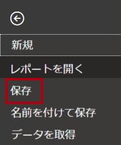

7. **[名前を付けて保存]** ウィンドウで、**D:\PL300\MySolution** フォルダーに移動します。

8. **[ファイル名]** ボックスに「**Sales Exploration**」と入力し、**[保存]** をクリックします。

    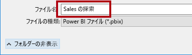

9. "**Sales Analysis**" データセットへのライブ接続を作成するには、**[ホーム]** リボン タブの **[データ]** グループ内から **[Power BI データセット]** をクリックします。

    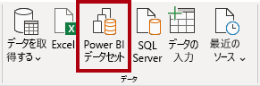

10. **[レポートを作成するデータセットの選択]** ウィンドウで、**Sales Analysis** データセットを選択します。

11. **Create** をクリックしてください。

    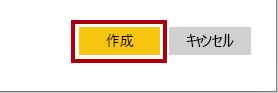

12. Power BI Desktop ファイルを保存します。

    *次に、2 つのレポート ページを作成し、各ページで異なるビジュアルを操作して、データの分析および調査を行います。*

## **演習 2:散布図を作成する**

この演習では、アニメーション化できる散布図を作成します。

### **タスク 1: アニメーション化される散布図を作成する**

このタスクでは、アニメーション化できる散布図を作成します。

1. **ページ 1** の名前を **散布図** に変更します。

    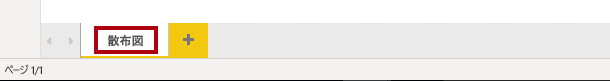

2. レポート ページに **散布図** ビジュアルを追加してから、ページ全体に表示されるように再配置およびサイズ変更します。

    

    

3. 次のフィールドをビジュアル ウェル/領域に追加します。

    このラボでは、フィールドを参照するために簡略表記を使用します。 次のようになります。**Reseller** **\|** **Business Type**. この例では、**Reseller** がテーブル名、**Business Type** がフィールド名です。

    

    - X 軸: **Sales \| Sales** 

    - Y 軸: **Sales \| Profit Margin**

    - 凡例: **Reseller \| Business Type**

    - サイズ:**Sales \| Quantity**

    - 再生軸: **Date \| Quarter**

    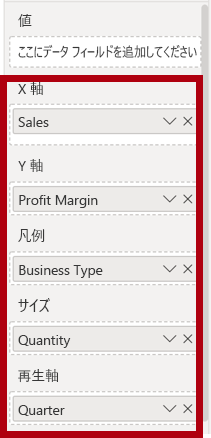

    " **[再生軸]** ウェルまたは領域にフィールドを追加すると、チャートをアニメーション化できます。"

4. **[フィルター]** ペインで、**Product \| Category** フィールドを **[このページでのフィルター]** ウェルまたは領域に追加します。

5. フィルター カードで、**Bikes** でフィルター処理します。

    

6. グラフをアニメーション化するには、左下隅の **[再生]** をクリックします。

    

7. **FY2018 Q1** から **FY2020 Q4** までのアニメーション サイクル全体を確認します。

    "散布図では、メジャーの値を同時に把握できます。この場合、注文数量、売上収益、および利益率です。"

    "各バブルが、販売店の業種を表します。*バブル サイズの変化は、注文量の増減を反映しています。水平方向の移動は売上収益の増加または減少を表し、垂直方向の移動は収益性の上昇または低下を表します。"*

8. アニメーションが停止したら、いずれかのバブルをクリックすると、時系列での追跡が表示されます。

9. バブルの上にカーソルを合わせると、その時点での、その種類の Reseller のメジャー値を示すヒントが表示されます。

10. **[フィルター]** ペインで、**Clothing** のみでフィルター処理を行うと、結果が大きく異なることに注目してください。

11. Power BI Desktop ファイルを保存します。

## **演習 3: 予測を作成する**

この演習では、予測を作成して、売上収益の将来の可能性を判断します。

### **タスク 1: 予測を作成する**

このタスクでは、予測を作成して、売上収益の将来の可能性を判断します。

1. 新しいページを追加して、ページの名前を **予測** に変更します。

    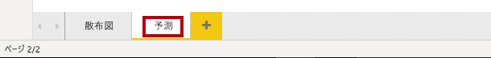

2. レポート ページに **折れ線グラフ** ビジュアルを追加してから、ページ全体に表示されるように配置してサイズを変更します。

    

    

  

3. 次のフィールドをビジュアル ウェル/領域に追加します。

    - X 軸: **Date \| Date**

    - Y 軸: **Sales \| Sales** 

    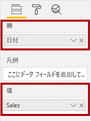

4. **[フィルター]** ペインで、**Date \| Year** フィールドを **[このページでのフィルター]** ウェルまたは領域に追加します。

5. フィルター カードで、**FY2019** および **FY2020** の 2 年でフィルター処理します。

    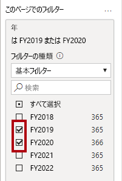

    *タイム ラインで予測する場合は、正確で安定した予測を生成するために、少なくとも 2 サイクル (年) のデータが必要になります。*

  

6. また、**Product \| Category** フィールドを **[このページでのフィルター]** ウェルまたは領域に追加して、**Bikes** でフィルター処理します。

    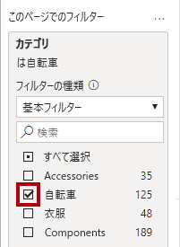

7. 予測を追加するには、**[視覚化]** ペインの下にある **[分析]** ペインを選択します。

    

8. **[予測]** セクションを展開します。

    " **[予測]** セクションが使用できない場合は、ビジュアルが正しく構成されていないことが原因の可能性があります。*予測は、軸には date 型のフィールドが 1 つあり、存在する値フィールドは 1 つだけという、2 つの条件が満たされている場合にのみ使用できます。"*

9. **[予測]** オプションを **[オン]** にします。

    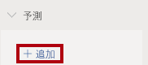

10. 次の予測プロパティを構成します。

    - 単位: 月

    - 予測の長さ: 1 か月

    - 季節性: 365
    
    - 信頼区間: 80%

11. **[Apply]** をクリックします。

    

12. 折れ線ビジュアルで、予測が履歴データを超過して 1 か月延長されていることに注目してください。

    "灰色の領域は、信頼度を表します。*信頼度が広いほど、安定性が低くなるため、予想はより精度が低くなります。"*

    "サイクルの長さ (この例では、年) がわかっている場合は、季節性ポイントを入力する必要があります。*週 (7)、または月 (30) の場合もあります。"*

13. **[フィルター]** ペインで、**Clothing** のみでフィルター処理を行うと、結果が異なることに注意してください。

14. Power BI Desktop ファイルを保存します。

### **タスク 2: 完了**

このタスクでは、ラボを完了します。

1. **散布図** ページを選択します。

2. Power BI Desktop ファイルを保存します。

3. ファイルを **[マイ ワークスペース]** に発行するには、 **[ホーム]** リボン タブの **[共有]** グループ内から、 **[発行]** をクリックします。次に **[選択]** をクリックして発行します。

    

4.  Power BI Desktop を閉じます。
