---
lab:
  title: 行レベルのセキュリティを実行する
  module: Module 13 - Row-Level Security
ms.openlocfilehash: b4b468b1c34d0cb562edd9ec407b07c9ee2efa1d
ms.sourcegitcommit: 3520e7d016e94549d408464207c1b91cd47867c2
ms.translationtype: HT
ms.contentlocale: ja-JP
ms.lasthandoff: 03/05/2022
ms.locfileid: "139273637"
---
# **行レベルのセキュリティを適用する**

**このラボの推定所要時間: 45 分**

このラボでは、**Salesperson** テーブルと **Sales** テーブルの間に多対多のリレーションシップを作成します。 また、営業担当者が確実に自分の担当地域の売上データだけを分析できるように、行レベルのセキュリティも適用します。

このラボでは、次の作業を行う方法について説明します。

- 多対多リレーションシップを構成する

- 行レベルのセキュリティを適用する

### **ラボのストーリー**

このラボは、データの準備に始まり、レポートおよびダッシュボードとして発行するまでの完全なストーリーとして設計されたラボ シリーズの 1 つです。 ラボは任意の順序で完了できます。 しかしながら、複数のラボに取り組む場合は、最初の 10 のラボについては、次の順序で行うことをお勧めします。

1. Power BI Desktop でのデータの準備

2. Power BI Desktop にデータを読み込む

3. Power BI Desktop でデータをモデル化する

5. Power BI Desktop での DAX 計算の作成、パート 1

6. Power BI Desktop で DAX 計算を作成する (パート 2)

7. Power BI Desktop でレポートを設計する (パート 1)

8. Power BI Desktop でレポートを設計する (パート 2)

9. Power BI ダッシュボードを作成する

10. Power BI Desktop でデータ分析を実行する

11. **行レベルのセキュリティを適用する**

## **演習 1: 行レベルのセキュリティを適用する**

この演習では、営業担当者が割り当てられた地域での売上のみを表示できるように、行レベルのセキュリティを適用します。

### **タスク 1: 開始する**

このタスクではこのラボ用の環境を設定します。

*重要:前のラボから継続している (および、そのラボを正常に完了した) 場合は、このタスクを完了させず、次のタスクから続行してください。*

1. Power BI Desktop を開くには、タスク バーにある Microsoft Power BI Desktop のショートカットをクリックします。

    

1. 「はじめに」ウィンドウを閉じるには、ウィンドウの左上にある「**X**」をクリックします。

    

1. スターター Power BI Desktop ファイルを開くには、「**ファイル**」リボン タブをクリックして、バックステージ ビューを開きます。

1. **[レポートを開く]** を選択します。

    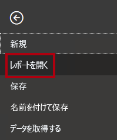

1. 「**レポートを参照**」をクリックします。

    

1. **[開く]** ウィンドウで、**D:\PL300\Labs\12-row-level-security\Starter** フォルダーに移動します。

1. **Sales Analysis** ファイルを選択します。

1. **[開く]** をクリックします。

    

1. 情報ウィンドウが開いている場合はすべて閉じます。

1. ファイルのコピーを作成するには、「**ファイル**」リボン タブをクリックして、バックステージ ビューを開きます。

1. **[名前を付けて保存]** を選択します。

    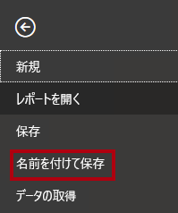

1. 変更を適用するかどうかを確認するメッセージが表示されたら、「**適用**」をクリックします。

    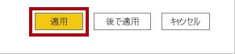

1. **[名前を付けて保存]** ウィンドウで、**D:\PL300\MySolution** フォルダーに移動します。

1. **[保存]** をクリックします。

    

### **タスク 2: 行レベルのセキュリティを適用する**

このタスクでは、行レベルのセキュリティを適用して、営業担当者が割り当てられた地域での売上のみを表示できるようにします。

1. データ ビューに切り替えます。

    

2. **[フィールド]** ペインで、**Salesperson (Performance)** テーブルを選択します。

3. データを確認すると、Michael Blythe (EmployeeKey 281) の UPN の値が **michael-blythe@adventureworks.com** になっています。

    *Michael Blythe の担当営業地域が US Northeast (米国北東部)、US Central (米国中部)、US Southeast (米国南東部) の 3 つであることを思い出してください。*

4. レポート ビューに切り替えます。

5. 「**モデリング**」リボン タブの「**セキュリティ**」グループの内から、「**ロールの管理**」をクリックします。

    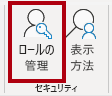

6. 「**ロールの管理**」ウィンドウで、「**作成**」をクリックします。

    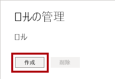

7. ボックスで、選択したテキストをロールの名前:**Salespeople** に置き換えてから、**Enter** キーを押します。

    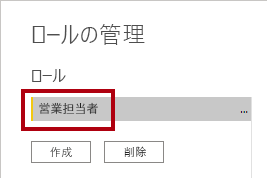

8. フィルターを割り当てるには、**Salesperson (Performance)** テーブルの省略記号 (…) 文字をクリックし、 **[フィルターの追加] \| [UPN]** を選択します。

    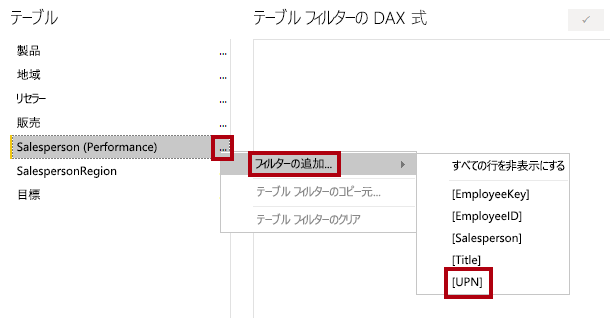

9. 「**テーブル フィルター DAX 式**」ボックスで、 **"Value"** を **USERPRINCIPALNAME()** に置き換えて式を変更します。

    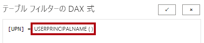

    "USERPRINCIPALNAME() は、認証されたユーザーの名前を返す Data Analysis Expressions (DAX) 関数です。*つまり、**Salesperson (Performance)** テーブルは、モデルをクエリするユーザーのユーザー プリンシパル名 (UPN) によってフィルター処理されます。"*

10. **[保存]** をクリックします。

    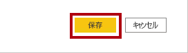

11. セキュリティ ロールをテストするには、「**モデリング**」リボン タブの「**セキュリティ**」グループ内から、「**表示方法**」をクリックします。

    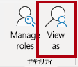

12. **[ロールとして表示]** ウィンドウで **[その他のユーザー]** 項目を選択してから、対応するボックスに「 **michael-blythe@adventureworks.com** 」と入力します。

13. 「**営業担当者**」ロールを確認します。

    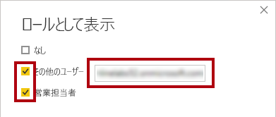

    "この構成により、**Salespeople** ロールと、Michael Blythe の名前を借りたユーザーが使用されることになります。"

14. **[OK]** をクリックします。

    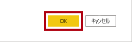

15. レポート ページの上に、テストのセキュリティ コンテキストを説明する黄色のバナーが表示されていることに注目してください。

    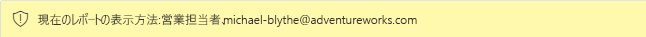

16. テーブル ビジュアルでは、営業担当者 **Michael Blythe** のみが表示されていることに注目してください。

    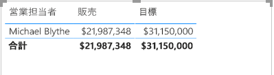

17. テストを中止するには、黄色のバナーの右側にある「**表示を中止**」をクリックします。

    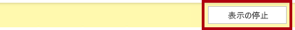

    "Power BI Desktop ファイルが Power BI サービスに発行されるときに、発行後のタスクを完了して、セキュリティ プリンシパルを **Salespeople** ロールにマップする必要があります。"*このラボでは行いません。"*

18. ロールを削除するには、「**モデリング**」リボン タブの「**セキュリティ**」グループ内から、「**ロールの管理**」をクリックします。

    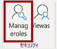

19. 「**ロールの管理**」ウィンドウで、「**削除**」をクリックします。

    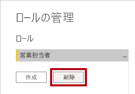

20. 削除の確認を求められたら、「**はい、削除します**」をクリックします。

21. **[保存]** をクリックします。

    

### **タスク 2: 完了**

このタスクでは、ラボを完了します。

1. Power BI Desktop ファイルを保存します。
