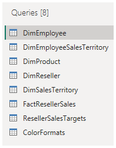

---
lab:
  title: Power BI でデータを取得する
  module: Get data in Power BI
---

# Power BI でのデータの取得

## ラボのストーリー

このラボでは、Power BI Desktop アプリケーションについて紹介し、データに接続する方法、データ プレビューの手法を使用してソース データの特性と品質を理解する方法について説明します。

このラボでは、次の作業を行う方法について説明します。

- Power BI Desktop を開きます。
- さまざまなデータ ソースに接続します。
- Power Query を使用してソース データをプレビューする。
- Power Query でデータ プロファイル機能を使用する。

**この配信には約 30 分かかります。**

## Power BI Desktop の概要

この演習を完了するには、まず Web ブラウザーを開き、次の URL を入力して zip フォルダーをダウンロードします。

`https://github.com/MicrosoftLearning/PL-300-Microsoft-Power-BI-Data-Analyst/raw/Main/Allfiles/Labs/01-get-data-in-power-bi/01-get-data.zip`

フォルダーを **C:\Users\Student\Downloads\01-get-data** フォルダーに展開します。

**01-Starter-Sales Analysis.pbix** ファイルを開きます。

- このスターター ファイルは、ラボを完了できるように特別に構成されています。 スターター ファイルでは、次のレポートレベルの設定が無効になっています。

  - データの読み込み > 最初の読み込みでデータ ソースからリレーションシップをインポートする
  - データの読み込み > データが読み込まれた後に新しいリレーションシップを自動検出する

## SQL Server からデータを取得する

このタスクでは、SQL Server データベースに接続し、Power Query でクエリを作成するテーブルをインポートする方法について説明します。

1. **[ホーム]** リボン タブで、**[データ]** グループ内から **[SQL Server]** を選択します。

     ![SQL Server の [データの取得] アイコン](Linked_image_Files/01-get-data-in-power-bi_image11.png)

1. **[SQL Server データベース]** ウィンドウの **[サーバー]** ボックスに「**localhost**」と入力して、**[データベース]** を空白のままにして **[OK]** を選択してください。

    > ***注**:このラボでは、**localhost** を使用して SQL Server データベースに接続します。 これはラボでは問題ありませんが、実際のソリューションのベスト プラクティスとは見なされません。*

1. 資格情報の入力を求められた場合は、**[Windows]、[現在の資格情報を使用する]** を選択し、**[接続]** を選択します。

1. 暗号化された接続を確立できないという警告が表示された場合は、**[OK]** を選択します。

1. **[ナビゲーター]** ウィンドウで、**AdventureWorksDW2020** データベースを展開してください。

    > ***注**: **AdventureWorksDW2020** データベースは、**AdventureWorksDW2017** サンプル データベースに基づいています。 コース ラボの学習の目的をサポートするために変更されています。*

1. **[DimEmployee]** テーブルを選択し、テーブル データのプレビューに注目してください。

     

    > ***注**: プレビュー データで、列と行のサンプルを確認できます。*

1. 名前の横にある**ボックスにチェックを入れて**次の表を選択します。

    - DimEmployee
    - DimEmployeeSalesTerritory
    - DimProduct
    - DimReseller
    - DimSalesTerritory
    - FactResellerSales

1. **[データの変換]** を選択してこのタスクを完了すると、Power Query エディターが開きます。次のタスクのためにこれを開いたままにしておきます。

これで、SQL Server データベースから 6 つのテーブルに接続できました。

## Power Query エディターでデータをプレビューする

このタスクでは、Power Query エディターが導入されるため、データを確認してプロファイリングできます。 これは、後でデータをクリーンして変換する方法を決定するのに役立ちます。 また、"Dim" というプレフィックスが付いたディメンション テーブルと、"Fact" というプレフィックスが付いたファクト テーブルの両方についても確認します。

1. **Power Query エディター** ウィンドウで、左側の **[クエリ]** ペインに注意してください。 **クエリ** ウィンドウには、チェックを付けた各テーブルに対して 1 つのクエリが含まれています。

     

1. **DimEmployee** クエリを選択します。

    > "SQL Server データベースの **DimEmployee** テーブルには、従業員ごとに 1 行が格納されます。このテーブルの行のサブセットは営業担当者を表します。これが、開発するモデルに関連します。"**

1. 左下隅にあるステータス バーに、テーブル統計情報が提供されます。テーブルには 33 列と 296 行があります。

     

1. データ プレビュー ペインで、水平方向にスクロールして、すべての列を確認します。 最後の 5 列に、**「テーブル」** または **「値」** のリンクが含まれていることに注意してください。

    > この 5 列は、データベース内の他のテーブルとのリレーションシップを表しています。*これらはテーブルを結合するために使用できます。* これらのテーブルは、後ほど **Power BI Desktop で変換されたデータを読み込む**ラボで結合します。

1. 列の品質を評価するには、**「表示」** リボン タブの **「データ プレビュー」** グループ内から、**「列の品質」** をオンにします。 列の品質機能を使用すると、列にある有効、エラー、または空の値の割合を簡単に判断できます。

     ![リボンの [列の品質] の選択](Linked_image_Files/01-get-data-in-power-bi_image23.png)

1. **[Position]** 列に 94% の空 (null) 行があることに注目してください。

     ![94% の空の行を示す [列の品質]](Linked_image_Files/01-get-data-in-power-bi_image24.png)

1. 列の分布を評価するには、**[表示]** リボン タブの **[データ プレビュー]** グループ内から、**[列の分布]** をオンにします。

1. **[Position]** 列を再度確認し、4 つの個別の値と 1 つの一意の値があることに注意してください。

1. **EmployeeKey** 列の列の分布を確認します。296 個の個別の値と 296 個の一意の値があります。

     

    > ***注**: 個別のカウントと一意のカウントが同じ場合は、列に一意の値が含まれていることを意味します。 モデリングする場合、一部のモデルのテーブルに一意の列が含まれていることが重要です。 これらの一意の列を使用して、一対多のリレーションシップを作成できます。これは、「**Power BI Desktop でデータをモデル化する**」のラボで行います。*

1. **[クエリ]** ペインで、**[DimProduct]** クエリを選択します。

    > **[DimProduct]** テーブルには、その会社が販売した商品ごとに 1 行が含まれています。**

1. **[クエリ]** ペインで、**[DimReseller]** クエリを選択します。

    > "**DimReseller** テーブルにはリセラーごとに 1 行が含まれます。リセラーは販売、流通を行い、Adventure Works の製品の価値を高めます。"**

1. 列値を表示するには、**「表示」** リボン タブの **「データ プレビュー」** グループ内から、**「列のプロファイル」** をオンにします。

1. **BusinessType** 列ヘッダーを選択し、データ プレビュー ペインの下にある新しいペインに注目します。 データ プレビュー ウィンドウで、列の統計および値の分布を確認します。

    > "データ品質の問題を見てください。倉庫にラベルが 2 つあります (**Warehouse** とスペルが間違っている **Ware House**)。"**

     

1. **[Ware House]** バーの上にカーソルを置くと、この値を持つ 5 つの行があることに気付きます。

1. **[クエリ]** ペインで、**[DimSalesTerritory]** クエリを選択します。  

    > "**DimSalesTerritory** テーブルには、**Corporate HQ** (本社) を含めて販売地域ごとに 1 行が含まれています。地域は国に割り当てられ、国はグループに割り当てられます。「**Power BI Desktop でデータをモデル化する**」ラボで、地域、国、またはグループ レベルでの分析をサポートする階層を作成します。"**

1. **[クエリ]** ペインで、**[FactResellerSales]** クエリを選択します。

    > "**FactResellerSales** テーブルには、販売注文明細ごとに 1 行が含まれています。販売注文には 1 行以上の品目が含まれています。"**

1. **TotalProductCost** 列の列の品質を確認して、行の 8% が空であることに注意してください。

    > ***TotalProductCost** 列値の不足は、データ品質の問題につながります。*

## CSV ファイルからデータを取得する

このタスクでは、CSV ファイルに基づいて新しいクエリを作成します。

1. 新しいクエリを追加するには、**[Power Query エディター]** ウィンドウの **[ホーム]** リボン タブで、**[新しいクエリ]** グループ内から、**[新しいソース]** 下矢印を選択し、**[テキスト/CSV]** を選択します。

1. 先ほど抽出した **Downloads > 01-get-data** フォルダーに移動し、**ResellerSalesTargets.csv** ファイルを選択します。 **[Open (開く)]** を選択します。

1. **ResellerSalesTargets.csv** ウィンドウで、プレビュー データを確認します。 **[OK]** を選択します。

1. **[クエリ]** ペインで、**ResellerSalesTargets** クエリが追加されていることに注意してください。

    > "**ResellerSalesTargets** CSV ファイルには、営業担当者ごとに 1 年につき 1 行が含まれています。各行には、12 個の月次売上目標が記録されます (千単位)。Adventure Works 社の事業年度は、7 月 1 日に開始されます。"**

1. 空の値を含む列がない点に注目してください。  月次売上目標がない場合は、代わりにハイフンが列に表示されます。

1. 列名の左側にある各列ヘッダーのアイコンを確認します。 アイコンは、列のデータ型を表します。 **123** は整数で、**ABC** はテキストです。

     

1. **ColorFormats.csv** ファイルに基づいて手順を繰り返し、クエリを作成します。

    > "**ColorFormats** CSV ファイルには、製品の色ごとに 1 行が含まれています。各行には、背景色とフォントの色を書式設定する HEX コードが記録されます。"**

これで、**ResellerSalesTargets** と **ColorFormats** という 2 つの新しいクエリが作成されました。

 

## ラボが完了しました

このラボでは必要ありませんが、Power BI レポートを保存することもできます。 次の演習では、事前に作成されたスターター ファイルを使用します。

1. 左上隅の **[ファイル]** メニューに移動し、**[名前を付けて保存]** を選択します。 
1. **[このデバイスを参照する]** を選択します。
1. ファイルを保存するフォルダーを選択し、わかりやすい名前を付けます。 
1. **[保存]** ボタンを選択して、レポートを .pbix ファイルとして保存します。 
1. 保留中のクエリの変更について適用を求めるダイアログ ボックスが表示された場合は、**[適用]** を選択します。
1. Power BI Desktop を閉じます。