---
lab:
  title: 変換されたデータを Power BI Desktop に読み込む
  module: 'Clean, Transform, and Load Data in Power BI'
---

# 変換されたデータを Power BI Desktop に読み込む

## ラボのストーリー

このラボでは、データ クレンジングと変換の手法を使用して、データ モデルの整形を開始します。 その後、クエリを適用し、それぞれテーブルとしてデータ モデルに読み込みます。

このラボでは、次の作業を行う方法について説明します。

- さまざまな変換を適用する
- データ モデルにクエリを読み込む

**この配信には約 45 分かかります。**

## 作業の開始

この演習を完了するには、まず Web ブラウザーを開き、次の URL を入力して zip フォルダーをダウンロードします。

`https://github.com/MicrosoftLearning/PL-300-Microsoft-Power-BI-Data-Analyst/raw/Main/Allfiles/Labs/02-load-data-with-power-query-in-power-bi-desktop/02-load-data.zip`

フォルダーを **C:\Users\Student\Downloads\02-load-data** フォルダーに展開します。

**02-Starter-Sales Analysis.pbix** ファイルを開きます。

> ***注**: **[キャンセル]** を選択すると、サインインを閉じることができます。 他のすべての情報ウィンドウを閉じます。 変更の適用を求めるメッセージが表示されたら、**[後で適用]** を選択します。

## Salesperson クエリを構成する

このタスクでは、Power Query エディターを使用して **Salesperson** クエリを構成します。

> ***重要**: 列の名前を変更するように指示されたら、指示どおりに名前を変更することが重要です。*

1. **[Power Query エディター]** ウィンドウを開くには、**[ホーム]** リボン タブの **[クエリ]** グループ内から、**[データの変換]** アイコンを選択します。

     ![[ホーム] リボンの [データの変換]](Linked_image_Files/02-load-data-with-power-query-in-power-bi-desktop_image10.png)

1. **[Power Query エディター]** ウィンドウの **[クエリ]** ウィンドウで、**[DimEmployee]** クエリを選択します。

     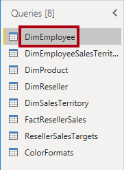

1. クエリの名前を変更するには、(右側にある) **[クエリの設定]** ペインで、**[名前]** ボックスのテキストを **Salesperson** に置き換え、**Enter** キーを押します。 次に、 **[クエリ]** ペインで名前が更新されたことを確認します。

    > クエリ名によって、モデル テーブルの名前が決まります。簡潔で、わかりやすい名前を定義することをお勧めします。**

1. 特定の列を見つけるには、 **[ホーム]** リボン タブの **[列の管理]** の下矢印を選択し、 **[列の選択]** の下矢印を選択して、 **[列に移動]** を選択します。

    > [列に移動] は、列が多いときに便利な機能です。または、水平方向にスクロールして列を見つけることができます。**

     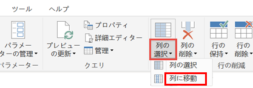

1. **[列に移動]** ウィンドウで、一覧を列名で並べ替えるには、 **[昇順]** 並べ替えボタンを選択し、 **[名前]** と **[SalesPersonFlag]** を選択します。 **[OK]** をクリックします。

     ![[列に移動] の並べ替えオプション](Linked_image_Files/02-load-data-with-power-query-in-power-bi-desktop_image14.png)

1. **SalesPersonFlag** 列を見つけたら、Salespeople (つまり、**TRUE**) のみが選択されるようにこの列をフィルター処理して、 **[OK]** をクリックします。

1. **[クエリの設定]** ペインの **[適用したステップ]** 一覧で、**[フィルターされた行]** ステップが追加されていることに注目してください。

    > 作成した変換ごとに、別のステップ ロジックが生成されます。ステップを編集または削除することができます。クエリ変換のその段階でクエリ結果をプレビューするステップを選択することもできます。**

     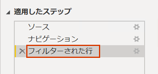

1. 列を削除するには、 **[ホーム]** リボン タブの **[列の管理]** グループを選択し、 **[列の選択]** アイコンを選択します。

1. 「**列の選択**」ウィンドウで、すべての列のチェックを外す場合は、「 **(すべての列を選択)** 」の項目をオフにします。

1. 列を含めるには、次の 6 つの列を確認します。

    - EmployeeKey
    - EmployeeNationalIDAlternateKey
    - FirstName
    - LastName
    - Title
    - EmailAddress

1. **[適用するステップ]** リストで、別のクエリ手順が追加されていることに注目してください。

     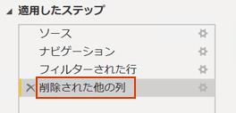

1. 1 つの名前列を作成するには、まず、**FirstName** 列ヘッダーを選択します。 **Ctrl** キーを押しながら、**LastName** 列を選択します。

     

1. 選択列ヘッダーのいずれかを右クリックし、コンテキスト メニューで **[列のマージ]** を選択します。

    > "多くの一般的な変換を適用することができます。そのためには、列ヘッダーを右クリックし、コンテキスト メニューから選択します。*ただし、リボンではより多くの変換を使用できます。"*

1. **[列の結合]** ウィンドウの **[区切り記号]** ボックスの一覧で、**[スペース]** を選択します。

1. **[新しい列名]** ボックスで、テキストを **"Salesperson"** に置き換えます。

1. **EmployeeNationalIDAlternateKey** 列の名前を変更するには、**EmployeeNationalIDAlternateKey** 列ヘッダーをダブルクリックし、テキストを **EmployeeID** に置換し、**Enter** キーを押します。

1. 前の手順を使用して、**EmailAddress** 列の名前を **UPN** に変更します。

    > *UPN は、User Principal Name の頭字語です。*

**左下にあるステータス バーで、クエリに 5 列と 18 行が含まれていることを確認します。**

## **SalespersonRegion クエリを構成する**

このタスクでは、**SalespersonRegion** クエリを構成します。

1. **[クエリ]** ペインで、**DimEmployeeSalesTerritory** クエリを選択します。

1. 「**クエリの設定**」ウィンドウで、クエリの名前を **SalespersonRegion** に変更します。

1. 最後の 2 つの列を削除するために、まず **DimEmployee** 列ヘッダーを選択します。

1. **Ctrl** キーを押しながら、**DimSalesTerritory** 列ヘッダーを選択します。

1. 選択した列ヘッダーのいずれかを右クリックし、コンテキスト メニューで **[列の削除]** を選択します。

**ステータス バーで、クエリに 2 列と 39 行が含まれていることを確認します。**

## Product クエリを構成する

このタスクでは、**Product** クエリを構成します。

> ***重要**: 詳細な手順が既に示されている場合、ラボの手順では、より簡潔な指示が行われます。 詳細な説明が必要な場合は、前のタスクの手順に戻って参照してください。*

1. **DimProduct** クエリを選択し、クエリの名前を **Product** に変更します。

1. **FinishedGoodsFlag** 列を見つけ、列をフィルター処理して、完成品 (つまり、TRUE) である製品を取得します。

1. 以下を**除く**すべての列を削除します。

    - ProductKey
    - EnglishProductName
    - StandardCost
    - Color
    - DimProductSubcategory

1. **DimProductSubcategory** 列は関連テーブルを表していることに注意してください (**Value** リンクが含まれています)。

1. **DimProductSubcategory** 列ヘッダーで、列名の右側にある展開ボタンを選択します。

    

1. 列の完全な一覧を表示し、 **[すべての列を選択]** ボックスを選択してすべての列の選択を解除します。

1. **EnglishProductSubcategoryName** と **DimProductCategory** を選択し、 **[元の列名をプレフィックスとして使用します]** チェック ボックスをオフにしてから、 **[OK]** を選択します。

    > "これら 2 つの列を選択すると、変換が適用されて **DimProductSubcategory** テーブルに結合され、これらの列が含まれます。***DimProductCategory** 列は、実際にはデータ ソース内の別の関連テーブルです。"*
    >
    > "クエリ列名は常に一意である必要があります。*このチェックボックスをオンにすると、各列の前に展開された列名が追加されます (この場合は **DimProductSubcategory**)。選択した列名が **Product** クエリの列名と競合しないことがわかっているため、オプションは選択解除されています。"*

1. 変換の結果、2 つの列が追加され、**DimProductSubcategory** 列が削除されたことがわかります。

1. **DimProductCategory** 列を展開し、**EnglishProductCategoryName** 列のみを導入します。

1. 次の 4 つの列の名前を変更します。

    - **EnglishProductName** を **Product** に
    - **StandardCost** を **Standard Cost** に (スペースを含む)
    - **EnglishProductSubcategoryName** を **Subcategory** に
    - **EnglishProductCategoryName** を **Category** に

**ステータス バーで、クエリに 6 列と 397 行が含まれていることを確認します。**

## Reseller クエリを構成する

このタスクでは、**Reseller** クエリを構成します。

1. **DimReseller** クエリを選択し、**Reseller** に名前を変更します。

1. 以下を**除く**すべての列を削除します。

    - ResellerKey
    - BusinessType
    - ResellerName
    - DimGeography

1. **DimGeography** 列を展開し、次の 3 つの列**のみ**を含めます。

    - City
    - StateProvinceName
    - EnglishCountryRegionName

1. **[ビジネスの種類]** 列ヘッダーで下矢印を選択し、個別の列の値を確認して、**Warehouse** と **Ware House** の両方の値に注目します。

1. **Business Type** 列ヘッダーを右クリックして、「**値の置換**」を選択します。

1. **[値の置換]** ウィンドウで、次の値を構成します。

    - **[検索する値]** ボックスに「**Ware House**」と入力します
    - **[置換後]** ボックスに「**Warehouse**」と入力します

     ![[値の置換] ダイアログ](Linked_image_Files/02-load-data-with-power-query-in-power-bi-desktop_image40.png)

1. 次の 4 つの列の名前を変更します。

    - **BusinessType** から **Business Type** に変更 (スペースを追加)
    - **ResellerName** を **Reseller** に
    - **StateProvinceName** を **State-Province** に
    - **EnglishCountryRegionName** を **Country-Region** に

**ステータス バーで、クエリに 6 列と 701 行が含まれていることを確認します。**

## Region クエリを構成する

このタスクでは、**Region** クエリを構成します。

1. **DimSalesTerritory** クエリを選択し、クエリの名前を **Region** に変更します。

1. **SalesTerritoryAlternateKey** 列にフィルターを適用して、値 0 (ゼロ) を削除します。

    > これにより、1 つの行が削除されます。**

1. 以下を**除く**すべての列を削除します。

    - SalesTerritoryKey
    - SalesTerritoryRegion
    - SalesTerritoryCountry
    - SalesTerritoryGroup

1. 次の 3 つの列の名前を変更します。

    - **SalesTerritoryRegion** を **Region** に
    - **SalesTerritoryCountry** を **Country** に
    - **SalesTerritoryGroup** を **Group** に

**ステータス バーで、クエリに 4 列と 10 行が含まれていることを確認します。**

## Sales クエリを構成する

このタスクでは、**Sales** クエリを構成します。

1. **FactResellerSales** クエリを選択し、名前を **Sales** に変更します。

1. 以下を**除く**すべての列を削除します。

    - SalesOrderNumber
    - OrderDate
    - ProductKey
    - ResellerKey
    - EmployeeKey
    - SalesTerritoryKey
    - OrderQuantity
    - UnitPrice
    - TotalProductCost
    - SalesAmount
    - DimProduct

    > ***注**:「**Power BI Desktop でデータを準備する**」ラボで、**FactResellerSales** 行のごく一部で **TotalProductCost** 値が不足していたことを思い出してください。 不足している値の修正に役立つように、製品の標準原価列を取得するための **DimProduct** 列が含まれています。*

1. **DimProduct** 列を展開し、すべての列のチェックを外してから **StandardCost** 列のみを含めます。

1. カスタム列を作成するには、 **[列の追加]** リボン タブの **[全般]** グループ内から、 **[カスタム列]** を選択します。

     

1. 「**カスタム列**」ウィンドウの「**新しい列名**」ボックスで、テキストを **Cost** に置き換えます。

1. **[カスタム列の式]** ボックスで、次の式を (等号の後に) 入力してから、新しい列を保存します。

   ` if [TotalProductCost] = null then [OrderQuantity] * [StandardCost] else [TotalProductCost] `

    > ***注**: 02-load-data フォルダー内の **Snippets.txt** ファイルから式をコピーできます。*

    > この式を使用すると、**TotalProductCost** 値が欠落しているかどうかをテストできます。欠落している場合は、**OrderQuantity** 値に **StandardCost** 値を掛けて値を生成します。それ以外の場合は、既存の **TotalProductCost** 値を使用します。**

1. 次の 2 つの列を削除します。

    - TotalProductCost
    - StandardCost

1. 次の 3 つの列の名前を変更します。

    - **OrderQuantity** を **Quantity** に
    - **UnitPrice** を **Unit Price** に (スペースを含む)
    - **SalesAmount** を **Sales** に

1. 列のデータ型を変更するには、**Quantity** 列ヘッダーで、列名の左側にある **[1.2]** アイコンを選択し、 **[整数]** を選択します。

    > "正しいデータ型を構成することが重要です。*列に数値が含まれていて、数学計算を実行する予定がある場合は、正しい型を選択することも重要です。"*

     

1. 次の 3 つの列のデータ型を **[固定小数点数]** に変更します。

    > 固定の 10 進数データ型では 19 桁を使用でき、丸めエラーを回避するために精度を高めることができます。財務値またはレート (為替レートなど) には、固定の 10 進数の型を使用することが重要です。**

    - Unit Price
    - Sales
    - Cost

**ステータス バーで、クエリに 10 列と 999 行以上が含まれていることを確認します。** *各クエリのプレビュー データとして最大 1000 行が読み込まれます。*

## Targets クエリを構成する

このタスクでは、**Targets** ターゲットを構成します。

1. **ResellerSalesTargets** クエリを選択し、名前を **Targets** に変更します。

1. 12 か月の列 (**M01**-**M12**) のピボットを解除するには、まず **Year** および **EmployeeID** の列ヘッダーを複数選択します。

1. 選択した列ヘッダーのいずれかを右クリックし、コンテキスト メニューで「**他の列のピボット解除**」を選択します。

1. 列名が **Attribute** 列に表示され、値が **Value** 列に表示されることに注意してください。

1. **Value** 列にフィルターを適用して、ハイフン (-) 値を削除します。

    > *ゼロ (0) を表すために、ソース CSV ファイルでハイフン文字が使用されていたことを思い出してください。*

1. 次の 2 つの列の名前を変更します。

    - **Attribute** を **MonthNumber** (スペースなし) に
    - **Value** を **Target** に

1. **[MonthNumber]** 列の値を準備するには、**[MonthNumber]** 列ヘッダーを右クリックしてから、**[値の置換]** を選択します。

    > "次に、変換を適用して日付列を作成します。*日付は、**Year** および **MonthNumber** 列から取得されます。列を作成するには、 **[例からの列]** 機能を使用します。"*

1. **[値の置換]** ウィンドウの **[検索する値]** ボックスに「**M**」と入力し、 **[置換後]** は空のままにします。

1. **MonthNumber** 列のデータ型を **[整数]** に変更します。

1. **[列の追加]** リボン タブの **[全般]** グループ内から、 **[例からの列]** アイコンを選択します。

    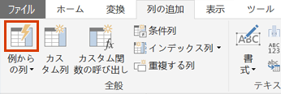

1. 最初の行は年 **2017** と月番号 **7** であることに注意してください。

1. **[Column1]** 列の最初のグリッド セルに、「**7/1/2017**」と入力してから、**Enter** キーを押します。

    > ***注**: この仮想マシンでは米国の地域設定を使用しているため、この日付は実際には "July 1, 2017" になります。 その他の地域設定では、日付より前に **0** が必要になる場合があります。*

1. グリッド セルは予測値を使用して更新されることに注目してください。

    > この機能により、**Year** と **MonthNumber** の列の値を結合していることが正確に予測されています。**

1. クエリ グリッドの上に表示される数式にも注目してください。

     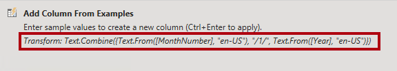

1. 新しい列の名前を変更するには、 **[マージ済み]** 列ヘッダーをダブルクリックし、列の名前を **TargetMonth** に変更します。

1. 次の列を削除します。

    - Year
    - MonthNumber

1. 次の列のデータ型を変更します。

    - **Target** を固定小数点数に
    - **TargetMonth** を日付に

1. **Target** 値に 1,000 を乗算するには、**Target** 列ヘッダーを選択し、 **[変換]** リボン タブの **[数値の列]** グループ内から **[標準]** を選択し、 **[乗算]** を選択します。

    > *ターゲット値は千単位で格納されていることを思い出してください。*

     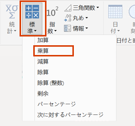

1. **[乗算]** ウィンドウの **[値]** ボックスに「**1000**」と入力し、 **[OK]** を選択します。

**ステータス バーで、クエリに 3 列と 809 行が含まれていることを確認します。**

## ColorFormats クエリを構成する

このタスクでは、**ColorFormats** クエリを構成します。

1. **ColorFormats** クエリを選択し、最初の行に列名が含まれていることに注意してください。

1. **[ホーム]** リボン タブの **[変換]** グループ内から、 **[1 行目をヘッダーとして使用]** を選択します。

     

**ステータス バーで、クエリに 3 列と 10 行が含まれていることを確認します。**

## Product クエリを更新する

このタスクでは、**ColorFormats** クエリをマージして、**Product** クエリを更新します。

1. **Product** クエリを選択します。

1. **ColorFormats** クエリをマージするには、 **[ホーム]** リボン タブの **[結合]** の下矢印を選択して、 **[クエリのマージ]** を選択します。

    > "クエリをマージすることで、異なるデータ ソース (SQL Server と CSV ファイル) のデータを統合できます。"**

     

1. **[マージ]** ウィンドウの **Product** クエリ グリッドで、**[Color]** 列ヘッダーを選択します。

     

1. **Product** クエリ グリッドの下のドロップダウン リストで、**ColorFormats** クエリを選択します。

     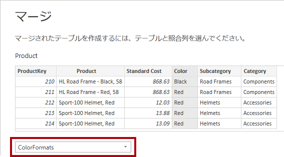

1. **ColorFormats** クエリ グリッドで、**Color** 列ヘッダーを選択します。

1. **[プライバシー レベル]** ウィンドウが開いたら、2 つのデータ ソースそれぞれについて、対応するドロップダウン リストで、 **[組織]** を選択し、 **[保存]** を選択します。

    > データ ソースのプライバシー レベルを構成して、ソース間でデータを共有できるかどうかを決定できます。各データ ソースを **[組織]** に設定すると、必要に応じてデータを共有できます。プライベート データ ソースを他のデータ ソースと共有することはできません。これは、プライベート データを共有できないという意味ではありません。つまり、Power Query エンジンではソース間でデータを共有できません。**

     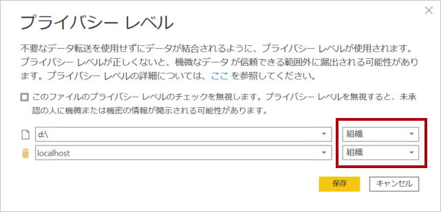

1. **[マージ]** ウィンドウで、既定の **[結合の種類]** (左外部の選択を維持する) を使用し、 **[OK]** を選択します。

1. **ColorFormats** 列を展開して、次の 2 つの列を含めます。

    - 背景色の書式
    - フォントの色の書式

**ステータス バーで、クエリに 8 列と 397 行が含まれていることを確認します。**

## ColorFormats クエリを更新する

このタスクでは、**ColorFormats** を更新して、その読み込みを無効にします。

1. **ColorFormats** クエリを選択します。

1. **[クエリの設定]** ペインで、**[すべてのプロパティ]** リンクを選択します。

     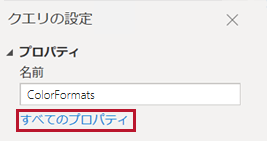

1. **[クエリのプロパティ]** ウィンドウで、**[レポートへの読み込みを有効にする]** チェックボックスをオフにします。

    > 読み込みを無効にすると、データ モデルにテーブルとして読み込まれません。これは、クエリが **Product** クエリとマージされ、データ モデルへの読み込みが有効になっているためです。**

     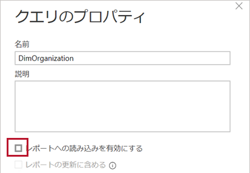

### 最終製品を確認する

Power Query エディターで、次のように適切な名前が付けられた **8 つのクエリ**があることを確認します。

- Salesperson
- SalespersonRegion
- Product
- Reseller
- Region
- Sales
- Targets
- ColorFormats (データ モデルに読み込まれない)

**[閉じる]、&amp;[適用]** を選択してデータをモデルに読み込み、Power Query エディター ウィンドウを閉じます。

右側に [フィルター]、[視覚化]、[データ] の各ペインがあるキャンバスが Power BI Desktop に表示されるようになりました。 [データ] ペインで、**7 つのテーブル**がデータ モデルに読み込まれたことを確認します。

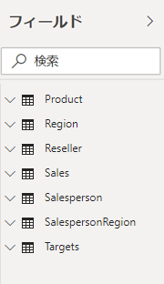

## ラボが完了しました