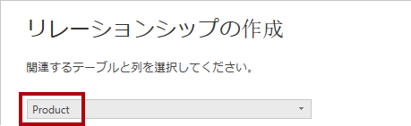
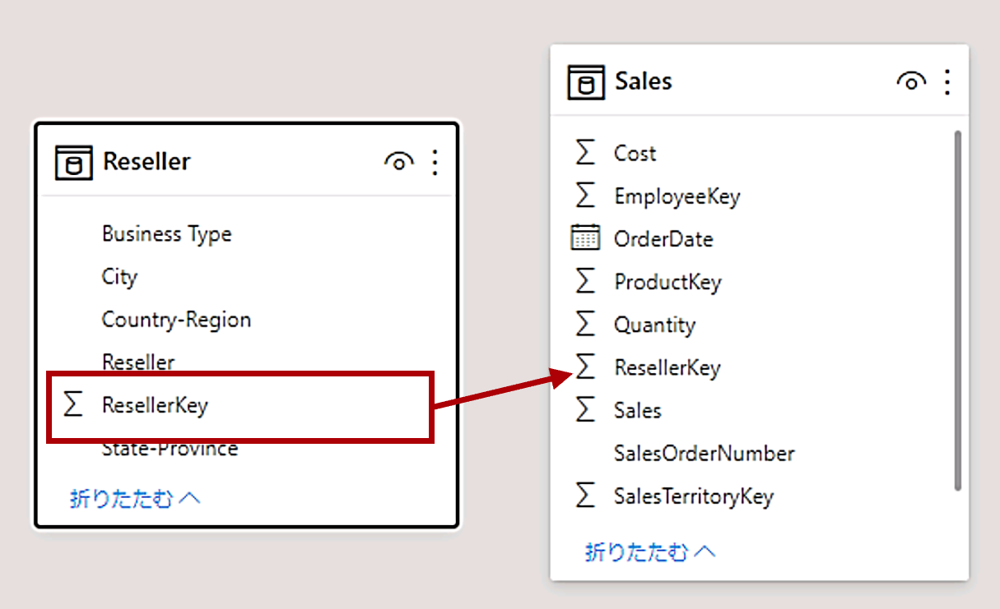
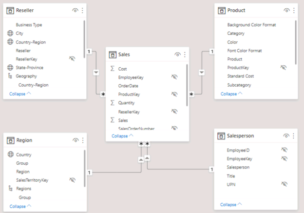
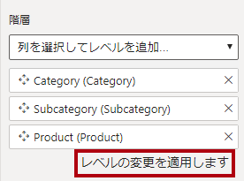
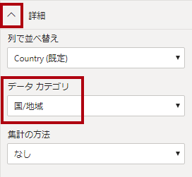
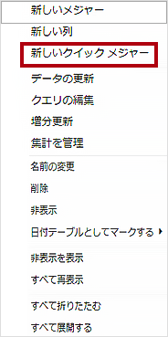
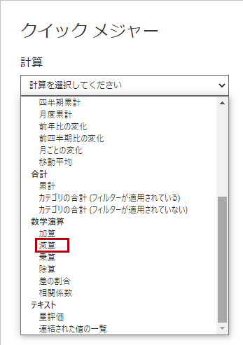
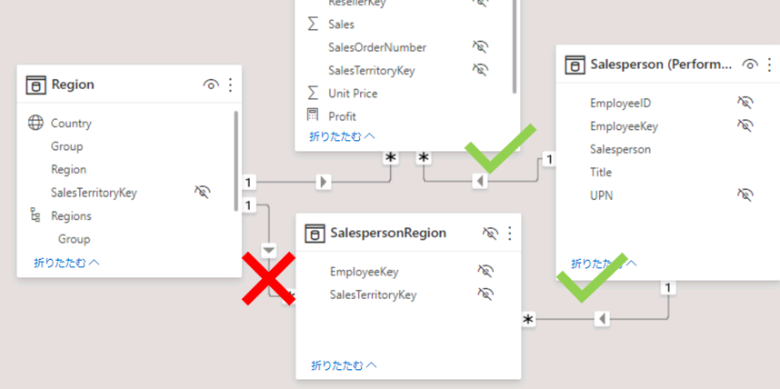
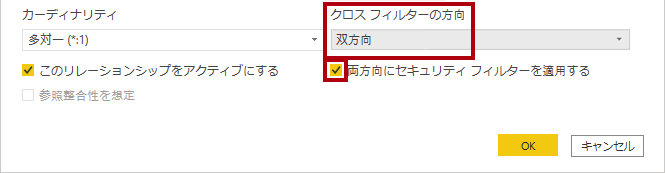

---
lab:
  course: 'PL-300, DP-605'
  title: Power BI でデータ モデルを設計する
  module: Design a Data Model in Power BI
---

# Power BI でデータ モデルを設計する

## **ラボのストーリー**

このラボでは、データ モデルの開発を開始します。 テーブル間のリレーションシップを作成してから、データ モデルのわかりやすさと使いやすさを向上させるために、テーブルと列のプロパティを構成します。 また、階層を作成し、クイック メジャーを作成します。

このラボでは、次の作業を行う方法について説明します。

- モデル リレーションシップを作成する
- テーブルと列のプロパティを構成する
- 階層を作成する

**この配信には約 45 分かかります。**

## **開始するには**

このタスクでは、ラボの環境を設定します。

1. Power BI Desktop を開きます。

    

1. スターター Power BI Desktop ファイルを開くには、**[このデバイスを開く] > [このデバイスを参照]** の順に選択します。

1. **D:\Allfiles\Labs\03-configure-data-model-in-power-bi-desktop\Starter** フォルダーに移動し、**Sales Analysis** ファイルを選択します。

   *注: この時点で、まだサインインしていない場合は、Power BI からサインインが求められます。サインインするか、**[キャンセル]** を選択してラボを続行できます。*

1. 情報ウィンドウが開いている場合はすべて閉じます。

1. **[ファイル] > [名前を付けて保存]** に移動し、ファイルを **D:\Allfiles\MySolution** フォルダーに保存します。

## **モデル リレーションシップを作成する**

このタスクでは、モデル リレーションシップを作成します。 このファイルは、これまでのラボのテーブル間のリレーションシップを識別しないように構成されています。 これは既定の設定ではありませんが、モデルの正しい関係を作成するための余分な作業を防ぐために推奨されます。

重要: このラボでは、フィールドを参照するために簡略表記を使用します。次のようになります。**Product \| Category**。この例では、**Product** はテーブル名、**Category** はフィールド名です。**

1. Power BI Desktop で、左側の **[モデル ビュー]** アイコンを選択します。

     

1. 7 つのテーブルがすべて表示されていない場合は、水平方向に右へスクロールし、テーブルをドラッグして、すべてを同時に表示できるように、より近づけて配置します。

     *ヒント:ウィンドウの最下部にあるズーム コントロールも使用できます。"*

1. レポート ビューに戻るには、左側の **[レポート]** ビュー アイコンを選択します。

     

1. すべてのテーブル フィールドを表示するには、 **[データ]** ペインで何も表示されていない領域を右クリックし、 **[すべて展開]** を選択します。

1. テーブル ビジュアルを作成するには、 **[データ]** ペインの **Product** テーブル内にある **Category** フィールドをオンにします。

1. テーブルに別の列を追加するには、 **[データ]** ペインで、**Sales \| Sales** フィールドをオンにします。

1. テーブル ビジュアルに 4 つの製品カテゴリが一覧表示され、それぞれの Sales 値が同じで、Total も同じであることに注意してください。

    問題は、このテーブルが異なる複数のテーブルのフィールドに基づいていることです。各製品カテゴリには、そのカテゴリの売上が表示されることが想定されています。ただし、これらのテーブル間にはモデルのリレーションシップがないため、**Sales** テーブルはフィルタリングされません。そこで、リレーションシップを追加してテーブル間のフィルターを反映します。**

     

1. **[モデリング]** リボン タブの **[リレーションシップ]** グループの中から、**[リレーションシップの管理]** を選択します。

     

1. **[リレーションシップの管理]** ウィンドウで、リレーションシップがまだ定義されていないことを確認します。

1. リレーションシップを作成するには、**[新規]** を選択します。

1. **[新しいリレーションシップ]** ウィンドウの最初のドロップダウン リストで、**Product** テーブルを選択します。

     

1. 2 番目のドロップダウンリスト (**Product** テーブル グリッドの下) で、**Sales** テーブルを選択します。

     

1. 各テーブルの **ProductKey** 列が自動的に選択されていることに注意してください。

    これらの列は同じ名前とデータ型を共有しているため、選択されました。実際のデータでは、異なる名前を持つ一致する列を見つけることが必要な場合があります。**

1. **[カーディナリティ]** のドロップダウン リストで、**[一対多(1:*)]** が選択されていることを確認します。

    "このカーディナリティは、**Product** テーブルの **ProductKey** 列に一意の値が含まれていることが Power BI によって認識されているため、自動的に検出されました。*一対多リレーションシップは最も一般的なカーディナリティで、このラボで作成するすべてのリレーションシップがこの種類になります。*

1. **[クロス フィルターの方向]** のドロップダウンリストで、**[単一]** が選択されていることを確認します。

    "単一というフィルターの方向は、フィルターが "一の側" から "多の側" に反映されることを意味します。*この場合、**Product** テーブルに適用されたフィルターは **Sales** テーブルに伝達されますが、逆方向には伝達されません。*

1. **[このリレーションシップをアクティブにする]** がオンになっていることに注意してください。

    "アクティブなリレーションシップは、フィルターを伝達します。*リレーションシップを非アクティブとしてマークして、フィルターが伝達しないようにすることができます。テーブル間に複数のリレーションシップ パスがある場合、非アクティブなリレーションシップが存在する可能性があります。この場合、モデルの計算で特殊な関数を使用して、それらをアクティブ化することができます。*

1. **[OK]** を選択し、 **[リレーションシップの管理]** ウィンドウで、新しいリレーションシップが表示されていることを確認して、 **[閉じる]** を選択します。

1. 2 つのテーブルの間にコネクタがあることを確認します (テーブルが互いに隣接しているかどうかは問題になりません)。
    1. **1** と **(*)** のインジケーターで表されているカーディナリティを解釈できます。
    1. フィルターの方向は、矢印の向きによって表されます。
    1. 実線はアクティブなリレーションシップを表し、破線は非アクティブなリレーションシップを表します。
    1. リレーションシップにカーソルを合わせると、関連する列が強調表示されます。

     

     リレーションシップを作成する簡単な方法があります。 モデル ダイアグラムで、列をドラッグ アンド ドロップして新しいリレーションシップを作成できます。

1. 別の方法を使用して新しいリレーションシップを作成するには、**Reseller** テーブルから、**ResellerKey** 列を **Sales** テーブルの **ResellerKey** 列にドラッグします。

    *ヒント:列をドラッグしたくない場合があります。このような状況が発生した場合は、別の列を選択し、もう一度ドラッグする列を選択して、もう一度やり直してください。図に新しいリレーションシップが追加されていることを確認します。"*

     

1. 新しい方法を使用して、次の 2 つのモデル リレーションシップを作成します。

     - **Region \| SalesTerritoryKey** から **Sales \| SalesTerritoryKey**
     - **Salesperson \| EmployeeKey** から **Sales \| EmployeeKey**

1. 図では、**Sales** テーブルが図の中央に配置され、関連するテーブルがその周りに配置されるようにテーブルを配置します。 切断されたテーブルを横に配置します。

     

1. レポート ビューでは、テーブル ビジュアルが更新され、製品カテゴリごとに異なる値が表示されていることを確認します。

    ***Product** テーブルに適用されたフィルターが、**Sales** テーブルに反映されるようになりました。*

     

1. Power BI Desktop ファイルを保存します。

## **テーブルを構成する**

この演習では、階層を作成し、列の非表示、書式設定、分類を行うことによって、各テーブルを構成します。

## **Product テーブルを構成する**

このタスクでは、**Product** テーブルを構成します。

1. モデル ビューの **[データ]** ペインで、必要に応じて、**Product** テーブルを展開してすべてのフィールドを表示します。

1. 階層を作成するには、 **[データ]** ペインで **Category** 列を右クリックし、次に **[階層の作成]** を選択します。

     ![[階層の作成] ダイアログ。](Linked_image_Files/03-configure-data-model-in-power-bi-desktop_image24.png)

1. **[プロパティ]** ペイン ( **[データ]** ペインの左側) で、 **[名前]** ボックスのテキストを「**Products**」に置き換えます。

1. 階層に 2 番目のレベルを追加するには、**[プロパティ]** ペインで、**[階層]** ドロップダウン リストで **[サブカテゴリ]** を選択します。(ウィンドウ内で下にスクロールする必要がある場合があります)。

1. 階層に 3 番目のレベルを追加するには、**[階層]** のドロップダウン リストで **[Product]** を選択します。

1. 階層の設計を完了するには、**[レベルの変更を適用します]** を選択します。

     

    ヒント: **[レベル変更の適用]** をクリックすることを忘れないでください。この手順を見落とすことはよくある間違いです。**

1. **[データ]** ペインで、**Products** 階層に注目します。

     

1. 階層レベルを表示するには、**Products** 階層を展開します。

     

1. 列を表示フォルダーに整理するには、 **[データ]** ペインで、まず **Background Color Format** 列を選択します。

1. **Ctrl** キーを押しながら、**[Font Color Format]** 列を選択します。

1. **[プロパティ]** ウィンドウの **[表示フォルダー]** ボックスに、「**書式設定**」と入力します。

     

1. **[データ]** ペインで、2 つの列がフォルダー内に表示されるようになったことを確認します。
    
   表示フォルダーは、特に多数のフィールドで構成されるテーブルを整理するのに最適な方法です。それらは論理的な表示専用です。**

     

## **Region テーブルを構成する**

このタスクでは、**Region** テーブルを構成します。

1. **Region** テーブルで、次の 3 つのレベルを持つ **Regions** という名前の階層を作成します。

     - Group
     - Country
     - リージョン

     

1. **Country** 列 (**Country** 階層レベルではありません) を選択します。

1. **[プロパティ]** ペインで、ペインの最下部にある **[詳細]** セクションを展開し、次に **[データ カテゴリ]** のドロップダウン リストで **[国/地域]** を選択します。

    "データ分類によってレポート デザイナーにヒントを提供できます。*この場合、列を国または地域に分類すると、マップ ビジュアライゼーションをレンダリングするときに、Power BI はより正確な情報を得られます。"*

     

## **Reseller テーブルを構成する**

このタスクでは、**Reseller** テーブルを構成します。

1. **Reseller** テーブルに、次の 2 つのレベルを持つ **Resellers** という名前の階層を作成します。

     - Business Type
     - Reseller

1. 次の 4 つのレベルを持つ **Geography** という名前の 2 番目の階層を作成します。

     - Country-Region
     - State-Province
     - City
     - Reseller

1. **[Country-Region]** 、 **[State-Province]** 、および **[City]** 列 (階層レベルではない) の **[データ カテゴリ]** を **[国/地域]** 、 **[都道府県]** 、 **[市区町村]** にそれぞれ設定します。

## **Sales テーブルを構成する**

このタスクでは、**Sales** テーブルを構成します。

1. **Sales** テーブルで、**Cost** 列を選択します。

1. **[プロパティ]** ペインの **[説明]** ボックスに、「*Based on standard cost*」と入力します。

    "*説明は、テーブル、列、階層、またはメジャーに適用できます。 **[データ]** ペインでレポート作成者がフィールドの上にカーソルを置いたとき、説明のテキストがヒントに表示されます。* "

1. **Quantity** 列を選択します。

1. **「プロパティ」** ペインの **「書式設定」** セクションで、**「桁区切り記号」** を **「はい」** にスライドします。

1. **Unit Price** 列を選択します。

1. **[プロパティ]** ペインの **[書式設定]** セクションで、 **[小数点以下の桁数]** プロパティを **2** に設定します。

1. **[詳細]** グループ (下にスクロールして見つける必要がある場合があります) の **[集計の方法]** のドロップダウン リストで、**[平均]** を選択します。

    既定では、数値型の列は、値を合計して集計されます。この既定の動作は、レートを表す **Unit Price** のような列には適していません。既定の集計を平均に設定すると、有用な結果が得られます。**

## **プロパティを一括更新する**

このタスクでは、1 回の一括更新で複数の列を更新します。 この方法を使用して列を非表示にし、列の値を書式設定します。

1. **[モデル] ビュー** > **[データ]** ペインから、**Product \| ProductKey** 列を選択します。

1. **Ctrl** キーを押しながら、次の 13 個の列 (複数のテーブルにまたがる) を選択します。

     - Region \| SalesTerritoryKey
     - Reseller \| ResellerKey
     - Sales \| EmployeeKey
     - Sales \| ProductKey
     - Sales \| ResellerKey
     - Sales \| SalesOrderNumber
     - Sales \| SalesTerritoryKey
     - Salesperson \| EmployeeID
     - Salesperson \| EmployeeKey
     - Salesperson \| UPN
     - SalespersonRegion \| EmployeeKey
     - SalespersonRegion \| SalesTerritoryKey
     - Targets \| EmployeeID

1. **[プロパティ]** ペインで、 **[非表示]** プロパティを **[はい]** にスライドします。

    *列はリレーションシップによって使用されるか、行レベルのセキュリティ構成または計算ロジックで使用されるため、非表示に設定されました。*

    「**Power BI Desktop で DAX 計算を作成する**」のラボでは、**SalesOrderNumber** を計算に使用します。**

1. 次の 3 列を複数選択します。

     - Product \| Standard Cost
     - Sales \| Cost
     - Sales \| Sales

1. **[プロパティ]** ペインの **[書式設定]** セクションで、**[小数点以下の桁数]** プロパティを **0** (ゼロ) に設定します。

## **モデル インターフェイスを確認する**

この演習では、レポート ビューに切り替えてモデル インターフェイスを確認します。

## **モデル インターフェイスを確認する**

このタスクでは、レポート ビューに切り替えてモデル インターフェイスを確認します。

1. レポート ビューに切り替えます。

1. **[データ]** ペインで、次の点に注目してください。

     - 列、階層、およびそれらのレベルはフィールドであり、レポートのビジュアルを構成するために使用できます
     - レポート作成に関連するフィールドのみが表示されます
     - **SalespersonRegion** テーブルは、すべてのフィールドが非表示になっているため、表示されません
     - **Region** および **Reseller** テーブルの Spatial フィールドには、空間アイコンが付きます
     - 既定では、シグマ記号 (Ʃ) の付いたフィールドが集計されます
     - **Sales \| Cost** フィールド上にカーソルを置くと、ヒントが表示されます

1. **Sales \| OrderDate** フィールドを展開し、日付階層が表示されることを確認します。

    **Targets \| TargetMonth** フィールドも同様の階層を提供します。これらの階層は自分で作成したものではありません。自動的に作成されました。ただし、問題があります。Adventure Works の会計年度は、毎年 7 月 1 日に始まります。ただし、この自動的に作成された日付階層では、日付階層の年は毎年 1 月 1 日に始まります。**

     

 この自動動作をオフにすることにします。 「**Power BI Desktop で DAX 計算を作成する**」のラボでは、DAX を使用して日付テーブルを作成し、Adventure Works 社のカレンダーを定義するように構成します。

1. 自動/日付時刻をオフにするには、 **[ファイル] > [オプションと設定] > [オプション] > [現在のファイル]** グループに移動し、 **[データの読み込み]** を選択します。
    1. **[タイム インテリジェンス]** セクションで、**[新しいファイルの自動の日付/時刻]** チェック ボックスをオフにします。

     

1. **[データ]** ペインで、日付階層を使用できなくなっていることを確認します。

     

## **クイック メジャーを作成する**

この演習では、2 つのクイック メジャーを作成します。

## **クイック メジャーを作成する**

このタスクでは、利益と利益率を計算するための 2 つのクイック メジャーを作成します。

クイック メジャーによって計算式が作成されます。シンプルで一般的な計算を簡単かつ迅速に作成できます。「**Power BI Desktop で DAX 計算を作成する**」のラボでは、このツールを使用せずにメジャーを作成します。**

1. **[データ]** ペインで、**Sales** テーブルを右クリックし、 **[新しいクイック メジャー]** を選択します。

     

1. **[クイック メジャー]** ウィンドウの **[計算]** ボックスの一覧で、**[数学演算]** グループ内から **[減算]** を選択します。

     

1. **[クイック メジャー]** ウィンドウの **[データ]** ペインで、**Sales** テーブルを展開します。

1. **Sales** フィールドを **[基準値]** ボックスにドラッグします。

1. **[コスト]** フィールドを **[減算する値]** ボックスにドラッグし、**[追加]** を選択します。  

     

1. **[データ]** ペインの **Sales** テーブル内で、新しいメジャーに注目します。
    1. メジャーには電卓アイコンが使われています。**

     

1. メジャーの名前を変更するには、メジャーを右クリックし、 **[名前の変更]** を選択して、名前を **Profit** に変更します。

    *ヒント:フィールドの名前を変更するには、それをダブルクリックするか、それを選択して **F2** キーを押してもかまいません。*

1. **Sales** テーブルで、次の要件に基づいて 2 番目のクイック メジャーを追加します。

     - **[除算]** 数学演算を使用します
     - **[分子]** を **Sales \| Profit** フィールドに設定します
     - **[分母]** を **Sales \| Sales** フィールドに設定します
     - メジャーの名前を **Profit Margin** に変更します

1. **Profit Margin** メジャーを確実に選択してから、**[メジャー ツール]** コンテキスト リボンで、形式を小数点以下 2 桁の **[パーセント]** に設定します。

     

1. 2 つのメジャーをテストするには、最初にレポート ページで**テーブル** ビジュアルを選択します。

1. **[データ]** ペインで、2 つのメジャーをオンにします。

     

1. 右側のガイドを選択してドラッグし、テーブル ビジュアルを広げます。

     

1. メジャーが適切にフォーマットされた適切な結果を生成することを確認します。

     

## **多対多リレーションシップを作成する**

このタスクでは、**Salesperson** テーブルと **Sales** テーブルの間に多対多のリレーションシップを作成します。

1. Power BI Desktop のレポート ビューの **[データ]** ペインで、次の 2 つのフィールドをオンにして、**テーブル** ビジュアルを作成します。

     - Salesperson \| Salesperson
     - Sales \| Sales

     

     *このテーブルには、各営業担当者の売上が表示されます。しかし、営業担当者と営業の間には別のリレーションシップもあります。営業担当者により、担当する地域の数は 1 つ、2 つ、またはそれより多い可能性もあります。さらに、1 つの営業地域に複数の営業担当者が割り当てられている場合もあります。*

     *パフォーマンス管理の観点からは、営業担当者の (割り当てられた担当地域に基づく) 売上を分析し、売上目標と比較する必要があります。次の演習では、この分析をサポートするリレーションシップを作成します。*

1. **Michael Blythe** の売上が約 900 万ドルであることにご注意ください。

1. モデル ビューに切り替え、**SalespersonRegion** テーブルをドラッグして、**Region** テーブルと **Salesperson** テーブルの間に配置します。

1. ドラッグ アンド ドロップ手法を使用して、次の 2 つのモデル リレーションシップを作成します。

     - **Salesperson \| EmployeeKey** から **SalespersonRegion \| EmployeeKey**
     - **Region \| SalesTerritoryKey** から **SalespersonRegion \| SalesTerritoryKey**

    ***SalespersonRegion** テーブルは、ブリッジ テーブルと考えることができます。*

1. レポート ビューに切り替えて、ビジュアルが更新されていないことを確認します。Michael Blythe の売上結果は変更されていません。

1. モデル ビューに戻り、**Salesperson** テーブルからのリレーションシップ フィルターの方向 (矢印の向き) をたどります。

    **Salesperson** テーブルによって **Sales** テーブルがフィルター処理されると考えます。また、**SalespersonRegion** テーブルにフィルターが適用されますが、**Region** テーブルには引き続き反映されていません (矢印が間違った方向を指しています)。**

     

1. **Region** テーブルと **SalespersonRegion** テーブル間のリレーションシップを編集するには、リレーションシップをダブルクリックします。

1. **[リレーションシップの編集]** ウィンドウの **[クロス フィルターの方向]** ドロップダウン リストで、 **[両方]** を選択します。

1. **[両方向にセキュリティ フィルターを適用する]** チェック ボックスをオンにし、[OK] を選択します。

     

1. これでリレーションシップの矢印の向きが両方になったことに注意してください。

     

1. レポート ビューに切り替えると、販売の値が依然として変更されていないことがわかります。

    この問題は、今度は、**Salesperson** テーブルと **Sales** テーブルの間に 2 つのフィルター伝播パスが可能であるという事実に関連します。この曖昧さは、"テーブル数最小" の評価に基づいて内部的に解決されます。明確にするため、モデルの設計にはこの種の曖昧さが存在しないようにする必要があります。この問題には、このラボの後のパートで対処するか、「**Power BI Desktop で DAX 計算を作成する**」 のラボを完了することによって対処します。**

1. モデル ビューに切り替えて、ブリッジング テーブルを介してフィルターを強制的に伝播します。 **Salesperson** テーブルと **Sales** テーブルのリレーションシップを編集 (ダブルクリック) します。

1. **[リレーションシップの編集]** ウィンドウで、 **[このリレーションシップをアクティブにする]** チェック ボックスをオフにし、 **[OK]** を選択します。

    *フィルターの伝播が、アクティブなパスのみを進むようになります。*

1. 図で、非アクティブなリレーションシップは破線で表されていることにご注意ください。

     

1. レポート ビューに切り替えて、Michael Blythe の売上が今度は約 2,200 万ドルになっていることを確認します。

     

1. また、各営業担当者の売上がテーブル合計を上回る場合もあります。

     地域の売上実績が 2 重、3 重などにカウントされるため、これは多対多のリレーションシップではよくあることです。もう 1 人の営業担当者 Brian Welcker がリストに含まれるものとします。彼の売上金額は合計売上金額と同じです。彼は営業部長なので、これは正しい結果です。彼の売上は、すべての地域の売上によって測定されます。**

     多対多リレーションシップは現在機能していますが、営業担当者による販売を分析することはできません (リレーションシップが非アクティブだからです)。「**Power BI Desktop で DAX 計算を作成する**」のラボで、営業担当者に割り当てられた販売地域での売上分析ができる計算テーブルを (実績分析のために) 導入すると、リレーションシップをもう一度アクティブにすることができます。**

1. モデリング ビューに切り替えて、図で **Salesperson** テーブルを選択します。

1. **[プロパティ]** ペインの **[名前]** ボックスで、テキストを "**Salesperson (Performance)**" に置き換えます。

*名前が変更されたテーブルは、その目的を反映するようになりました。これは、担当営業地域の売上に基づいて営業担当者の実績を報告および分析するために使用されます。*

## **Targets テーブルを関連付ける**

このタスクでは、**Targets** テーブルへのリレーションシップを作成します

1. **Salesperson (Performance) \| EmployeeID** 列と **Targets \| EmployeeID** 列からのリレーションシップを作成します。

1. レポート ビューで、**Targets \| Target** フィールドをテーブル ビジュアルに追加します。

1. テーブル ビジュアルのサイズを変更し、すべての列が表示されるようにします。

     

 売上と目標を視覚化することが可能になりましたが、2 つの点において注意が必要です。第 1 に、期間に対するフィルターがないため、目標には将来の目標金額も含まれます。第 2 に、目標は加算できないため、合計が表示されないようにする必要があります。これらは、ビジュアルの書式設定を使用して無効にするか、計算ロジックを使用して削除できます。「**Power BI Desktop で高度な DAX 計算を作成する**」のラボでは、2 番目の方法に従って、複数の営業担当者をフィルター処理すると BLANK が返される目標メジャーを作成します。**

### **仕上げ**

このタスクでは、ラボを完了します。

Power BI Desktop ファイルを保存し、クエリの適用を求められたら **[後で適用]** を選択します。
