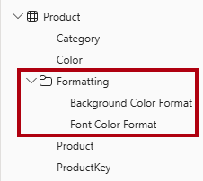
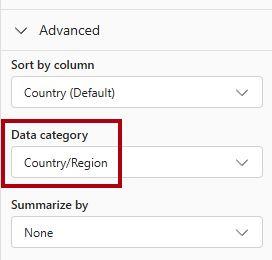
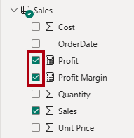
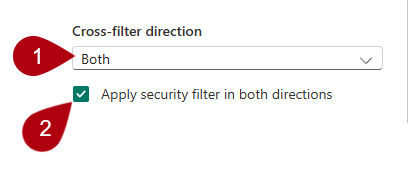

---
lab:
  title: Power BI でセマンティック モデルを構成する
  module: Configure a semantic model in Power BI
---

# Power BI でセマンティック モデルを構成する

## ラボのストーリー

このラボでは、データ モデルの開発を開始します。 テーブル間のリレーションシップを作成してから、データ モデルのわかりやすさと使いやすさを向上させるために、テーブルと列のプロパティを構成します。 また、階層とクイック メジャーを作成します。

このラボでは、次の作業を行う方法について説明します。

- モデル リレーションシップを作成する。
- テーブルと列のプロパティを構成する。
- 階層を作成する。
- クイック メジャーを作成する。
- 多対多リレーションシップを構成する。

**この配信には約 45 分かかります。**

## 作業の開始

この演習を完了するには、まず Web ブラウザーを開き、次の URL を入力して zip ファイルをダウンロードします。

`https://github.com/MicrosoftLearning/PL-300-Microsoft-Power-BI-Data-Analyst/raw/Main/Allfiles/Labs/03-configure-semantic-model/03-model-data.zip`

ファイルを **C:\Users\Student\Downloads\03-model-data** フォルダーに展開します。

**03-Starter-Sales Analysis.pbix** ファイルを開きます。

> _**注**:ファイルが読み込まれると、サインイン ダイアログが表示されることがあります。**[キャンセル]** を選択してサインイン ダイアログを閉じます。他のすべての情報ウィンドウを閉じます。変更の適用を求めるメッセージが表示されたら、**[後で適用]** を選択します。_

## モデル リレーションシップを作成する

このタスクでは、モデル リレーションシップを作成します。 このファイルは、テーブル間のリレーションシップを識別しないように構成されました。これは既定の設定ではありませんが、モデルの正しいリレーションシップを作成するための余分な作業を防ぐために推奨されます。

> "このラボでは、フィールドを参照するために簡略表記を使用します。 次のようになります: `Product | Category`。 この例では、`Product` はテーブル名、`Category` はフィールド名です。

1. Power BI Desktop ですべてのテーブル フィールドを表示するには、**[データ]** ペインで何も表示されていない領域を右クリックし、**[すべて展開]** を選択します。

1. テーブルの視覚エフェクトを作成するには、**[データ]** ペインの `Product` テーブル内で、`Category` フィールドをオンにします。

1. テーブルに別の列を追加するには、**[データ]** ペインで、`Sales | Sales` フィールドをオンにします。

1. テーブル ビジュアルに 4 つの製品カテゴリが一覧表示され、それぞれの Sales 値が同じで、Total も同じであることに注意してください。

    

    > _問題は、このテーブルが異なる複数のテーブルのフィールドに基づいていることです。各製品カテゴリには、そのカテゴリの売上が表示されることが想定されています。ただし、これらのテーブル間にモデル リレーションシップがないため、`Sales` テーブルはフィルター処理されません。そこで、リレーションシップを追加してテーブル間のフィルターを反映します。_

1. モデル デザイナーに切り替えるには、左側の **[モデル ビュー]** アイコンを選択します。

    

1. **[ホーム]** リボンで **[リレーションシップの管理]** を選択します。

    

1. **[リレーションシップの管理]** ウィンドウで、リレーションシップがまだ定義されていないことを確認します。

1. 新しいリレーションシップを作成するには、**[+ 新しいリレーションシップ]** を選択します。

1. `Product` テーブルから `Sales` テーブルへのリレーションシップを構成するには、**[テーブルから]** ドロップダウン リストで `Product` テーブルを選択し、**[テーブルへ]** ドロップダウン リストで `Sales` テーブルを選択します。

    

1. 次のプロパティが自動的に構成されていることがわかります。

    - **各テーブルの ProductKey 列が選択されています**。 これらの列は同じ名前とデータ型を共有しているため、選択されました。実際のデータでは、異なる名前を持つ一致する列を見つけることが必要な場合があります。__
    - **カーディナリティの種類は一対多 (1:\*)** です。 _このカーディナリティは、`Product` テーブルの `ProductKey` 列に一意の値が含まれていることが Power BI によって認識されているため、自動的に検出されました。一対多リレーションシップは最も一般的なカーディナリティで、このラボで作成するすべてのリレーションシップがこの種類になります。_
    - **クロスフィルター方向の種類は単一です**。 _単一というフィルターの方向は、フィルターが "一の側" から "多の側" に反映されることを意味します。この場合、`Product` テーブルに適用されたフィルターは `Sales` テーブルに伝達しますが、逆方向には伝達しません。_
    - **[このリレーションシップをアクティブにする] はオンになっています**。 "アクティブなリレーションシップは、フィルターを伝達します。_フィルターが反映されないように、リレーションシップを非アクティブとしてマークすることができます。テーブル間に複数のリレーションシップ パスがある場合、非アクティブなリレーションシップが存在する可能性があります。この場合、モデル計算は特別な関数を使用してアクティブ化できます。_

    

1. **[保存]** を選択し、**[リレーションシップの管理]** ウィンドウで、新しいリレーションシップが表示されていることを確認して、**[閉じる]** を選択します。

1. モデル ダイアグラムでは、2 つのテーブル間にコネクタがあることがわかります (リレーションシップをより明確に確認するために、テーブルの位置を変更することもできます)。

    

    > リレーションシップ プロパティの多くは、ダイアグラムのリレーションシップの線を調べることで解釈できます。__
    >
    > - カーディナリティは **1** および **(\*)** インジケーターによって表されます。__
    > - フィルターの方向は、矢印の向きによって表されます。__
    > - 実線はアクティブなリレーションシップを表し、点線は非アクティブなリレーションシップを表します。__
    >
    > ヒント:リレーションシップにカーソルを合わせると、関連する列が強調表示されます。_

1. **レポート ビュー**に切り替えると、テーブルの視覚エフェクトが更新され、製品カテゴリごとに異なる値が表示されます。

    > `Product` テーブルに適用されたフィルターが `Sales` テーブルに伝達されるようになりました。__

    

## 追加のリレーションシップを作成する

もっと簡単にリレーションシップを作成する方法があります。 モデル ダイアグラムで、列をドラッグ アンド ドロップして新しいリレーションシップを作成できます。

1. 別の手法を使用して新しいリレーションシップを作成するには、**モデル ビュー**に切り替えます。

1. `Reseller` テーブルから、`ResellerKey` 列を `Sales` テーブルの `ResellerKey` 列にドラッグします。

    > _**重要**: 列をドラッグできない場合があります。このような状況が発生した場合は、別の列を選択し、もう一度ドラッグする列を選択して、もう一度やり直してください。図に新しいリレーションシップが追加されていることを確認します。"_

    

1. **新しいリレーションシップ** ウィンドウで構成を確認し、**[保存]** を選択します。

1. 新しい方法を使用して、次の 2 つのモデル リレーションシップを作成します。

     - `Sales | SalesTerritoryKey` に対して `Region | SalesTerritoryKey` を行います
     - `Sales | EmployeeKey` に対して `Salesperson | EmployeeKey` を行います

1. ダイアグラムでは、`Sales` テーブルが図の中央に配置され、関連するテーブルがその周りに配置されるようにテーブルを配置します。 切断されたテーブルを横に配置します。

    

1. Power BI Desktop ファイルを保存します。

## Product テーブルを構成する

このタスクでは、`Product` テーブルに階層と表示フォルダーを構成します。

1. **[モデル]** ビューに切り替えます。

1. 必要であれば、**[データ]** ペインで `Product` テーブルを展開してすべてのフィールドを表示します。

1. `Product` テーブルで、`Category` 列を右クリックし、**[階層の作成]** を選択します。

    

1. **[プロパティ]** ペインの **[名前]** ボックスで、値を「_Products_」に置き換えます。

    

1. 階層にレベルを追加するには、**[階層]** ドロップダウン リストで **Subcategory** を選択してから **Product** を選択し、次に **[レベルの変更を適用する]** を選択します。

    

1. **[データ]** ペインの `Products` 階層に注目してください。 階層レベルを表示するには、展開します。

    

1. 列を表示フォルダーに整理するには、**[データ]** ペインで、まず `Background Color Format` 列を選択します。

1. **Ctrl** キーを押しながら、`Font Color Format` 列を選択します。

1. **[プロパティ]** ウィンドウの **[表示フォルダー]** ボックスに、「_書式設定_」と入力します。

    

1. **[データ]** ペインで、2 つの列がフォルダー内に表示されるようになったことを確認します。

    

    > _表示フォルダーは、特に多数のフィールドで構成されるテーブルを整理するのに最適な方法です。それらは論理的な表示専用です。_

## Region テーブルを構成する

このタスクでは、`Region` テーブルに階層と更新されたカテゴリを構成します。

1. `Region` テーブルで、次の 3 つのレベルを持つ _Regions_ という名前の階層を作成します。

     - `Group`
     - `Country`
     - `Region`

1. `Country` 列を選択します (`Country` 階層レベルではありません)。

1. **[プロパティ]** ペインで、(ペインの最下部にある) **[詳細]** セクションを展開し、次に **[データ カテゴリ]** ドロップダウン リストで **[国/地域]** を選択します。

    

    > "データ分類によってレポート デザイナーにヒントを提供できます。_この場合、列を国または地域に分類すると、マップ ビジュアライゼーションをレンダリングするときに、Power BI はより正確な情報を得られます。"_

## Reseller テーブルを構成する

このタスクでは、`Reseller` テーブルを構成して階層を追加し、データ カテゴリを更新します。

1. `Reseller` テーブルに、次の 2 つのレベルを持つ _Resellers_ という名前の階層を作成します。

     - `Business Type`
     - `Reseller`

1. 次の 4 つのレベルを持つ _Geography_ という名前の 2 番目の階層を作成します。

     - `Country-Region`
     - `State-Province`
     - `City`
     - `Reseller`

1. 次の列のデータ カテゴリを設定します (階層内ではありません)。

    - `Country-Region` から **Country/Region**
    - `State-Province` から **State or Province**
    - `City` から **City**

## Sales テーブルを構成する

このタスクでは、`Sales` テーブルを、更新された説明、書式設定、要約で構成します。

1. `Sales` テーブルで、`Cost` 列を選択します。

1. **[プロパティ]** ペインの **[説明]** ボックスに、次のように入力します。_Based on standard cost_

    > "_説明は、テーブル、列、階層、またはメジャーに適用できます。 **[データ]** ペインでレポート作成者がフィールドの上にカーソルを置いたとき、説明のテキストがヒントに表示されます。_ "

1. `Quantity` 列を選択します。

1. **[プロパティ]** ペインの **[書式設定]** セクションで、**[桁区切り記号]** プロパティを [オン] に設定します。__

1. `Unit Price` 列を選択します。

1. **[プロパティ]** ペインの **[書式設定]** セクションで、 **[小数点以下の桁数]** プロパティを _2_ に設定します。

1. **[詳細]** グループ (下にスクロールして見つける必要がある場合があります) の **[集計の方法]** のドロップダウン リストで、**[平均]** を選択します。

    > "_既定では、数値型の列は、値を合計して集計されます。この既定の動作は、レートを表す `Unit Price` のような列には適していません。既定の集計を平均に設定すると、有用な結果が得られます。"_

## プロパティを一括更新する

このタスクでは、1 回の一括更新で複数の列を更新します。 この方法を使用して列を非表示にし、列の値を書式設定します。

1. **[データ]** ペイン (またはモデル ダイアグラム) で、`Product | ProductKey` 列を選択します。

1. **Ctrl** キーを押しながら、次の 13 個の列 (複数のテーブルにまたがる) を選択します。

     - `Region | SalesTerritoryKey`
     - `Reseller | ResellerKey`
     - `Sales | EmployeeKey`
     - `Sales | ProductKey`
     - `Sales | ResellerKey`
     - `Sales | SalesOrderNumber`
     - `Sales | SalesTerritoryKey`
     - `Salesperson | EmployeeID`
     - `Salesperson | EmployeeKey`
     - `Salesperson | UPN`
     - `SalespersonRegion | EmployeeKey`
     - `SalespersonRegion | SalesTerritoryKey`
     - `Targets | EmployeeID`

1. **[プロパティ]** ペインで、**[非表示]** プロパティを _[はい]_ に設定します。

    > 列はリレーションシップによって使用されるか、行レベルのセキュリティ構成または計算ロジックで使用されるため、非表示に設定されました。__
    >
    > 「**Power BI Desktop で DAX 計算を作成する**」のラボでは、`SalesOrderNumber` 列を計算に使用します。__

1. 次の 3 列を複数選択します。

     - `Product | Standard Cost`
     - `Sales | Cost`
     - `Sales | Sales`

1. **[プロパティ]** ペインの **[書式設定]** セクションで、**[小数点以下の桁数]** プロパティを _0_ (ゼロ) に設定します。

## モデルのインターフェイスについて調べる

このタスクでは、**レポート ビュー**に切り替えて、モデル インターフェイスを確認し、自動の日付/時刻の設定を構成します。

1. **レポート** ビューに切り替えます。

1. **[データ]** ペインで、次の点に注目してください。

     - 列および階層とそれらのレベルはフィールドであり、レポートの視覚エフェクトを構成するために使用できます。
     - レポート作成に関連するフィールドのみが表示されます。
     - `SalespersonRegion` テーブルは表示されません。そのフィールドがすべて非表示になっているためです。
     - `Region` および `Reseller` テーブルの空間フィールドには、空間アイコンが表示されます。
     - 既定では、シグマ記号 (Ʃ) の付いたフィールドが集計されます。
     - カーソルを `Sales | Cost` フィールドに合わせると、ヒントが表示されます。

1. `Sales | OrderDate` フィールドを展開すると、`Date Hierarchy` が表示されることがわかります。 `Targets | TargetMonth` フィールドも同様の階層構造です。

    

    > _**重要**: これらの階層は自分で作成したものではありません。これらは、既定の設定として自動的に作成されました。ただし、問題があります。Adventure Works の会計年度は、毎年 7 月 1 日に始まります。ただし、この自動的に作成された日付階層では、日付階層の年は毎年 1 月 1 日に始まります。"_

1. 自動日付/時刻設定をオフにするには、**[ファイル] > [オプションと設定] > [オプション]** に移動します。

1. **オプション** ウィンドウの **[現在のファイル]** セクションで、**[データの読み込み] > [タイム インテリジェンス]** に移動し、**[自動の日付/時刻]** のチェックを外します。

    

1. **[データ]** ペインで、日付階層を使用できなくなっていることを確認します。

## クイック メジャーを作成する

このタスクでは、利益と利益率を計算するための 2 つのクイック メジャーを作成します。 クイック メジャーが自動的に計算を作成します。 単純で一般的な計算を、簡単にすばやく作成できます。

1. **[データ]** ペインで、`Sales` テーブルを右クリックし、**[新しいクイック メジャー]** を選択します。

    

1. **[クイック メジャー]** ペインの **[計算の選択]** ドロップダウン リストで、**[数学演算]** グループ内から **[減算]** を選択します。

    

1. **[データ]** ペインから、`Sales | Sales` フィールドを **[基準値]** ウェルにドラッグします。

    

1. `Sales | Cost` フィールドを **[減算する値]** ボックスにドラッグします。  

    

1. **[追加]** を選択します。

1. **[データ]** ペインの `Sales` テーブル内で、新しいメジャーに注目します。

    > _メジャーは電卓アイコンで表示されます。_

    

1. メジャーの名前を変更するには、メジャーを右クリックし、**[名前の変更]** を選択して、名前を「_Profit_」に変更します。

    > _ヒント:フィールドの名前を変更するには、それをダブルクリックするか、それを選択して **F2** キーを押してもかまいません。_

1. `Sales` テーブルで、次の要件に基づいて 2 番目のクイック メジャーを追加します。

    > _**重要**:クイック メジャーを作成するオプションがコンテキスト メニューに表示されない場合は、**[ホーム]** リボンの **[計算]** グループ内にあるコマンドを使用します。

    - **[除算]** 数学演算を使用します。
    - **[分子]** を `Sales | Profit` フィールドに設定します。
    - **[分母]** を `Sales | Sales` フィールドに設定します。
    - メジャーの名前を「_Profit Margin_」に変更します。

1. `Profit Margin` メジャーを確実に選択してから、**[メジャー ツール]** コンテキスト リボンで、形式を小数点以下 2 桁の **[パーセント]** に設定します。

    

1. 2 つのメジャーをテストするには、最初にページ上の既存のテーブルの視覚エフェクトを選択します。

1. **[データ]** ペインで、`Profit` メジャーと `Profit Margin` メジャーをオンにしてテーブルに追加します。

    

1. 右側のガイドを選択してドラッグし、テーブル ビジュアルを広げます。

    

1. メジャーが適切にフォーマットされた適切な結果を生成することを確認します。

    

## 多対多の関連性を作成する

このタスクでは、`Salesperson` テーブルと `Sales` テーブルの間に多対多リレーションシップを作成します。

1. **レポート ビュー**で、レポート ページの空白領域を選択します。

1. 新しいテーブルの視覚エフェクトを作成するには、**[データ]** ペインで次の 2 つのフィールドをオンにします。

     - `Salesperson | Salesperson`
     - `Sales | Sales`

    

    > _このテーブルの視覚エフェクトには、各営業担当者の売上が表示されます。しかし、営業担当者と営業の間には別のリレーションシップもあります。営業担当者により、担当する地域の数は 1 つ、2 つ、またはそれより多い可能性もあります。さらに、1 つの営業地域に複数の営業担当者が割り当てられている場合もあります。_
    >
    > _パフォーマンス管理の観点からは、営業担当者の (割り当てられた担当地域に基づく) 売上を分析し、売上目標と比較する必要があります。次の演習では、この分析をサポートするリレーションシップを作成します。_

1. _Michael Blythe_ が約 900 万ドルの売上を達成したことに注目してください。

1. **モデル ビュー**に切り替えて、`SalespersonRegion` テーブルをドラッグして、`Region` テーブルと `Salesperson` テーブルの間に配置します。

1. ドラッグ アンド ドロップ手法を使用して、次の 2 つのモデル リレーションシップを作成します。

    - `SalespersonRegion | EmployeeKey` に対して `Salesperson | EmployeeKey` を行います
    - `SalespersonRegion | SalesTerritoryKey` に対して `Region | SalesTerritoryKey` を行います

    > `SalespersonRegion` テーブルはブリッジ テーブルと見なすことができます。__

1. **レポート ビュー**に切り替えて、ビジュアルが更新されていないこと (Michael Blythe の売上結果が変更されていないこと) に注目します。

1. **モデル ビュー**に戻り、`Salesperson` テーブルからのリレーションシップ フィルターの方向 (矢印の向き) をたどります。

    > `Salesperson` テーブルが `Sales` テーブルをフィルター処理することに着目します。__ そこでは `SalespersonRegion` テーブルもフィルター処理しますが、`Region` テーブルへのフィルターの伝達は継続されていません (矢印の方向が間違っています)。

    

1. `Region` テーブルと `SalespersonRegion` テーブル間のリレーションシップを編集するには、リレーションシップをダブルクリックします。

1. **[リレーションシップの編集]** ウィンドウの **[クロス フィルターの方向]** ドロップダウン リストで、 _[両方]_ を選択します。

1. **[両方向にセキュリティ フィルターを適用する]** チェック ボックスをオンにします。

    

1. **[保存]** を選択します。

1. これでリレーションシップの矢印の向きが両方になったことに注意してください。

    

1. **レポート ビュー**に切り替えて、販売の値がまだ変更されていないことに注目します。

    > _この問題は、今度は、`Salesperson` テーブルと `Sales` テーブルの間に 2 つのフィルター伝播パスが可能であるという事実に関連します。この曖昧さは、"テーブル数最小" の評価に基づいて内部的に解決されます。明確にするために、このようなあいまいさを持つモデルを設計しないでください。この問題は、このラボの後半で部分的に解決され、「**Power BI Desktop での DAX 計算の作成**」のラボを完了するまでに解決されます。_

1. **[モデル]** ビューに切り替えます。

1. ブリッジ テーブルを介してフィルターの伝達を強制するには、`Salesperson` テーブルと `Sales` テーブルのリレーションシップを編集 (ダブルクリック) します。

1. **[リレーションシップの編集]** ウィンドウで、**[このリレーションシップをアクティブにする]** チェック ボックスをオフにします。

    

1. **[保存]** を選択します。

    > フィルターの伝達が、アクティブなパスのみに従うようになりました。__

1. モデル ダイアグラムでは、非アクティブなリレーションシップは点線で表されていることに注目してください。

    

1. **レポート ビュー**に切り替えて、Michael Blythe の売上が今度は約 2,200 万ドルになっていることに注目します。

1. また、各営業担当者の売上がテーブル合計を上回る場合もあります。

     > _地域の売上実績が 2 重、3 重などにカウントされるため、これは多対多のリレーションシップではよくあることです。もう 1 人の営業担当者 Brian Welcker がリストに含まれるものとします。彼の売上金額は合計売上金額と同じです。彼は営業部長なので、これは正しい結果です。彼の売上は、すべての地域の売上によって測定されます。_
     >
     > _これで多対多リレーションシップは動作するようになりましたが、今度は営業担当者の売上を分析することができません (リレーションシップが非アクティブなため)。「**Power BI Desktop で DAX 計算を作成する**」のラボで、営業担当者に割り当てられた販売地域での売上分析ができる計算テーブルを (実績分析のために) 導入すると、リレーションシップをもう一度アクティブにすることができます。_

1. **モデル ビュー**に切り替えて、モデル ダイアグラムで `Salesperson` テーブルを選択します。

1. **[プロパティ]** ペインの **[名前]** ボックスで、テキストを "_Salesperson (Performance)_" に置き換えます。

    > 名前を変更したテーブルには、その目的が反映されます。つまり、このテーブルを使用して、営業担当者が割り当てられた販売地域の売上に基づいて営業担当者の業績をレポートおよび分析します。__

## Targets テーブルを関連付ける

このタスクでは、`Targets` テーブルへのリレーションシップを作成します。

1. `Salesperson (Performance) | EmployeeID` 列と `Targets | EmployeeID` 列からリレーションシップを作成します。

1. **レポート ビュー**で、`Targets | Target` フィールドをテーブルの視覚エフェクトに追加します。

1. テーブル ビジュアルのサイズを変更し、すべての列が表示されるようにします。

    

 > _売上と目標を視覚化できるようになりましたが、2 つの理由から注意が必要です。第 1 に、期間に対するフィルターがないため、目標には将来の目標金額も含まれます。第 2 に、目標は加算できないため、合計が表示されないようにする必要があります。これらは、視覚エフェクトの書式設定を使用して無効にするか、計算ロジックを使用して削除できます。_

1. Power BI Desktop ファイルを保存します。

## ラボが完了しました

このラボでは必要ありませんが、Power BI レポートを保存することもできます。 次の演習では、事前に作成されたスターター ファイルを使用します。

1. 左上隅の **[ファイル]** メニューに移動し、**[名前を付けて保存]** を選択します。 
1. **[このデバイスを参照する]** を選択します。
1. ファイルを保存するフォルダーを選択し、わかりやすい名前を付けます。 
1. **[保存]** ボタンを選択して、レポートを .pbix ファイルとして保存します。 
1. 保留中のクエリの変更について適用を求めるダイアログ ボックスが表示された場合は、**[適用]** を選択します。
1. Power BI Desktop を閉じます。