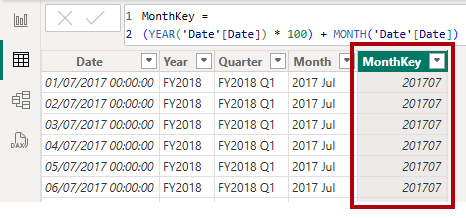

---
lab:
  title: セマンティック モデルで DAX 計算を作成する
  module: Create DAX calculations in semantic models
---

# セマンティック モデルで DAX 計算を作成する

## ラボのストーリー

このラボでは、Data Analysis Expressions (DAX) を使用して、計算テーブル、計算列、およびシンプルなメジャーを作成します。

このラボでは、次の作業を行う方法について説明します。

- 計算テーブルを作成する。
- 計算列を作成する。
- メジャーを作成する。

**この配信には約 45 分かかります。**

## 作業の開始

この演習を完了するには、まず Web ブラウザーを開き、次の URL を入力して zip ファイルをダウンロードします。

`https://github.com/MicrosoftLearning/PL-300-Microsoft-Power-BI-Data-Analyst/raw/Main/Allfiles/Labs/04-create-dax-calculations\04-dax-calculations.zip`

ファイルを **C:\Users\Student\Downloads\04-dax-calculations** フォルダーに展開します。

**04-Starter-Sales Analysis.pbix** ファイルを開きます。

> _**注**:**[キャンセル]** を選択すると、サインインを閉じることができます。他のすべての情報ウィンドウを閉じます。変更の適用を求めるメッセージが表示されたら、**[後で適用]** を選択します。_

## Salesperson 計算テーブルを作成する

このタスクでは、`Salesperson` 計算テーブル (`Sales` テーブルと直接リレーションシップを持つ) を作成します。

計算テーブルを作成するには、最初にテーブル名を入力し、続けて等号 (=) と、テーブルが返される DAX 式を入力します。 データ モデル内に既に存在しているテーブル名は使用できません。

"数式バー" に有効な DAX 式を入力します。__ 数式バーには、オートコンプリート、Intellisense、色分けなどの機能が用意されているため、すばやく正確に数式を入力できます。

1. Power BI Desktop のレポート ビューで、**[モデリング]** リボンの **[計算]** グループの中から、**[新しいテーブル]** を選択します。

    

1. 数式バー (計算を作成または編集するときにリボンのすぐ下に表示されます) に「`Salesperson =`」と入力し、**Shift+Enter** キーを押して、「`'Salesperson (Performance)'`」と入力してから、**Enter** キーを押します。

    > _**注**:参考までに、このラボのすべての DAX 定義は **04-dax-calculations\Snippets.txt** ファイルにあるスニペット ファイルからコピーできます。_

    

    > このテーブル定義では、`Salesperson (Performance)` テーブルのコピーが作成されます。__ コピーされるのはデータのみで、表示や書式設定などのモデル プロパティはコピーされません。

1. **[データ]** ペインで、新しいテーブルのアイコンに追加の電卓アイコンも含まれている (計算テーブルを示す) ことに注目してください。

    

    > _**注**:計算テーブルは、テーブルを返す DAX 式を使用して定義します。計算テーブルは、値を具体化して格納するため、データ モデルのサイズが大きくなることを理解しておくことが重要です。また、新しい (将来の) 日付値がテーブルに読み込まれるこのデータ モデルの場合のように、数式の依存関係が更新されるたびに再計算されます。_
    >
    > _Power Query に由来するテーブルとは異なり、計算テーブルを使用して外部データ ソースからデータを読み込むことはできません。既にデータ モデルに読み込まれている内容に基づいてのみ変換できます。"_

1. モデル ビューに切り替えると、`Salesperson` テーブルが使用可能であることがわかります。

1. `Salesperson | EmployeeKey` 列から `Sales | EmployeeKey` 列へのリレーションシップを作成します。

    > "このラボでは、フィールドを参照するために簡略表記を使用します。_次のようになります: `Salesperson | EmployeeKey`。_ この例では、`Salesperson` はテーブル名、`EmployeeKey` は列名です。

1. `Salesperson (Performance)` テーブルと `Sales` テーブル間の非アクティブなリレーションシップ (点線) を右クリックし、**[削除]** を選択します。 削除するかどうかを確認するメッセージが表示されたら、 **[はい]** を選択します。

1. `Salesperson` テーブルで、次の列を複数選択し、非表示にします (**[非表示]** プロパティを [はい] に設定します)。__

    - `EmployeeID`
    - `EmployeeKey`
    - `UPN`

1. モデル ダイアグラムで、`Salesperson` テーブルを選択します。

1. **[プロパティ]** ペインの **[説明]** ボックスに、次のように入力します。売上に関連する営業担当者__

    > 以前も説明したように、ユーザーがカーソルをテーブルまたはフィールドに合わせると、**[データ]** ペインにヒントとして説明が表示されます。__

1. `Salesperson (Performance)` テーブルの説明を次のように設定します。_地域に関連する営業担当者_

> "これで、販売員を分析するときに、データ モデルによって 2 つの代替手段が提供されるようになりました。_`Salesperson` テーブルを使用すると、販売員による売上を分析できます。一方、`Salesperson (Performance)` テーブルでは、販売員に割り当てられた販売地域での売上を分析できます。_

## Date テーブルを作成する

このタスクでは、`Date` テーブルを作成します。

1. データ ビューに切り替えます。 **[ホーム]** リボン タブの **[計算]** グループの中から、**[新しいテーブル]** を選択します。

    

1. 数式バーに次の DAX を入力します。

    ```dax
    Date =  
    CALENDARAUTO(6)
    ```

    

    > _`CALENDARAUTO` 関数は、日付値で構成される 1 列のテーブルを返します。"自動的な" 動作により、すべてのデータ モデルの日付列がスキャンされ、データ モデルに格納されている最も古い日付値と最も新しい日付値が決定されます。次に、この範囲内の各日付に対して 1 つの行が作成されます。範囲をいずれかの方向に拡張して、すべての年のデータが格納されるようにします。"_
    >
    > "この関数は、1 年の最後の月数である 1 つの省略可能な引数を受け取ることができます。_省略した場合、その値は 12 になります。12 月が年度の最終月であるという意味です。この場合は "6" が入力されています。6 月が年度の最終月であるという意味です。"_

1. 米国の地域設定 (mm/dd/yyyy) を使用して書式設定されている日付値の列に注目してください。

    

1. 左下隅のステータス バーに、テーブルの統計情報が表示されているのがわかります。1826 行のデータが生成されていることを確認します。これは 5 年間全体のデータを表します。

    

## 計算列を作成する

このタスクでは、列をさらに追加して、さまざまな期間によるフィルター処理とグループ化を可能にします。 また、計算列を作成して、他の列の並べ替え順序の制御も行います。

> _**注**:参考までに、このラボのすべての DAX 定義は **Snippets.txt** ファイルからコピーできます。_

1. **[テーブル ツール]** コンテキスト リボンの **[計算]** グループ内から、**[新しい列]** を選択します。

    > "計算列を作成するには、最初に列名を入力し、続けて等号 (=) と、単一値の結果が返される DAX 式を入力します。テーブル内に既に存在している列名は使用できません。"__

    

1. 数式バーに次のように入力 (またはスニペット ファイルからコピー) して、**Enter** キーを押します。

    > _この数式では日付の年の値が使用されますが、月が 6 月よりも後の場合は、年の値に 1 が加算されます。このようにして、Adventure Works 社の会計年度が計算されます。_

   ```dax
   Year =
   "FY" & YEAR('Date'[Date]) + IF(MONTH('Date'[Date]) > 6, 1)
   ```

1. スニペットのファイル定義を使用して、`Date` テーブルに対して次の 2 つの計算列を作成します。

    - `Quarter`
    - `Month`

1. 新しい列が追加されたことを確認します。

    

1. 計算を確認するために、レポート ビューに切り替えます。

1. 新しいレポート ページを作成するには、**[ページ 1]** の横にあるプラス アイコンを選択します。

    

1. 新しいレポート ページに行列の視覚エフェクトを追加するには、**[視覚化]** ペインで、行列の視覚エフェクトの種類を選択します。

    > _ヒント:各アイコンの上にカーソルを置くと、視覚エフェクトの種類について説明するヒントが表示されます。"_

    

1. **[データ]** ペインの `Date` テーブル内から、`Year` フィールドを **[行]** ウェルにドラッグします。

    

1. `Month` フィールドを **[行]** ウェル、`Year` フィールドのすぐ下にドラッグします。

1. マトリックス ビジュアルの右上 (またはビジュアルの場所によっては下部) にある、分岐した二重矢印アイコンを選択します (すべての年を 1 レベル下に展開します)。

    

1. 年が月に展開され、月が時系列順ではなくアルファベット順に並べ替えられていることがわかります。

    

    > _既定では、テキスト値はアルファベット順に、数値は昇順に、日付は最も古いものから最も新しいものの順に並べ替えられます。_

1. `Month` フィールドの並べ替え順序をカスタマイズするために、テーブル ビューに切り替えます。

1. `MonthKey` 列を `Date` テーブルに追加します。

    ```dax
    MonthKey =
    (YEAR('Date'[Date]) * 100) + MONTH('Date'[Date])
    ```

    > _この数式により、年と月の各組み合わせに対する数値が計算されます。_

1. テーブル ビューで、新しい列に数値が含まれていることを確認します (たとえば、2017 年 7 月に対して 201707、など)。

    

1. もう一度レポート ビューに切り替えます。

1. **[データ]** ペインで `Month` フィールドを選択します。

1. **[列ツール]** コンテキスト リボンで、**[並べ替え]** グループ内から **[列で並べ替え]** を選択して、**[MonthKey]** を選択します。

    

1. 行列の視覚エフェクト内で、月が時系列順に並べ替えられるようになったことがわかります。

    

## Date テーブルを完成させる

このタスクでは、1 つの列を非表示にし、階層を作成することで、`Date` テーブルのデザインを完成させます。 次に、`Sales` と `Targets` のテーブルへのリレーションシップを作成します。

1. [モデル] ビューに切り替えます。

1. `Date` テーブルで、`MonthKey` 列を非表示にします (**[非表示]** を [はい] に設定します)。__

1. **[データ]** ペインで、`Date` テーブルを選択し、`Year` 列を右クリックして、**[階層の作成]** を選択します。

    

1. **[プロパティ]** ペインの **[名前]** ボックスで、値を「_Fiscal_」に置き換えます。

    

1. 階層にレベルを追加するには、**[階層]** ドロップダウン リストで **Quarter** を選択し、**Month** を選択して、**[レベルの変更を適用する]** を選択します。

    

1. 次の 2 つのモデル リレーションシップを作成します。

    - `Sales | OrderDate` に対して `Date | Date` を行います
    - `Targets | TargetMonth` に対して `Date | Date` を行います

1. 次の 2 つの列を非表示にします。

    - `Sales | OrderDate`
    - `Targets | TargetMonth`

## Date テーブルをマークする

このタスクでは、`Date` テーブルを日付テーブルとしてマークします。

1. レポート ビューに切り替えます。

1. **[データ]** ペインで、`Date` テーブル (`Date` フィールドではありません) を選択します。

1. **[テーブル ツール]** コンテキスト リボンの **[カレンダー]** グループ内から、**[日付テーブルとしてマーク]** を選択します。

    

1. **[日付テーブルとしてマーク]** ウィンドウで、**[日付テーブルとしてマーク]** プロパティを [はい] にスライドします。__

1. **[日付列の選択]** ドロップダウン リストで、**Date** を選択します。

    

1. **[保存]** を選択します。

1. Power BI Desktop ファイルを保存します。

> これで、このテーブルによって日付 (タイム) が定義されていることが Power BI Desktop に認識されるようになりました。__
>
> _日付テーブルに対するこのデザイン方法は、データ ソース内に日付テーブルがない場合に適しています。データ ウェアハウスをお持ちの場合は、データ モデルで日付ロジックを「再定義」するのではなく、日付ディメンション テーブルから日付データをロードするのが適切です。_

## 単純なメジャーを作成する

このタスクでは、シンプルなメジャーを作成します。 単純なメジャーは、単一の列の値を集計するか、テーブルの行をカウントします。

1. レポート ビューの**ページ 2** の **[データ]** ペインから、`Sales | Unit Price` フィールドをマトリックスの視覚エフェクトにドラッグします。

    

1. 視覚エフェクト フィールド ペイン (**[視覚化]** ペイン内) の **[値]** ウェルで、`Unit Price` フィールドが**単価の平均**として構成されていることがわかります。

    

1. **[Unit Price の平均]** の下向き矢印を選択して、使用可能なメニュー オプションを確認します。

    > "表示可能な数値列を使用すると、レポートの作成者は、レポートの設計時に列の値をどのように集計するか (またはしないか) を決定できます。_ただし、これにより、不適切な報告が発生する可能性があります。_
    >
    > _ただし、一部のデータ モデル作成者は、物事を偶然に任せたくないので、これらの列を非表示にし、メジャーで定義された集計ロジックを公開することを選択します。このラボでも、この方法を採用します。_

1. メジャーを作成するには、**[データ]** ペインで `Sales` テーブルを右クリックして、**[新しいメジャー]** を選択します。

1. 数式バーに、次のメジャーの定義を追加します。

    ```DAX
    Avg Price =  
    AVERAGE(Sales[Unit Price])
    ```

1. マトリックスの視覚エフェクトに `Avg Price` メジャーを追加して、`Unit Price` 列と同じ結果が生成される (ただし、書式設定は異なる) ことに注目してください。

1. **[値]** ウエルで、`Avg Price` フィールドのコンテキスト メニューを開き、集計手法を変更できないことに注目してください。

    

    > メジャーの集計動作を変更することはできません。__

1. スニペットのファイル定義を使用して、`Sales` テーブルに対して次の 5 つのメジャーを作成します。

    - `Median Price`
    - `Min Price`
    - `Max Price`
    - `Orders`
    - `Order Lines`

    > `Orders` メジャーで使用される `DISTINCTCOUNT` 関数は、注文を 1 回だけカウントします (重複は無視されます)。__`Order Lines` メジャーで使用される `COUNTROWS` 関数はテーブルに対して実行されます。
    >
    > この場合、注文数は、`SalesOrderNumber` 列の一意の値をカウントすることによって計算されますが、注文の行の数は、単純にテーブルの行の数になります (各行が 1 つの注文の 1 行になります)。__

1. モデル ビューに切り替えて、価格の 4 つのメジャー `Avg Price`、`Max Price`、`Median Price`、`Min Price` を複数選択します。

1. 複数選択したメジャーに対して、次の要件を構成します。

    - 書式を小数点以下 2 桁に設定する。
    - _Pricing_ という表示フォルダーに割り当てる (**[プロパティ]** ペインの **[表示フォルダー]** プロパティを使用)。

    

1. `Unit Price` 列を非表示にします。

    > _`Unit Price` 列はレポート作成者には使用できなくなりました。モデルに追加した価格メジャーを使用する必要があります。このデザイン方法では、レポート作成者が不適切に価格を集計することができなくなります (たとえば、それらを合計する)。_

1. `Order Lines` および `Orders` のメジャーを複数選択し、次の要件を構成します。

    - 桁区切り記号を使用するように書式を設定する。
    - _Counts_ という名前の表示フォルダーに割り当てる。

    

1. レポート ビューで、マトリックスの視覚エフェクトの **[値]** で、**[Unit Price の平均]** の **[X]** を選択して削除します。

    

1. ページの幅と高さに合わせて、行列の視覚エフェクトのサイズを大きくします。

1. マトリックス ビジュアルに次の 5 つのメジャーを追加します。

    - `Median Price`
    - `Min Price`
    - `Max Price`
    - `Orders`
    - `Order Lines`

1. 結果が適切に表示され、正しく書式設定されていることを確認します。

    

## 追加のメジャーを作成する

このタスクでは、より複雑な数式を使用するメジャーをさらに作成します。

1. レポート ビューで、**[ページ 1]** を選択し、営業担当者のテーブルの視覚エフェクト (右側) を確認して、**[Sum of Target]** 列の合計を確認します。

    

1. テーブルの視覚エフェクトを選択し、**[視覚化]** ペインで **[Sum of Target]** を削除します。

1. `Targets | Target` 列の名前を「_TargetAmount_」に変更します。

    > "_ヒント: レポート ビューで列の名前を変更するには、いくつかの方法があります。 **[データ]** ペインで、列を右クリックしてから **[名前の変更]** を選択するか、列をダブルクリックするか、**F2** キーを押します。_ "

1. `Targets` テーブルに対して、次のメジャーを作成します。

    ```dax
    Target =
    IF(
        HASONEVALUE('Salesperson (Performance)'[Salesperson]),
        SUM(Targets[TargetAmount])
    )
    ```

    > _`HASONEVALUE` 関数は、`Salesperson` 列内の 1 つの値がフィルター処理されているかどうかをテストします。true の場合は、式によって (その販売員のみの) 目標金額の合計が返されます。false の場合は `BLANK` が返されます。_

1. `Target` メジャーを、小数点以下 0 桁に書式設定します。

    > _ヒント: **[メジャー ツール]** コンテキスト リボンを使用できます。_

1. `TargetAmount` 列を非表示にします。

    > "_ヒント: **[データ]** ペインで列を右クリックして **[非表示]** を選択することができます。_ "

1. 一覧の先頭に `Targets` テーブルが表示されるようになったことに注目してください。

    

    > _表示されるメジャーのみを含むテーブルは、自動的に一覧の先頭に表示されます。_

1. テーブルの視覚エフェクトに `Target` メジャーを追加します。

1. **Target** 列の合計が `BLANK` になっていることに注目してください。

    

1. スニペットのファイル定義を使用して、`Targets` テーブルに対して次の 2 つのメジャーを作成します。

    - `Variance`
    - `Variance Margin`

1. `Variance` メジャーを、小数点以下 0 桁に書式設定します。

1. `Variance Margin` メジャーは、小数点以下 2 桁のパーセンテージとして書式設定してください。

1. `Variance` および `Variance Margin` メジャーをテーブルの視覚エフェクトに追加します。

1. すべての列と行が表示されるように、テーブル ビジュアルのサイズを変更します。

    

    > すべての営業担当者が目標を達成していないように見えますが、テーブルの視覚エフェクトはまだ特定の期間でフィルタリングされていないことに注意してください。__「**Power BI Desktop でレポートをデザインする**」のラボでは、ユーザーが選択した期間でフィルター処理を行う販売実績レポートを生成します。

1. Power BI Desktop ファイルを保存します。

## ラボが完了しました
