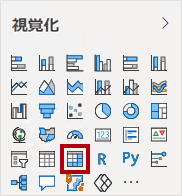
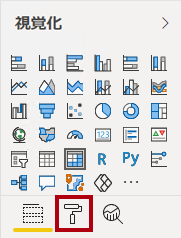
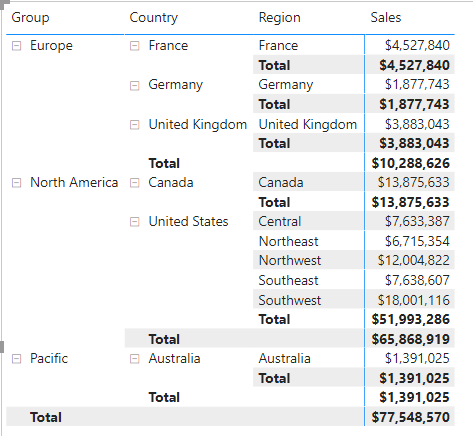
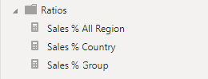

---
lab:
  title: Power BI Desktop で高度な DAX 計算を作成する
  module: Create Model Calculations using DAX in Power BI
---

# Power BI Desktop で高度な DAX 計算を作成する

## **ラボのストーリー**

このラボでは、フィルター コンテキストの操作を伴う DAX 式を使用してメジャーを作成します。

このラボでは、次の作業を行う方法について説明します。

- CALCULATE() 関数を使用してフィルター コンテキストを操作する
- タイム インテリジェンス関数を使用する

**この配信には約 45 分かかります。**

## 作業の開始

この演習を完了するには、まず Web ブラウザーを開き、次の URL を入力して zip フォルダーをダウンロードします。


`https://github.com/MicrosoftLearning/PL-300-Microsoft-Power-BI-Data-Analyst/raw/Main/Allfiles/Labs/05-create-dax-calculations-in-power-bi-desktop-advanced/05-advanced-dax.zip`

フォルダーを **C:\Users\Student\Downloads\05-advanced-dax** フォルダーに展開します。

**05-Starter-Sales Analysis.pbix** ファイルを開きます。

> ***注**: **[キャンセル]** を選択すると、サインインを閉じることができます。 他のすべての情報ウィンドウを閉じます。 変更の適用を求めるメッセージが表示されたら、**[後で適用]** を選択します。

## 行列の視覚エフェクトを作成する

このタスクでは、新しいメジャーのテストをサポートするためのマトリックス ビジュアルを作成します。

1. Power BI Desktop の**レポート ビュー**で、新しいレポート ページを作成します。

1. **[ページ 3]** で、行列の視覚エフェクトを追加します。

    

1. ページ全体に合わせて行列の視覚エフェクトのサイズを変更します。

1. 行列の視覚エフェクトのフィールドを構成するには、 **[データ]** ペインから **Region \| Regions** 階層をドラッグして、視覚エフェクト内にドロップします。

    > "このラボでは、フィールドまたは階層を参照するために簡略表記を使用します。*次のようになります。**Region \| Regions**。この例では、**Region** はテーブル名、**Regions** は階層名です。"*

1. **[Sales \| Sales]** フィールドも [Values] ウェルに追加します。

1. 階層全体を展開するには、行列の視覚エフェクトの右上にある 2 つに分かれた矢印アイコンを 2 回選択します。

    

1. 視覚エフェクトを書式設定するには、 **[視覚化]** ペインにある **[書式]** ペインを選択します。

    

1. **[検索]** ボックスに「**Layout**」と入力します。

1. **[Layout]** プロパティを **[Tabular]** に設定します。

    

1. マトリックス ビジュアルに 4 つの列見出しができたことを確認します。

    

    > "Adventure Works では、販売地域はグループ、国、地域に分類されます。*すべての国 (米国を除く) には地域が 1 つだけあり、その国にちなんだ名前が付けられています。米国は非常に大きな販売地域であるため、5 つの販売地域に分かれています。"*

この演習ではいくつかのメジャーを作成し、行列の視覚エフェクトに追加してテストします。

## フィルター コンテキストを操作する

このタスクでは、CALCULATE() 関数を使用してフィルター コンテキストを操作する DAX 式を使って、いくつかのメジャーを作成します。

> "CALCULATE() 関数は、フィルター コンテキストを操作するために使用される強力な関数です。*最初の引数では、式またはメジャーを受け取ります (メジャーは単に名前付きの式です)。その後の引数によって、フィルター コンテキストを変更できます。"*

1. 次の式に基づいて、**Sales** テーブルにメジャーを追加します。

    > **注**: *便宜上、このラボのすべての DAX 定義は **C:\Users\Student\Downloads\05-advanced-dax\Snippets.txt** ファイルからコピーできます。*

    ```DAX
    Sales All Region =

    CALCULATE(SUM(Sales[Sales]), REMOVEFILTERS(Region))
    ```

    >
    > "REMOVEFILTERS() 関数では、アクティブなフィルターが削除されます。*引数を指定しないことも、テーブル、列、または複数の列を引数として指定することもできます。"*
    >
    > "この数式では、メジャーは、変更されたフィルター コンテキストの **Sales** 列の合計を評価します。これにより、**Region** テーブルの列に適用されているフィルターがすべて削除されます。**

1. **Sales All Region** メジャーをマトリックス ビジュアルに追加します。

    

1. **Sales All Region** メジャーによって、各地域、国 (小計)、およびグループ (小計) のすべての地域売上の合計が計算されていることがわかります。

    "新しいメジャーはまだ有用な結果を提供していません。 *"グループ、国、または地域の販売をこの値で割ると、"総計の割合" と呼ばれる有用な比率が生成されます。"*

1. **[データ]** ペインで、**Sales All Region** メジャーが選択されていることを確認し (選択されている場合は、背景が濃い灰色になります)、数式バーでメジャー名と数式を次の数式に置き換えます。

    ''ヒント: 既存の数式を置き換えるには、まずスニペットをコピーします。次に、数式バー内を選択し、**Ctrl + A** キーを押してすべてのテキストを選びます。次に、**Ctrl + V** キーを押してスニペットを貼り付け、選択したテキストを上書きします。次に、**Enter** キーを押します。''**

    ```DAX
    Sales % All Region =  
    DIVIDE(  
     SUM(Sales[Sales]),  
     CALCULATE(  
     SUM(Sales[Sales]),  
     REMOVEFILTERS(Region)  
     )  
    )
    ```

    "更新された数式の内容を正確に反映するように、メジャーの名前が変更されました。*DIVIDE() 関数によって、(フィルター コンテキストによって変更されない) **Sales** メジャーが、**Region** テーブルに適用されているすべてのフィルターが削除される変更されたコンテキストの **Sales** メジャーによって除算されます。"*

1. マトリックス ビジュアルで、メジャーの名前が変更され、グループ、国、および地域ごとに異なる値が表示されるようになったこと注目してください。

1. **Sales % All Region** メジャーを、小数点以下 2 桁のパーセンテージとして書式設定します。

1. 行列の視覚エフェクトで、**Sales % All Region** メジャーの値を確認します。

    

1. 次の式に基づいて、**Sales** テーブルにもう 1 つのメジャーを追加し、パーセンテージとして書式設定します。

    ```DAX
    Sales % Country =  
    DIVIDE(  
     SUM(Sales[Sales]),  
     CALCULATE(  
     SUM(Sales[Sales]),  
     REMOVEFILTERS(Region[Region])  
     )  
    )
    ```

1. **Sales % Country** の数式は、**Sales % All Region** の数式とは若干異なることにお気付きでしょうか。

    "異なるのは、分母でのフィルター コンテキストの変更が、**Region** テーブルのすべての列ではなく、**Region** テーブルの **Region** 列に対するフィルターを削除することで行われている点です。これは、グループまたは国の列に適用されているすべてのフィルターが保持されることを意味します。これにより、国の割合として売上を表す結果が得られます。"**

1. 行列の視覚エフェクトに **Sales % Country** メジャーを追加します。

1. 米国の地域だけに、100% ではない値が生成されていることに注目してください。

    

    > "米国だけに複数の地域があることを思い出すかもしれません。他のすべての国には地域が 1 つしかなく、すべて 100% になるのはそのためです。"**

1. 視覚エフェクトでのこのメジャーの読みやすさを向上させるために、**Sales % Country** メジャーを次の改良された数式で上書きします。

    ```DAX
    Sales % Country =  
    IF(  
     ISINSCOPE(Region[Region]),  
     DIVIDE(  
     SUM(Sales[Sales]),  
     CALCULATE(  
     SUM(Sales[Sales]),  
     REMOVEFILTERS(Region[Region])  
     )  
     )  
    )
    ```

    > "IF() 関数では、地域の列がレベル階層のレベルであるかどうかをテストするために ISINSCOPE() 関数が使用されます。true の場合、DIVIDE() 関数が評価されます。false の場合、地域の列がスコープ内にないため、空白の値が返されます。"**

1. **Sales % Country** メジャーによって、地域がスコープ内にある場合にのみ値が返されるようになったことがわかります。

    

1. 次の式に基づいて、**Sales** テーブルにもう 1 つのメジャーを追加し、パーセンテージとして書式設定します。

    ```DAX
    Sales % Group =  
    DIVIDE(  
     SUM(Sales[Sales]),  
     CALCULATE(  
     SUM(Sales[Sales]),  
     REMOVEFILTERS(  
     Region[Region],  
     Region[Country]  
     )  
     )  
    )
    ```

    > *グループの割合としての売上を得るために、2 つのフィルターを適用して、2 つの列に対するフィルターを効果的に削除できます。*

1. 行列の視覚エフェクトに **Sales % Group** メジャーを追加します。

1. 視覚エフェクトでのこのメジャーの読みやすさを向上させるために、**Sales % Group** メジャーを次の改良された数式で上書きします。

    ```DAX
    Sales % Group =  
    IF(  
     ISINSCOPE(Region[Region])  
     || ISINSCOPE(Region[Country]),  
     DIVIDE(  
     SUM(Sales[Sales]),  
     CALCULATE(  
     SUM(Sales[Sales]),  
     REMOVEFILTERS(  
     Region[Region],  
     Region[Country]  
     )  
     )  
     )  
    )
    ```

1. **Sales % Group** メジャーによって、地域または国がスコープ内にある場合にのみ値が返されるようになったことがわかります。

1. モデル ビューで、3 つの新しいメジャーを **Ratios** という名前の表示フォルダーに配置します。

    

1. Power BI Desktop ファイルを保存します。

"**Sales** テーブルに追加されたメジャーによって、階層ナビゲーションを実現するためにフィルター コンテキストが変更されました。*小計の計算を実現するためのパターンでは、フィルター コンテキストから一部の列を削除する必要があり、総計を得るためにはすべての列を削除する必要があることに注意してください。"*

## YTD メジャーを作成する

このタスクでは、タイム インテリジェンス関数を使用して、売上の年度累計 (YTD) メジャーを作成します。

1. レポート ビューの **[ページ 2]** で、行にグループ化された年と月を含むさまざまなメジャーを表示するマトリックス ビジュアルに注目します。

2. 次の式に基づいて、**Sales** テーブルにメジャーを追加します。小数点以下 0 桁に書式設定します。

    ```DAX
    Sales YTD =  
    TOTALYTD(SUM(Sales[Sales]), 'Date'[Date], "6-30")
    ```

    > *TOTALYTD() 関数を使用すると、指定した日付列に対して式 (この場合は **Sales** 列の合計) が評価されます。日付列は、日付テーブルとしてマークされている日付テーブルに属している必要があります。*
    >
    > "この関数には、年度の最後の日付を表す、省略可能な 3 番目の引数を指定することもできます。*この日付を指定しない場合は、12 月 31 日が年度の最後の日付になります。Adventure Works では、6 月が年度の最後の月なので、"6-30" が使用されます。"*

3. **Sales** フィールドと **Sales YTD** メジャーを行列の視覚エフェクトに追加します。

4. 年内の売上の値が累積されていることがわかります。

    

"TOTALYTD() 関数によって、フィルター操作 (具体的には、時間フィルター操作) が実行されます。*たとえば、2017 年 9 月 (会計年度の 3 番目の月) の YTD 売上を計算する場合は、**Date** テーブルのすべてのフィルターが削除され、年度の開始日 (2017 年 7 月 1 日) に始まりコンテキスト内の日付期間の最後の日付 (2017 年 9 月 30 日) まで続く日付の新しいフィルターに置き換えられます。"*

*一般的な時間フィルター操作をサポートするために、多くのタイム インテリジェンス関数を DAX で使用できます。*

## YoY 成長メジャーを作成する

このタスクでは、変数を使用して売上の YoY 成長メジャーを作成します。

> *変数は、数式を簡略化するのに役立ち、数式内でロジックを複数回使用する場合に効率が高くなります。変数は一意の名前で宣言され、メジャー式は **RETURN** キーワードの後に出力される必要があります。他の一部のコーディング言語変数とは異なり、DAX 変数は単一の数式内でのみ使用できます。*

1. 次の式に基づいて、**Sales** テーブルに別のメジャーを追加します。

    ```DAX
    Sales YoY Growth =  
    VAR SalesPriorYear =  
     CALCULATE(  
     SUM(Sales[Sales]),  
     PARALLELPERIOD(  
     'Date'[Date],  
     -12,  
     MONTH  
     )  
     )  
    RETURN  
     SalesPriorYear
    ```

    > ''**SalesPriorYear** 変数には、変更されたコンテキストで **Sales** 列の合計を計算する式が代入されます。そこでは、PARALLELPERIOD() 関数を使用して、フィルター コンテキストの各日付が 12 か月前にシフトされます。''**

1. 行列の視覚エフェクトに **Sales YoY Growth** メジャーを追加します。

1. 新しいメジャーは、最初の 12 か月間は空白を返します (会計年度の 2017 年以前には売上が記録されていないため)。

1. **2018 年 7 月**の **Sales YoY Growth** メジャー値が **2017 年 7 月**の **Sales** 値であることに注意してください。

    

    > "これで数式の "難しい部分" をテストできたので、成長の結果を計算する最終的な数式で、メジャーを上書きすることができます。"**

1. メジャーを完成させるには、次の数式で **Sales YoY Growth** を上書きして、小数点以下 2 桁のパーセンテージとして書式設定します。

    ```DAX
    Sales YoY Growth =  
    VAR SalesPriorYear =  
     CALCULATE(  
     SUM(Sales[Sales]),  
     PARALLELPERIOD(  
     'Date'[Date],  
     -12,  
     MONTH  
     )  
     )  
    RETURN  
     DIVIDE(  
     (SUM(Sales[Sales]) - SalesPriorYear),  
     SalesPriorYear  
     )
    ```

1. この数式の **RETURN** 句では、変数が 2 回参照されていることがわかります。

1. **2018 年 7 月**の YoY 成長が **392.83%** であることを確認します。

    

    > ''YoY 成長率メジャーは、前年の同じ期間の売上がほぼ 400% (つまり、4 倍) 増加していることを示します。''**

1. モデル ビューで、2 つの新しいメジャーを **Time Intelligence** という名前の表示フォルダーに配置します。

    

## ラボが完了しました
