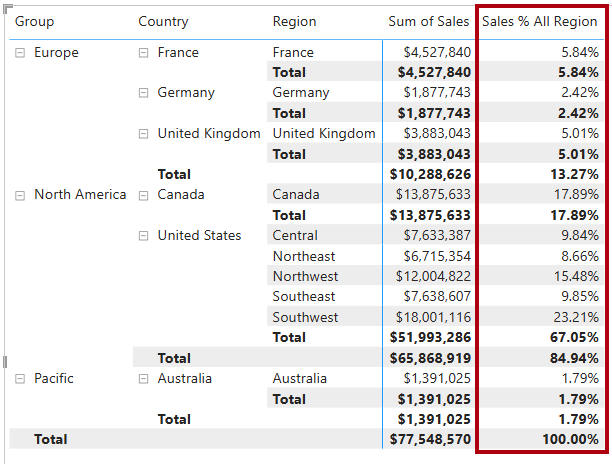

---
lab:
  title: Power BI で DAX フィルター コンテキストを変更する
  module: Modify DAX filter context in Power BI
---

# Power BI で DAX フィルター コンテキストを変更する

## ラボのストーリー

このラボでは、フィルター コンテキストの操作を伴う DAX 式を使用してメジャーを作成します。

学習内容は次のとおりです。

 - `CALCULATE` 関数を使用してフィルター コンテキストを操作する。

**この配信には約 30 分かかります。**

## 作業の開始

この演習を完了するには、まず Web ブラウザーを開き、次の URL を入力して zip ファイルをダウンロードします。

`https://github.com/MicrosoftLearning/PL-300-Microsoft-Power-BI-Data-Analyst/raw/Main/Allfiles/Labs/05-modify-dax-filter-context/05-modify-dax-filter-context.zip`

ファイルを **C:\Users\Student\Downloads\05-modify-dax-filter-context** フォルダーに展開します。

**05-Starter-Sales Analysis.pbix** ファイルを開きます。

> _**注**:**[キャンセル]** を選択すると、サインインを閉じることができます。他のすべての情報ウィンドウを閉じます。変更の適用を求めるメッセージが表示されたら、**[後で適用]** を選択します。_

## 行列の視覚エフェクトを作成する

このタスクでは、新しいメジャーのテストをサポートするためのマトリックス ビジュアルを作成します。

1. Power BI Desktop で、新しいレポート ページを作成します。

1. **[ページ 3]** で、行列の視覚エフェクトを追加します。

    

1. ページ全体に合わせて行列の視覚エフェクトのサイズを変更します。

1. マトリックスの視覚エフェクトのフィールドを構成するには、**[データ]** ペインから `Region | Regions` 階層をドラッグして、視覚エフェクト内にドロップします。

    > "このラボでは、フィールドまたは階層を参照するために簡略表記を使用します。 次のようになります: `Region | Regions`。 この例では、`Region` はテーブル名、`Regions` は階層名です。_

1. `Sales | Sales` フィールドを **[値]** ウェルに追加します。

1. 階層全体を展開するには、行列の視覚エフェクトの右上にある 2 つに分かれた矢印アイコンを 2 回選択します。

    

1. 視覚エフェクトを書式設定するには、 **[視覚化]** ペインにある **[書式]** ペインを選択します。

    

1. **[検索]** ボックスに「_Layout_」と入力します。

1. **[Layout]** プロパティを _[Tabular]_ に設定します。

    

1. マトリックス ビジュアルに 4 つの列見出しができたことを確認します。

    

    > "Adventure Works では、販売地域はグループ、国、地域に分類されます。_すべての国 (米国を除く) には地域が 1 つだけあり、その国にちなんだ名前が付けられています。米国は非常に大きな販売地域であるため、5 つの販売地域に分かれています。_

この演習ではさまざまなメジャーを作成し、マトリックスの視覚エフェクトに追加してテストします。

## フィルター コンテキストを操作する

このタスクでは、`CALCULATE` 関数を使用してフィルター コンテキストを操作する DAX 式を使って、いくつかのメジャーを作成します。

> _`CALCULATE` 関数は、フィルター コンテキストを操作するために使用できる強力な関数です。最初の引数では、式またはメジャーを受け取ります (メジャーは単に名前付きの式です)。その後の引数によって、フィルター コンテキストを変更できます。"_

1. 次の式に基づいて、`Sales` テーブルにメジャーを追加します。

    > _**注**:参考までに、このラボのすべての DAX 定義は **C:\Users\Student\Downloads\05-modify-dax-filter-context\Snippets.txt** ファイルからコピーできます。_

    ```dax
    Sales All Region =
    CALCULATE(
        SUM(Sales[Sales]),
        REMOVEFILTERS(Region)
    )
    ```

    > _`REMOVEFILTERS` 関数は、アクティブなフィルターを削除します。引数を指定しないことも、テーブル、列、または複数の列を引数として指定することもできます。"_
    >
    > この数式では、メジャーは、変更されたフィルター コンテキストの `Sales` 列の合計を評価します。これにより、`Region` テーブルの列に適用されているフィルターがすべて削除されます。__

1. マトリックスの視覚エフェクトに `Sales All Region` メジャーを追加します。

    

1. このメジャーによって、各地域、国 (小計)、およびグループ (小計) のすべての地域売上の合計が計算されていることに注目してください。

    > "新しいメジャーはまだ有用な結果を提供していません。_グループ、国、または地域の販売をこの値で割ると、「総計の割合」と呼ばれる有用な比率が生成されます。_

1. **[データ]** ペインで、`Sales All Region` メジャーが選択されていることを確認し (選択されている場合は、背景が濃い灰色になります)、数式バーでメジャー名と数式を次の数式に置き換えます。

    > ''ヒント: 既存の数式を置き換えるには、まずスニペットをコピーします。次に、数式バー内を選択し、**Ctrl + A** キーを押してすべてのテキストを選びます。次に、**Ctrl + V** キーを押してスニペットを貼り付け、選択したテキストを上書きします。次に、**Enter** キーを押します。''__

    ```dax
    Sales % All Region =
    DIVIDE(
        SUM(Sales[Sales]),
        CALCULATE(
            SUM(Sales[Sales]),
            REMOVEFILTERS(Region)
        )
    )
    ```

    > "更新された数式の内容を正確に反映するように、メジャーの名前が変更されました。__ 
`DIVIDE` 関数は、`Sales` 列 (フィルター コンテキストによって変更されていない) の合計を、変更されたコンテキストの `Sales` 列の合計で割ります。これにより、`Region` テーブルに適用されているフィルターがすべて削除されます。

1. マトリックス ビジュアルで、メジャーの名前が変更され、グループ、国、および地域ごとに異なる値が表示されるようになったこと注目してください。

1. `Sales % All Region` メジャーは、小数点以下 2 桁のパーセンテージとして書式設定してください。

1. マトリックスの視覚エフェクトで、`Sales % All Region` メジャー値を確認します。

    

1. 次の式に基づいて、`Sales` テーブルにもう 1 つのメジャーを追加し、パーセンテージとして書式設定します。

    ```dax
    Sales % Country =
    DIVIDE(
        SUM(Sales[Sales]),
        CALCULATE(
            SUM(Sales[Sales]),
            REMOVEFILTERS(Region[Region])
        )
    )
    ```

1. `Sales % Country` メジャーの数式は、`Sales % All Region` メジャーの数式とわずかに異なることに注意してください。

    > _異なるのは、分母でのフィルター コンテキストの変更が、`Region` テーブルのすべての列ではなく、`Region` テーブルの `Region` 列に対するフィルターを削除することで行われている点です。これは、グループまたは国の列に適用されているすべてのフィルターが保持されることを意味します。これにより、国の割合として売上を表す結果が得られます。_

1. マトリックスの視覚エフェクトに `Sales % Country` メジャーを追加します。

1. 米国のリージョンのみが 100% ではない値を生成することに注意してください。

    

    > 以前に説明したように、複数の地域があるのは米国のみです。__ 他の国はすべて 1 つの地域として扱われているため、すべての割合が 100% になっています。

1. 視覚エフェクトでのこのメジャーの読みやすさを向上させるために、`Sales % Country` メジャーを次の改良された数式で上書きします。

    ```dax
    Sales % Country =
    IF(
        ISINSCOPE(Region[Region]),
        DIVIDE(
            SUM(Sales[Sales]),
            CALCULATE(
                SUM(Sales[Sales]),
                REMOVEFILTERS(Region[Region])
            )
        )
    )
    ```

    > _`IF` 関数は `ISINSCOPE` 関数を使用して、リージョン列がレベルの階層内のレベルであるかどうかをテストします。true の場合、`DIVIDE` 関数が評価されます。false の場合、リージョン列がスコープ内にないため、`BLANK` が返されます。_

1. `Sales % Country` メジャーによって、地域がスコープ内にある場合にのみ値が返されるようになったことに注目してください。

    

1. 次の式に基づいて、`Sales` テーブルにもう 1 つのメジャーを追加し、パーセンテージとして書式設定します。

    ```dax
    Sales % Group =
    DIVIDE(
        SUM(Sales[Sales]),
        CALCULATE(
            SUM(Sales[Sales]),
            REMOVEFILTERS(
                Region[Region],
                Region[Country]
            )
        )
    )
    ```

    > _グループの割合としての売上を得るために、2 つのフィルターを適用して、2 つの列に対するフィルターを効果的に削除できます。_

1. マトリックスの視覚エフェクトに `Sales % Group` メジャーを追加します。

1. 視覚エフェクトにおけるこのメジャーの読みやすさを向上させるには、`Sales % Group` メジャーを次の数式で上書きします。

    ```dax
    Sales % Group =
    IF(
        ISINSCOPE(Region[Region])
            || ISINSCOPE(Region[Country]),
        DIVIDE(
            SUM(Sales[Sales]),
            CALCULATE(
                SUM(Sales[Sales]),
                REMOVEFILTERS(
                    Region[Region],
                    Region[Country]
                )
            )
        )
    )
    ```

1. `Sales % Group` メジャーによって、地域または国がスコープ内にある場合にのみ値が返されるようになったことに注目してください。

1. モデル ビューで、3 つの新しいメジャーを _Ratios_ という名前の表示フォルダーに配置します。

    

1. Power BI Desktop ファイルを保存します。

> _`Sales` テーブルに追加されたメジャーによって、階層ナビゲーションを実現するためにフィルター コンテキストが変更されました。小計の計算を実現するためのパターンでは、フィルター コンテキストから一部の列を削除する必要があり、総計を得るためにはすべての列を削除する必要があることに注意してください。"_

## ラボが完了しました
