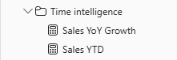

---
lab:
  title: Power BI で DAX タイム インテリジェンス関数を使用する
  module: Use DAX time intelligence functions in Power BI
---

# Power BI で DAX タイム インテリジェンス関数を使用する

## ラボのストーリー

このラボでは、タイム インテリジェンスを含む DAX 式を使用してメジャーを作成します。

このラボでは、次の方法について説明します。

 - さまざまなタイム インテリジェンス関数を使用して、日付に関係する特定のフィルター コンテキストを操作する。

**このラボには約 15 分かかります。**

## 作業の開始

この演習を完了するには、まず Web ブラウザーを開き、次の URL を入力して zip ファイルをダウンロードします。

`https://github.com/MicrosoftLearning/PL-300-Microsoft-Power-BI-Data-Analyst/raw/Main/Allfiles/Labs/06-use-dax-time-intelligence/06-time-intelligence.zip`

ファイルを **C:\Users\Student\Downloads\06-time-intelligence** フォルダーに展開します。

**06-Starter-Sales Analysis.pbix** ファイルを開きます。

> _**注**:ファイルが読み込まれると、サインイン ダイアログが表示されることがあります。**[キャンセル]** を選択してサインイン ダイアログを閉じます。他のすべての情報ウィンドウを閉じます。変更の適用を求めるメッセージが表示されたら、**[後で適用]** を選択します。_

## YTD メジャーを作成する

このタスクでは、タイム インテリジェンス関数を使用して、売上の年度累計 (YTD) メジャーを作成します。

1. Power BI Desktop の**レポート ビュー**の **[ページ 2]** で、行にグループ化された年と月を含むさまざまなメジャーを表示するマトリックスの視覚エフェクトに注目します。

2. 次の式に基づいて、`Sales` テーブルにメジャーを追加します。小数点以下 0 桁に書式設定します。

    ```dax
    Sales YTD =
    TOTALYTD(
        SUM(Sales[Sales]),
        'Date'[Date],
        "6-30"
    )
    ```

    > _`TOTALYTD` 関数では、指定した日付列に対して式 (この場合は `Sales` 列の合計) が評価されます。日付列は、日付テーブルとしてマークされている日付テーブルに属している必要があります。_
    >
    > "この関数には、年度の最後の日付を表す、省略可能な 3 番目の引数を指定することもできます。_この日付を指定しない場合は、12 月 31 日が年度の最後の日付になります。Adventure Works では、6 月が年度の最後の月なので、"6-30" が使用されます。_

3. マトリックスの視覚エフェクトに `Sales` フィールドと `Sales YTD` メジャーを追加します。

4. 年内の売上の値が累積されていることがわかります。

    

> _`TOTALYTD` 関数によって、フィルター操作 (具体的には、時間フィルター操作) が実行されます。たとえば、2017 年 9 月 (会計年度の 3 番目の月) の YTD 売上を計算する場合は、`Date` テーブルのすべてのフィルターが削除され、年度の開始日 (2017 年 7 月 1 日) に始まりコンテキスト内の日付期間の最後の日付 (2017 年 9 月 30 日) まで続く日付の新しいフィルターに置き換えられます。_
>
> 一般的な時間フィルター操作をサポートするために、多くの[タイム インテリジェンス関数](/dax/time-intelligence-functions-dax/?azure-portal=true)を DAX で使用できます。__

## YoY 成長メジャーを作成する

このタスクでは、変数を使用して売上の YoY 成長メジャーを作成します。

> 変数は、数式を簡略化するのに役立ち、数式内でロジックを複数回使用する場合の効率が向上します。 変数は一意の名前で宣言されます。その後、メジャー式を `RETURN` キーワードの後の出力にする必要があります。 他のコーディング言語の変数とは異なり、DAX 変数は単一の数式内でのみ使用できます。_

1. 次の式に基づいて、`Sales` テーブルに別のメジャーを追加します。

    ```dax
    Sales YoY Growth =
    VAR SalesPriorYear =
        CALCULATE(
            SUM(Sales[Sales]),
            PARALLELPERIOD(
                'Date'[Date],
                -12,
                MONTH
            )
        )
    RETURN
        SalesPriorYear
    ```

    > `SalesPriorYear` 変数には、変更されたコンテキストで `Sales` 列の合計を計算する式が割り当てられます。__ このコンテキストでは、`PARALLELPERIOD` 関数を使用して、フィルター コンテキストの各日付から 12 か月前に戻します。

1. マトリックスの視覚エフェクトに `Sales YoY Growth` メジャーを追加します。

1. 新しいメジャーは、最初の 12 か月間は `BLANK` を返します (会計年度の 2017 年以前には売上が記録されていないため)。

1. "2018 年 7 月" に対する `Sales YoY Growth` メジャーの値が、"2017 年 7 月" の sales の値であることに注目してください。____

    

    > これで数式の "難しい部分" をテストできたので、成長の結果を計算する最終的な数式で、メジャーを上書きすることができます。__

1. メジャーを完成させるには、次の数式で `Sales YoY Growth` を上書きして、小数点以下 2 桁のパーセンテージとして書式設定します。

    ```dax
    Sales YoY Growth =
    VAR SalesPriorYear =
        CALCULATE(
            SUM(Sales[Sales]),
            PARALLELPERIOD(
                'Date'[Date],
                -12,
                MONTH
            )
        )
    RETURN
        DIVIDE(
            (SUM(Sales[Sales]) - SalesPriorYear),
            SalesPriorYear
        )
    ```

1. この数式の `RETURN` 句では、変数が 2 回参照されていることに注目してください。

1. "2018 年 7 月" の YoY 成長が 392.83% であることを確認します。__

    

    > YoY 成長率メジャーは、前年の同じ期間の売上がほぼ 400% (つまり、4 倍) 増加していることを示します。__

1. **モデル ビュー**で、2 つの新しいメジャーを _Time Intelligence_ という名前の表示フォルダーに配置します。

    

1. Power BI Desktop ファイルを保存します。

## ラボが完了しました

このラボでは必要ありませんが、Power BI レポートを保存することもできます。 次の演習では、事前に作成されたスターター ファイルを使用します。

1. 左上隅の **[ファイル]** メニューに移動し、**[名前を付けて保存]** を選択します。 
1. **[このデバイスを参照する]** を選択します。
1. ファイルを保存するフォルダーを選択し、わかりやすい名前を付けます。 
1. **[保存]** ボタンを選択して、レポートを .pbix ファイルとして保存します。 
1. 保留中のクエリの変更について適用を求めるダイアログ ボックスが表示された場合は、**[適用]** を選択します。
1. Power BI Desktop を閉じます。