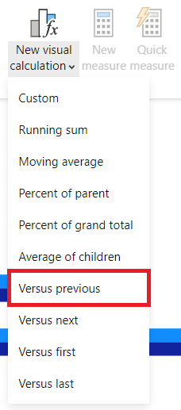
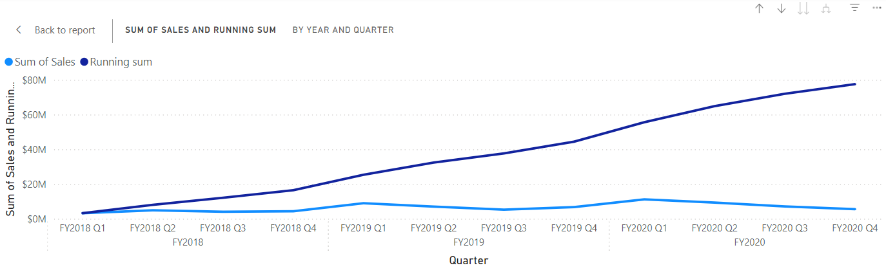

---
lab:
  title: Power BI Desktop でビジュアル計算を作成する
  module: Create visual calculations in Power BI Desktop
---

# Power BI Desktop でビジュアル計算を作成する

## ラボのストーリー

このラボでは、Data Analysis Expressions (DAX) を使用してビジュアル計算を作成します。

このラボでは、次の作業を行う方法について説明します。

- 視覚エフェクトを作成して編集する。
- PREVIOUS() 関数、RUNNINGSUM() 関数、MOVINGAVERAGE() 関数を使用して各会計年度間の比較メトリックを作成する。
- 比較メトリックを作成する場合は、オプションの Axis パラメーターを使用します。
- 複数レベルの軸の累積計算をカスタマイズするには、オプションの Reset パラメーターを使用します。

**この配信には約 30 分かかります。**

## 作業の開始

この演習を完了するには、まず Web ブラウザーを開き、次の URL を入力して zip フォルダーをダウンロードします。

`https://github.com/MicrosoftLearning/PL-300-Microsoft-Power-BI-Data-Analyst/raw/Main/Allfiles/Labs/07-create-visual-calculations/07-visual-calculations.zip`

フォルダーを **C:\Users\Student\Downloads\07-visual-calculations** フォルダーに展開します。

**07-Starter-Sales Analysis.pbix** ファイルを開きます。

> _**注**:ファイルが読み込まれると、サインイン ダイアログが表示されることがあります。**[キャンセル]** を選択してサインイン ダイアログを閉じます。他のすべての情報ウィンドウを閉じます。変更の適用を求めるメッセージが表示されたら、**[後で適用]** を選択します。_

## 横棒グラフ ビジュアルを作成する

このタスクでは、会計年度別の売上金額、製品原価の合計、および利益を示す横棒グラフを作成し、比較メトリックをヒントとして表示します。

1. **[視覚化]** ペインで [集合横棒グラフ] の視覚化タイプを選択します。

   

1. **[データ]** ペインで、**Date** テーブル内から **[Y 軸]** ウェル/エリアに **Year** フィールドをドラッグします。

1. **Sales** テーブルから **[X 軸]** ウェル/エリアに **"Sales"** フィールドと **"Cost"** フィールドをドラッグします。

    > ビジュアルに Sales と Cost を追加すると、各フィールドの合計が自動的に計算されたことに注目してください。

1. 3 点メニューから **[Year]**、**[昇順で並べ替え]** の順に選択して、結果の横棒グラフを **Year** の昇順に並べ替えます。

   

    > これで、Year 別の Sales の合計と Cost の合計が時系列で並べ替えられた横棒グラフが作成されました。

## 計算を追加する

1. 横棒グラフを選択した状態で、リボンの **[新しいビジュアル計算]** を選択します。

   

1. ビジュアル計算の編集ウィンドウが開きます。 ビジュアル マトリックスの上の数式バーに次の式を入力し、Enter キーを押して計算をコミットします。

    ```DAX
   Profit = [Sum of Sales] - [Sum of Cost]
    ```

1. 画面の下部にあるビジュアル マトリックスに Profit 列が表示されたことを確認します。

   

1. **[新しいビジュアル計算]** でメニューを展開し、テンプレート オプションから **[前と比較]** を選択します。

    > **[前と比較]** は値を前の値と比較するので、Year の前の値と比較した Profit が表示されます。

   

1. 数式バーで、`[Field]` プレースホルダーを `[Profit]` に 2 回置き換え、計算をコミットします。

1. テンプレート メニューから **[累計]** を選択し、`[Field]` プレースホルダーを `[Profit]` に置き換えて、計算をコミットします。

    > **[累計]** は、値の合計を計算し、前の値に現在の値を追加するので、今年度と前年度の合計が表示されます。

1. テンプレート メニューから **[移動平均]** を選択し、`[Field]` プレースホルダーを `[Profit]` に、`WindowSize` プレースホルダーを 2 に置き換えます。 次のような設定になります。

    > **[移動平均]** は、値の合計を期間のサイズで割って、指定された期間に含まれる一連の値の平均を計算します。 期間のサイズを 2 に設定すると、2 つの連続する値の平均が計算されます。 この例では、値は年間利益なので、2019 年度の移動平均は 2018 年度と 2019 年度の利益の平均になります。

   

1. **[X 軸]** ウェル/エリアで、次のフィールドの可視性アイコンを選択すると、そのフィールドがビジュアルに表示されなくなります。

    - Sales の合計
    - Cost の合計
    - Profit

   

    > 非表示にしたフィールドと計算がビジュアルに表示されなくなったことに注意してください。

1. **[視覚化]** ペインで、**[累計]** と **[移動平均]** を **[ツールヒント]** ウェル/エリアにドラッグします。  

1. ビジュアルが目標を達成したことを確認します。 ビジュアル計算の編集画面を終了して、レポートに戻ります。

   

    > これで、Sales の合計、Cost の合計、Profit、Profit の *[前と比較]* の値を含んだ横棒グラフが作成され、Profit の *[累計]* と Profit の *[移動平均]* のツールヒントも表示されます。

## マトリックス ビジュアルを作成する

このタスクでは、カテゴリ別の売上金額を後続の年度ごとに最初の会計年度と比較するマトリックス ビジュアルを作成します。

1. **[レポート ビュー]** で、新しいレポート ページを作成します。

1. **[ページ 2]** で、マトリックス ビジュアルを追加します。

1. 次のフィールドをビジュアル ウェル/領域に追加します。

    - 行: **Product \| Category**
    - 列: **Date \| Year**
    - 値: **Sales \| Sales**

    > "このラボでは、フィールドを参照するために簡略表記を使用します。*次のようになります。**Date \| Year**。この例では、**Date** はテーブル名、**Year** はフィールド名です。"*

## 計算を追加する

1. マトリックスを選択した状態で、リボンの **[新しいビジュアル計算]** を選択します。

1. ビジュアル計算の編集ウィンドウで、次の計算を入力して保存します。

    ```DAX
   Versus first = [Sum of Sales] - FIRST([Sum of Sales])
    ```

    > 各カテゴリの売上金額と最初のカテゴリの差がマトリックスにどのように表示されるかに注目してください。

1. **[値]** ウェル/エリアで **[最初と比較]** フィールドを選択し、Axis パラメーターの ROWS 値を FIRST に追加して計算を更新します。

    ```DAX
   Versus first = [Sum of Sales] - FIRST([Sum of Sales], ROWS)
    ```

    > ROWS が Axis パラメーターの既定値であるため、何も変更されないことがわかります。

1. ROWS を COLUMNS に置き換え、計算によってカテゴリごとの売上金額が最初の会計年度と比較されることを確認します。

   

    > **Total Sales** の **[最初と比較]** 列が、最初の会計年度との差ではなくゼロを返していることに注意してください。 **Total Sales** は、年単位の合計とは異なる階層レベルなので、そのレベルの最初の列と見なされます。

1. ビジュアル計算の編集画面を終了して、レポートに戻ります。

## 折れ線グラフ ビジュアルを作成する

このタスクでは、売上の累計を示す折れ線グラフを作成します。 この合計は、各会計年度の初めにリセットされます。

1. **[レポート ビュー]** で、新しいレポート ページを作成します。

1. **[ページ 3]** で、折れ線グラフ ビジュアルを追加します。

1. 次のフィールドをビジュアル ウェル/領域に追加します。

    - X 軸: **Date \| Year** および **Date \| Quarter**
    - Y 軸: **Sales \| Sales**

## 累計を追加する

1. 折れ線グラフを選択した状態で、**[新しいビジュアル計算]** のメニューを展開し、テンプレート オプションから **[累計]** を選択します。

1. `[Field]` プレースホルダーを `[Sum of Sales]` に置き換え、変更をコミットします。 ビジュアルは次のようになります。

   

## 新しい会計年度ごとに再起動するように累計を更新する

1. ビジュアル計算の編集ウィンドウで、**[Y 軸]** 下の **"累計"** フィールドを選択したあと、HIGHESTPARENT リセット パラメーターを追加してこの計算の式を更新し、変更をコミットします。

    ```DAX
   Running sum = RUNNINGSUM([Sum of Sales], HIGHESTPARENT)
    ```

新しい会計年度ごとに、累計が実際に再起動されることを確認します。

   

## ラボが完了しました

このラボでは必要ありませんが、Power BI レポートを保存することもできます。 次の演習では、事前に作成されたスターター ファイルを使用します。

1. 左上隅の **[ファイル]** メニューに移動し、**[名前を付けて保存]** を選択します。 
1. **[このデバイスを参照する]** を選択します。
1. ファイルを保存するフォルダーを選択し、わかりやすい名前を付けます。 
1. **[保存]** ボタンを選択して、レポートを .pbix ファイルとして保存します。 
1. 保留中のクエリの変更について適用を求めるダイアログ ボックスが表示された場合は、**[適用]** を選択します。
1. Power BI Desktop を閉じます。