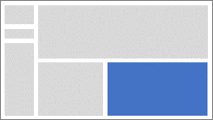
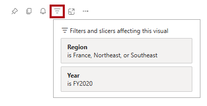
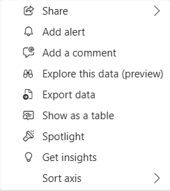

---
lab:
  title: Power BI レポートをデザインする
  module: Design Power BI reports
---

# Power BI レポートをデザインする

## ラボのストーリー

このラボでは、3 ページのレポートを作成します。 次に、Power BI サービスにそれを発行し、そこでレポートを開いて操作します。

このラボでは、次の作業を行う方法について説明します。

- レポートをデザインする。
- 視覚エフェクトのフィールドと書式プロパティを構成する。
- スライサーを同期する。
- Power BI サービスにレポートを発行します。
- レポートとその視覚エフェクトを操作する。

**この配信には約 45 分かかります。**

## 作業の開始

この演習を完了するには、まず Web ブラウザーを開き、次の URL を入力して zip ファイルをダウンロードします。

`https://github.com/MicrosoftLearning/PL-300-Microsoft-Power-BI-Data-Analyst/raw/Main/Allfiles/Labs/08-design-power-bi-reports/08-design-report.zip`

ファイルを **C:\Users\Student\Downloads\08-design-report** フォルダーに展開します。

**08-Starter-Sales Analysis.pbix** ファイルを開きます。

> _**注**:ファイルが読み込まれると、サインイン ダイアログが表示されることがあります。**[キャンセル]** を選択してサインイン ダイアログを閉じます。他のすべての情報ウィンドウを閉じます。変更の適用を求めるメッセージが表示されたら、**[後で適用]** を選択します。_

## ページ 1 をデザインする

このタスクでは、最初のレポート ページをデザインします。 デザインが完了すると、ページは次のようになります。

1. Power BI Desktop でページの名前を変更するには、左下の **[ページ 1]** を右クリックし、**[名前の変更]** を選択します。 ページの名前を「_Overview_」に変更します。

    > _ヒント:ページ名をダブルクリックして名前を変更することもできます。"_

1. 画像を追加するには、**[挿入]** リボン タブで、**[要素]** グループ内の **[画像]** を選択します。

    

1. **[開く]** ウィンドウで、**C:\Users\Student\Downloads\08-design-report** フォルダーに移動します。

1. **AdventureWorksLogo.jpg** ファイルを選択し、**[開く]** を選択します。

1. 画像をドラッグして左上隅に配置し、ガイド マーカーをドラッグしてサイズを変更します。

    

1. スライサーを追加するには、まずレポート ページの空の領域をクリックして画像を選択し、**[視覚化]** ペインで **[スライサー]** を選択します。

    

1. **[データ]** ペインで、`Date | Year` フィールド (階層の `Year` レベルではありません) を **[視覚化]** ペインのスライサー **[フィールド]** にドラッグします。

    > "このラボでは、フィールドを参照するために簡略表記を使用します。_次のようになります: `Date | Year`。この例では、`Date` はテーブル名、`Year` はフィールド名です。_

    

1. スライサーを一覧からドロップダウンに変換するには、**[視覚化]** ペインで **[視覚エフェクトの書式設定]** を選択します。 **[スライサー設定]** を展開し、**[スタイル]** ドロップダウンを **[ドロップダウン]** に設定します。

    

1. イメージの下に配置され、イメージと同じ幅になるようにスライサーのサイズと位置を変更します。

    

1. **Year** スライサーで、ドロップダウン リストを開き、**FY2020** を選択してドロップダウン リストを折りたたみます。

    > "レポート ページは、**FY2020** 年でフィルター処理されるようになりました。"__

    

1. レポート ページの空いている領域を選択して、スライサーの選択を解除します。

1. `Region | Region` フィールド (階層の `Region` レベルではありません) に基づいて 2 つ目のスライサーを作成します。

1. スライサーをリストのままにして、**Year** スライサーでスライサーのサイズを変更し、配置します。

    

1. レポート ページの空いている領域を選択して、スライサーの選択を解除します。

1. ページにグラフを追加するには、**[視覚化]** ペインで、**[折れ線グラフおよび積み上げ縦棒グラフ]** 視覚化の種類を選択します。

    

1. ビジュアルをロゴの右側に配置し、レポート ページの幅と等しくなるようにサイズを変更します。

    

1. 次のフィールドをビジュアルにドラッグ アンド ドロップします。

     - `Date | Month`
     - `Sales | Sales`

1. 視覚エフェクト フィールド ペイン (**[視覚化]** ペインの下にあります) で、フィールドが **[X 軸]** および **[列の Y 軸]** ウェルに割り当てられていることに注目してください。

    > _フィールドを視覚エフェクトにドラッグすると、既定のウェルに追加されます。より正確にするには、次に行うように、フィールドをウェルに直接ドラッグすることができます。_

    

1. **[データ]** ペインから、`Sales | Profit Margin` フィールドを **[線の Y 軸]** ウェルにドラッグします。

    

1. 視覚化に 11 か月しかないことに注意してください。

    > _1 年の最後の月である 2020 年 6 月は、売上がまだありません。既定で、この視覚エフェクトでは、売上が `BLANK` の月を除去しています。次に、すべての月が表示されるように視覚エフェクトを構成します。_

1. 視覚エフェクト フィールド ペインの **[X 軸]** ウェルで、**[Month]** フィールドの下向き矢印を選択し、**[データのないアイテムを表示]** を選択します。

    

    > ''**2020 June** の月が表示されるようになったことに注目してください。''__

1. レポート ページの空いている領域を選択して、グラフの選択を解除します。

1. ページにグラフを追加するには、 **[視覚化]** ペインで、 **[積み上げ縦棒グラフ]** という視覚化の種類を選択します。

    

1. ビジュアルのサイズを変更して縦棒/折れ線グラフの下に配置し、上のグラフの幅の半分になるようにします。

    

1. 視覚化のウェルに次のフィールドを追加します。

     - X 軸: `Region | Group`
     - Y 軸: `Sales | Sales`
     - 凡例: `Product | Category`

1. レポート ページの空いている領域を選択して、グラフの選択を解除します。

1. ページにグラフを追加するには、**[視覚化]** ペインで、**[積み上げ横棒グラフ]** 視覚化の種類を選択します。

    

1. ビジュアルのサイズを変更し、残りのレポート ページ領域を埋めるように配置します。

    

1. 視覚化のウェルに次のフィールドを追加します。

     - Y 軸: `Product | Category`
     - X 軸: `Sales | Quantity`

1. 視覚化の書式を設定するには、**[書式]** ペインを開きます。

    

1. **[バー]** セクション、**[色]** グループの順に展開し、**[色]** プロパティを適切な色に設定します (縦棒グラフや折れ線グラフを補完する色)。

1. **[データ ラベル]** セクションを **[オン]** に設定します。

    

1. Power BI Desktop ファイルを保存します。

    > _最初のページのデザインが完了しました。_

## ページ 2 をデザインする

このタスクでは、2 番目のレポート ページをデザインします。 デザインが完了すると、ページは次のようになります。

> _**重要**: ラボに詳細な手順が既に用意されている場合は、ラボの手順により簡潔な手順が提供されます。詳細な手順が必要な場合は、このラボの他のタスクを参照してください。"_

1. 新しいページを作成するには、左下にあるプラス アイコンを選択します。 ページが追加されたら、名前を「_Profit_」に変更します。

1. `Region | Region` フィールドに基づいてスライサーを追加します。

1. **書式**ウィンドウを使用して、[すべて選択] オプションを表示します (**[スライサー設定] > [選択]** セクションにあります)。__

1. スライサーのサイズを変更してレポート ページの左側に配置し、ページの高さの約半分になるようにします。

    

1. マトリックス ビジュアルを追加し、サイズを変更して配置して、レポート ページの残りの領域を埋めます

    

1. `Date | Fiscal` 階層をマトリックスの **[行]** ウェルに追加します。

    

1. `Sales` テーブルの次の 5 つのフィールドを、**[値]** ウェルに追加します。

     - `Orders` (`Counts` フォルダーから)
     - `Sales`
     - `Cost`
     - `Profit` (`Pricing` フォルダーから)
     - `Profit Margin` (`Pricing` フォルダーから)

    

1. **[フィルター]** ペイン (**[視覚化]** ペインの左側) で、**[このページでのフィルター]** セクションに注目してください (ペインを展開して下にスクロールする必要がある場合があります)。

    

1. **[データ]** ペインから、`Product | Category` フィールドを **[このページでのフィルター]** ウェルにドラッグします。

    > "**[フィルター]** ペインにフィールドを追加すると、スライサーと同じ結果を得ることができます。_違いの 1 つは、レポート ページのスペースが占有されないことです。もう 1 つの違いは、より洗練されたフィルター処理要件を達成するように構成できることです。"_

1. フィルター カード内の右上にある矢印を選択して、カードを折りたたみます。

1. `Product` テーブルの次の各フィールドを **[このページでのフィルター]** ウェルの `Category` カードのすぐ下に追加し、それぞれを折りたたみます。

     - `Subcategory`
     - `Product`
     - `Color`

    

1. Power BI Desktop ファイルを保存します。

    > _2 番目のページのデザインが完了しました。_

## ページ 3 をデザインする

このタスクでは、3 番目 (最後) のレポート ページをデザインします。 デザインが完了すると、ページは次のようになります。

1. 新しいページを作成し、名前を「_My Performance_」に変更します。

1. 行レベルのセキュリティ フィルターのパフォーマンスをシミュレートするには、`Salesperson (Performance) | Salesperson` フィールドを、[フィルター] ペインの [ページ レベル フィルター] にドラッグします。

    

1. フィルター カードで、**Michael Blythe** を選択します。

    > レポート ページのデータはフィルター処理され、Michael Blythe のデータのみが表示されます。__

1. `Date | Year` フィールドに基づくドロップダウン スライサーを追加し、サイズと位置を変更してページの左上隅に配置します。

    

1. スライサーで、**FY2019** によってフィルター処理するようにページを設定します。

    

1. **[複数の行カード]** 視覚エフェクトをページに追加し、スライサーの右側でページの残りの幅を埋めるようにサイズと位置を変更します。

    

    

1. 視覚化に次の 4 つのフィールドを追加します。

     - `Sales | Sales`
     - `Targets | Target`
     - `Targets | Variance`
     - `Targets | Variance Margin`

1. 視覚化の書式を設定します。

     - **[コールアウト値]** セクションで、フォント サイズのプロパティを **28pt** に増やします。
     - **[全般]** タブの **[効果]** セクションで、背景色のプロパティを薄い灰色 ("白、10% 暗い" など) に設定してコントラストを高めます。__

        

1. **[クラスター棒グラフ]** 視覚エフェクトを追加し、複数行カード視覚エフェクトの下に位置し、ページの残りの高さと、複数行カード視覚エフェクトの幅の半分になるようにサイズを変更します。

    

    

1. 視覚化のウェルに次のフィールドを追加します。

     - Y 軸: `Date | Month`
     - X 軸: `Sales | Sales` と `Targets | Target`

        

1. 視覚化のコピーを作成するには、**Ctrl + C** キーを押してから、**Ctrl + V** キーを押します。

1. 新しいビジュアルを元のビジュアルの右側に配置します。

    

1. 視覚エフェクトの種類を変更するには、**[視覚化]** ペインで **[集合縦棒グラフ]** を選択します。

    

     > _同じデータを 2 つの異なる視覚化の種類で表したものを見ることができるようになりました。最後のページのデザインが完成しました。_

## スライサーを同期する

このタスクでは、_[Year]_ と _[Region]_ のスライサーを同期します。

1. _[Overview]_ ページで、_[Year]_ スライサーを **FY2018** に設定します。

1. _[My Performance]_ ページに移動すると、_[Year]_ スライサーの値が異なっていることがわかります。

    > _スライサーが同期されていないと、データが誤って表示され、レポート ユーザーのフラストレーションにつながる可能性があります。ここで、レポート スライサーを同期します。_

1. _[概要]_ ページに戻り、_[年]_ スライサーを選択します。

1. **[表示]** リボン タブの **[ペインを表示する]** グループ内の **[スライサーの同期]** を選択します。

    

1. **[スライサーの同期]** ペイン (**[視覚化]** ペインの左側) の 2 番目の列 (同期中を表します) で、_[Overview]_ ページと _[My Performance]_ ページのチェックボックスをオンにします。

    

1. _[Overview]_ ページで、_[Region]_ スライサーを選択します。

1. スライサーを _[Overview]_ ページおよび _[Profit]_ ページと同期します。

    

1. さまざまなフィルター オプションを選択してスライサーの同期をテストし、同期されたスライサーが同じ選択でフィルター処理されることを確認します。

1. **[スライサーの同期]** ページを閉じるには、**[ビュー]** リボン タブにある **[スライサーの同期]** オプションを選択します。

## レポートを発行して調べる

このタスクでは、レポートを Power BI サービスに発行します。 次に、発行されたレポートの動作を確認します。

> _**注**:レポートを発行するには、少なくとも **Power BI Free** ライセンスが必要です。Microsoft Edge ブラウザーを開き、_ `https://app.powerbi.com`_ に移動します。 認可されたラボ ホスト (ALH) から提供された Microsoft 365 テナントの資格情報を使ってサインインします。パズルを解くか、無料の Fabric 試用版を開始するように求められたら、それをスキップしてブラウザーを閉じてかまいません。_

> _**注**:タスクを直接実行する Power BI サービスにアクセスできない場合でも、演習の残りの部分を確認できます。_

1. _[Overview]_ ページを選択してから、Power BI Desktop ファイルを保存します。

1. **[ホーム]** リボン タブで、**[共有]** グループの **[発行]** を選択します。

    > まだ Power BI Desktop にサインインしていない場合は、レポートを発行する前にまずサインインする必要があります。__

    

1. **[Power BI へ発行]** ウィンドウで、[マイ ワークスペース] が選択されていることがわかります。__

    > このラボでは、Power BI サービス内のさまざまな項目について詳しくは説明しません。__

1. レポートを発行するには、 **[選択]** を選びます。 発行が完了するまで待ちます。

1. 発行が成功したら、**[了解]** を選択します。

1. Microsoft Edge ブラウザーを開き、`https://app.powerbi.com` に移動します。

1. ブラウザー ウィンドウの Power BI サービスの**ナビゲーション** ウィンドウ (左側にあり、折りたたまれている場合があります) で、**[マイ ワークスペース]** を展開します。

    

1. ワークスペースのコンテンツを確認します。

    - ワークスペースにはさまざまな項目が含まれますが、このラボに関連するのはセマンティック モデルとレポートです。
    - セマンティック モデルが表示されない場合は、必要に応じてブラウザーを更新します。
    - レポートを発行すると、データ モデルはセマンティック モデルとして発行されます。

1. レポートを確認するには、_[08-Starter-Sales Analysis]_ レポートを選択します。

1. 左側の **[ページ]** ペインで、**[Overview]** ページが選択されていることを確認します。

1. _Region_ スライサーで、**Ctrl** キーを押しながら複数の地域を選択します。

1. 縦棒と折れ線のグラフで、任意の月の列を選択して、ページをクロスフィルター処理します。

1. **Ctrl** キーを押しながら、別の月を選択します。

     > 既定で、クロスフィルター処理によってページ上の他のすべての視覚エフェクトがフィルター処理されます。__

1. 横棒グラフがフィルター処理されて強調表示されており、横棒の太字部分がフィルター処理された月を表していることに注意してください。

1. 棒グラフ視覚エフェクトにカーソルを合わせ、右上の**フィルター** アイコンにカーソルを合わせます。

    

    > フィルター アイコンを使用すると、他の視覚エフェクトからのスライサーとクロスフィルターも含めて、視覚エフェクトに適用されているすべてのフィルターがわかります。__

1. 横棒をポイントし、ヒントの情報を確認します。

1. クロスフィルターを取り消すには、縦棒と折れ線のグラフで、視覚化の空いている領域を選択します。

1. 積み上げ縦棒グラフ視覚エフェクトをポイントしてから、右上にある **[フォーカス モード]** アイコンを選択します。

    > _フォーカス設定モードでは、視覚化が全ページ サイズに拡大されます。_

    

1. 棒グラフの別のセグメントにカーソルを合わせると、ヒントが表示されます。

1. レポートのページに戻るには、左上にある **[レポートに戻る]** を選択します。

    

1. もう一度ビジュアルの 1 つをポイントし、右上にある省略記号 (...) を選択して、メニュー オプションに注目します。 **[共有]** 内のものを除き、各オプションを試してみてください。

    

1. 左側の **[ページ]** ペインで、**Profit** ページを選択します。

    

1. スライサーが同期されているため、_[Region]_ スライサーの選択は _[Overview]_ ページで選択した内容と一致していることに注目してください。

1. **[フィルター]** ペイン (右側にあります) でフィルター カードを展開し、フィルターをいくつか適用します。

    > " **[フィルター]** ペインでは、スライサーとしてページに収まりきらない可能性があるほど多くのフィルターを定義できます。"__

1. マトリックスの視覚エフェクトで、プラス (+) ボタンを使用して `Fiscal` 階層の詳細を表示します。

1. **My Performance** ページを選択します。

    

1. メニュー バーの右上にある **[表示]** を選択して、**[全画面]** を選択します。

    

1. スライサーを変更し、ページをクロスフィルター処理して、ページを操作します。

1. ウィンドウの最下部には、ページの変更、ページ間での前後への移動、または全画面表示モードを終了するためのコマンドがあります。

1. 右側のアイコンを選択して、全画面表示モードを終了します。

    

## ラボが完了しました

1. Microsoft Edge ブラウザーを閉じます。
1. Power BI Desktop を閉じます。