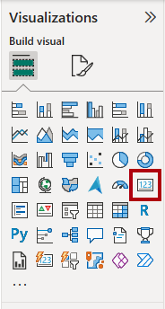
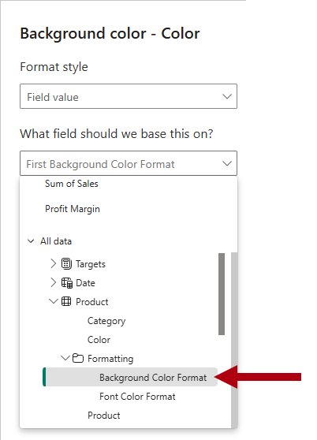
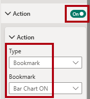

---
lab:
  title: Power BI レポートのデザインを強化する
  module: Enhance Power BI report designs for the user experience
---

# Power BI レポートのデザインを強化する

## ラボのストーリー

このラボでは、高度なデザイン機能を使用して _Sales Analysis_ レポートを強化します。

このラボでは、次の作業を行う方法について説明します。

- ドリルスルー ページを作成する。
- 条件付き書式を適用する。
- ブックマークとボタンを作成して使用する。

**この配信には約 45 分かかります。**

## 作業の開始

この演習を完了するには、まず Web ブラウザーを開き、次の URL を入力して zip ファイルをダウンロードします。

`https://github.com/MicrosoftLearning/PL-300-Microsoft-Power-BI-Data-Analyst/raw/Main/Allfiles/Labs/09-enhance-power-bi-reports/09-enhanced-report.zip`

ファイルを **C:\Users\Student\Downloads\09-enhanced-report** フォルダーに展開します。

**09-Starter-Sales Analysis.pbix** ファイルを開きます。

> _**注**:**[キャンセル]** を選択すると、サインインを閉じることができます。他のすべての情報ウィンドウを閉じます。変更の適用を求めるメッセージが表示されたら、**[後で適用]** を選択します。_

## ドリルスルー ページを構成する

この演習では、新しいページを作成し、ドリルスルー ページとして構成します。 デザインが完了すると、ページは次のようになります。

1. 新しいページを作成し、名前を「_Product Details_」に変更します。

1. **[Product Details]** ページ タブを右クリックし、**[ページを非表示にする]** を選択します。

    > _レポート ユーザーがドリルスルー ページに直接アクセスすることはできません。代わりに、他のページの視覚エフェクトからアクセスします。このラボの最後の演習では、このページにドリルスルーする方法を学習します。_

1. **[視覚化]** ペインの下にある **[ドリルスルー]** セクションで、`Product | Category` フィールドを **[ドリルスルー フィールドをここに追加する]** ボックスに追加します。

    > "このラボでは、フィールドを参照するために簡略表記を使用します。_次のようになります: `Product | Category`。この例では、`Product` はテーブル名、`Category` はフィールド名です。_

    

1. ドリルスルー ページをテストするには、ドリルスルー フィルター カードで _[Bikes]_ を選択します。

    

1. レポート ページの左上にある矢印ボタンに注目してください。

    > _レポート デザイナーは、[ドリルスルー] ウェルにフィールドが追加されると、自動的に矢印ボタンを追加します。これを使うと、レポート ユーザーがドリルスルー元のページに戻ることができます。"_

1. ページに**カード** ビジュアルを追加し、サイズを変更して、ボタンの右側に配置し、ページの残りの幅を埋めるようにします。

    

    

1. `Product | Category` フィールドをカード視覚エフェクトにドラッグします。

1. 視覚エフェクトの書式オプションを構成して **[カテゴリ ラベル]** プロパティを **[オフ]** にします。

    

1. **[全般]** タブの **[効果]** セクションで、背景色のプロパティを薄い灰色 ("白、10% 暗い" など) に設定してコントラストを高めます。__

    

1. ページに **[テーブル]** ビジュアルを追加し、サイズを変更して、カード ビジュアルの下に配置し、ページ上の残りの領域を埋めます。

    

    

1. 視覚化に次のフィールドを追加します。

    - `Product | Subcategory`
    - `Product | Color`
    - `Sales | Quantity`
    - `Sales | Sales`
    - `Sales | Profit Margin`

1. 視覚エフェクトの書式オプションを構成し、**[グリッド]** セクションで、**[グローバル フォント サイズ]** プロパティを **[20pt]** に設定します。

    > _ドリルスルー ページのデザインはほぼ完了です。次の演習では、条件付き書式を使用してページを拡張します。_

## 条件付き書式を追加する

この演習では、条件付き書式を使用してドリルスルー ページを拡張します。 デザインが完了すると、ページは次のようになります。

1. テーブル視覚化を選択します。 **[列]** ウェルで、**Profit Margin** フィールドの下矢印を選択し、**[条件付き書式] > [アイコン]** を選択します。

    

1. **[アイコン - Profit Margin]** ウィンドウの **[アイコン レイアウト]** ドロップダウン リストで、**[データの右側]** を選択します。

    

1. 中央のルールを削除するには、黄色の三角形の右側にある **[X]** を選択します。

    

1. 次のように、最初のルール (赤色のひし形) を構成します。

    - 2 つ目のコントロールで値を削除します
    - 3 つ目のコントロールで **[番号]** を選択します
    - 5 つ目のコントロールに「**0**」と入力します
    - 6 つ目のコントロールで **[番号]** を選択します

1. 次のように、2 つ目のルール (緑色の円) を構成します。

    - 2 つ目のコントロールに「**0**」と入力します
    - 3 つ目のコントロールで **[番号]** を選択します
    - 5 つ目のコントロールで値を削除します
    - 6 つ目のコントロールで **[番号]** を選択します

    

    > _ルールは次のように解釈できます。利益率の値が 0 未満の場合は赤いひし形を表示します。それ以外の場合は、値が 0 以上であれば、緑の円を表示します。_

1. **アイコン - Profit Margin** ウィンドウの **[適用先]** ドロップダウン リストで、**[値と合計]** を選択します。

    

1. **[OK]** を選択します。

1. テーブル視覚化で、正しいアイコンが表示されていることを確認します。

    

1. **[色]** フィールドの背景色の条件付き書式を構成します。

1. **[背景色 -- 色]** ウィンドウの **[書式設定スタイル]** ドロップダウン リストで、 **[フィールド値]** を選択します。

    

1. **[基準にするフィールド]** ドロップダウン リストの [すべてのデータ] グループで、`Product | Formatting | Background Color Format` フィールドを選択します。__

    

1. 上記の手順を繰り返して、`Product | Formatting | Font Color Format` フィールドを使用して **[色]** フィールドのフォント色の条件付き書式を構成します。

 > 以前に説明したように、背景色とフォント色は、「**Power BI Desktop でのデータの準備**」ラボの **ColorFormats.csv** ファイルから取得し、「**Power BI Desktop へのデータの読み込み**」ラボの **Product** クエリに統合しました。__

## ブックマークとボタンを追加する

この演習では、[マイ パフォーマンス] ページをボタンを使用して拡張し、レポート ユーザーが表示する視覚エフェクトの種類を選択できるようにします。__ デザインが完了すると、ページは次のようになります。

1. _[My Performance](マイ パフォーマンス)_ ページに移動します。

1. **[表示]** リボン タブの **[ペインを表示する]** グループ内の **[ブックマーク]** を選択します。

    

1. **[表示]** リボン タブの **[ペインを表示する]** グループ内の **[Selection]\(選択範囲\)** を選択します。

    

1. **[選択]** ペインで、_[Sales and Target by Month](月別売上高と目標)_ 項目の横にある視覚化を非表示にするには、目のアイコンを選択します。

    

1. **[ブックマーク]** ペインで、**[追加]** を選択します。

    

    > _ヒント:ブックマークの名前を変更するには、ブックマークをダブルクリックします。_

1. 表示されているグラフが横棒グラフの場合は、ブックマークの名前を _[Bar Chart ON]_ に変更します。それ以外の場合は、ブックマークの名前を _[Column Chart ON]_ に変更します。

1. ブックマークを編集するには、 **[ブックマーク]** ペインでブックマークにカーソルを合わせて省略記号を選んでから **[データ]** を選択します。

    > _**[データ]** オプションを無効にすると、ブックマークで現在のフィルターの状態が使用されなくなります。これが重要である理由は、そのようにしないと、現在 [Year] スライサーによって適用されているフィルターがブックマークによって永久にロックされるからです。_

    

1. ブックマークを更新するには、省略記号をもう一度選んでから **[更新]** を選択します。

    > 次の手順では、2 つ目のブックマークを作成および構成して、2 つ目の視覚エフェクトを表示します。__

1. **[選択項目]** ペインで、2 つの _[Sales and Target by Month](月別売上高と目標)_ 項目の表示を切り替えます。

    > _つまり、表示されている視覚化を非表示にし、非表示の視覚化を表示します。_

    

1. 2 つ目のブックマークを作成し、適切な名前を付けます (「_Column Chart ON_」または「_Bar Chart ON_」)。

    

1. 2 つ目のブックマークを構成してフィルターを無視し (**[データ]** オプションをオフ)、ブックマークを更新します。

1. **[選択項目]** ウィンドウで両方のビジュアルを表示するには、非表示のビジュアルを表示するだけです。

1. 両方の視覚化のサイズと位置を変更して、マルチカード視覚化の下のページ全体に表示し、互いに完全に重なり合うようにします。

    > ''隠れている視覚化を選ぶ場合は、 **[選択]** ペインで選びます。''__

    

1. **[ブックマーク]** ペインで各ブックマークを選択します。1 つの視覚化のみが表示されることに注目してください。

    > デザインの次の段階では、ページに 2 つのボタンを追加します。__ これらのボタンを使用すると、レポート ユーザーはブックマークを選択できます。

1. **[挿入]** リボンの **[要素]** グループ内の **[ボタン]** を選択し、**[空白]** を選択します。

    

1. _Year_ スライサーの真下にボタンを配置します。

1. ボタンを選択し、**[書式設定ボタン]** ペインで **[スタイル]** セクションを展開し、**[テキスト]** セクションを **[オン]** に設定します。

    

1. **[テキスト]** セクションの **[テキスト]** ボックスに「_Bar Chart_」と入力します。

1. **[塗りつぶし]** セクションを **[オン]** に設定してから、補完的な色を使用して塗りつぶしの色を設定します。

1. **[アクション]** セクションを **[オン]** に設定し、**[種類]** プロパティを **[ブックマーク]** に設定します。

1. **[ボタン]** を選択し、 **[アクション]** プロパティを **[オン]** にします。

1. **[アクション]** セクションを展開し、**[種類]** ドロップダウン リストを **[ブックマーク]** に設定します。

1. **[ブックマーク]** ドロップダウン リストで、**[Bar Chart ON](横棒グラフ オン)** を選択します。

    

1. コピーと貼り付けを使用してボタンのコピーを作成し、次のように新しいボタンを構成します。

    > _ヒント:コピーと貼り付けのショートカット コマンドは、**Ctrl+C** キーに続いて **Ctrl+V** キーです。"_

    - ボタンのテキストを「_Column Chart_」に設定します。
    - アクション ブックマークを **[Column Chart ON]** に設定します。

    > _これで、Sales Analysis レポートのデザインが完成しました。_

## レポートを発行して調べる

この演習では、レポートを Power BI サービスに発行し、発行したレポートの動作を調べます。

> _**注**:レポートを発行するには、少なくとも **Power BI Free** ライセンスが必要です。 Microsoft Edge ブラウザーを開いてから、`https://app.powerbi.com` でサインインします。 パズルを解くか、無料の Fabric 試用版を開始するように求められたら、それをスキップしてブラウザーを閉じてかまいません。

> _**注**:タスクを直接実行する Power BI サービスにアクセスできない場合でも、演習の残りの部分を確認できます。_

1. _[概要]_ ページを選択します。

1. _[年]_ スライサーで、**[FY2020]** を選択します。

1. "国/地域" スライサーで、国/地域が選択されていないことを確認します。__

1. Power BI Desktop ファイルを保存します。

1. **[ホーム]** リボン タブで、**[共有]** グループの **[発行]** を選択します。

    > まだ Power BI Desktop にサインインしていない場合は、レポートを発行する前にまずサインインする必要があります。__

    

1. **[Power BI へ発行]** ウィンドウで、[マイ ワークスペース] が選択されていることがわかります。__

1. レポートを発行するには、 **[選択]** を選びます。 発行が完了するまで待ちます。

1. 発行が成功したら、**[了解]** を選択します。

1. Power BI Desktop を閉じます。

1. Microsoft Edge ブラウザーを開き、`https://app.powerbi.com` でサインインします (または既存のブラウザー セッションを使用します)。

1. ブラウザー ウィンドウの Power BI サービスの**ナビゲーション** ウィンドウ (左側にあり、折りたたまれている場合があります) で、**[マイ ワークスペース]** を選択します。

1. レポートを確認するには、_[09-Starter-Sales Analysis]_ レポートを選択します。

1. ドリルスルー機能をテストするには、[概要] ページの _[Sum of Quantity by Category]_ 視覚エフェクトで _[Clothing]_ バーを右クリックし、**[ドリルスルー] > [Product Details]** を選択します。__

    

1. _Product Details_ ページでは _Clothing_ の視覚エフェクトがフィルター処理されていることがわかります。

1. ソース ページに戻るには、ページの左上隅の矢印ボタンを選択します。

1. _[My Performance](マイ パフォーマンス)_ ページに移動します。

1. 各ボタンを選択すると、別の視覚化が表示されることに注目してください。

## ラボが完了しました
