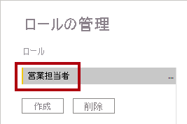
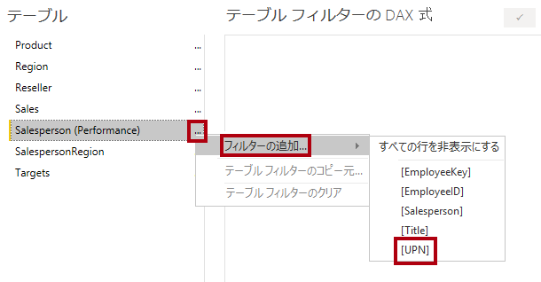
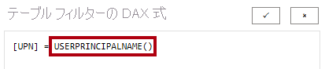
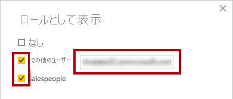
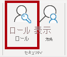
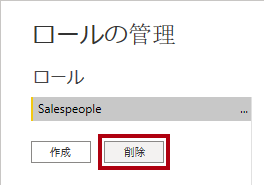

---
lab:
  course: PL-300
  title: 行レベルのセキュリティを実行する
  module: Enforce Row-Level Security
---

# **行レベルのセキュリティを適用する**

## **ラボのストーリー**

このラボでは、営業担当者が確実に自分の担当地域の売上データだけを分析できるように、行レベルのセキュリティを適用します。

このラボでは、次の作業を行う方法について説明します。

- 行レベルのセキュリティを適用する
- 動的メソッドと静的メソッドのいずれかを選択する

**この配信には約 20 分かかります。**

## **開始するには**

このタスクでは、ラボの環境を設定します。

''重要: 前のラボから続行している (および、そのラボを正常に完了した) 場合は、このタスクを完了せず、代わりに次のタスクから続行してください。''**

1. Power BI Desktop を開きます。

    

    ''ヒント: 既定では、Power BI Desktop の前に [はじめに] ダイアログ ボックスが開きます。**サインイン**してから、ポップアップを閉じます。''**

1. スターター Power BI Desktop ファイルを開くには、 **[ファイル] > [レポートを開く] > [レポートの参照]** の順に選択します。

1. **[開く]** ウィンドウで、**D:\Allfiles\Labs\10-row-level-security\Starter** フォルダーに移動し、**Sales Analysis** ファイルを開きます。

1. 情報ウィンドウが開いている場合はすべて閉じます。

1. リボンの下の警告メッセージにご注意ください。 "このメッセージは、クエリが、モデル テーブルとしての読み込みに適用されていないことを警告しています。クエリは、このラボの後半で適用します。"**
    
    この警告メッセージを無視するには、警告メッセージの右側にある **[X]** を選択します。**

1. このファイルのコピーを作成するには、**[ファイル] > [名前を付けて保存]** に移動し、**D:\Allfiles\MySolution** フォルダーに保存します。

1. 変更の適用を求めるメッセージが表示されたら、**[後で適用]** を選択します。

## **行レベルのセキュリティを適用する**

このタスクでは、行レベルのセキュリティを適用して、営業担当者が自分の担当地域での売上のみを表示できるようにします。

1. データ ビューに切り替えます。

   

1. **[データ]** ペインで、**Salesperson (Performance)** テーブルを選択します。

1. データを確認すると、Michael Blythe (EmployeeKey 281) の UPN の値が **michael-blythe@adventureworks.com** になっています。
    
    ''Michael Blythe の担当地域が、米国北東部、米国中部、米国南東部の 3 つであることを思い出すかもしれません。''**

1. **[モデリング]** リボン タブで、 **[セキュリティ]** グループ内から **[ロールの管理]** を選択します。

    

1. **[ロールの管理]** ウィンドウで、**[作成]** を選択します。

1. ボックスで、選択したテキストをロールの名前:**Salespeople** に置き換えてから、**Enter** キーを押します。

   

1. フィルターを割り当てるには、**Salesperson (Performance)** テーブルの省略記号 (…) 文字を選択し、 **[フィルターの追加] \| [UPN]** を選択します。

   

1. **[テーブル フィルターの DAX 式]** ボックスで、 **[値]** を **USERPRINCIPALNAME()** に置き換えて式を変更してから、 **[保存]** を選択します。
    
    "USERPRINCIPALNAME() は、認証されたユーザーの名前を返す Data Analysis Expressions (DAX) 関数です。*つまり、**Salesperson (Performance)** テーブルは、モデルをクエリするユーザーのユーザー プリンシパル名 (UPN) によってフィルター処理されます。"*

   

1. セキュリティ ロールをテストするには、**[モデリング]** リボン タブで、**[セキュリティ]** グループ内から **[View As](表示方法)** を選択します。

   

1. **[ロールとして表示]** ウィンドウで **[その他のユーザー]** 項目を選択してから、対応するボックスに「**michael-blythe@adventureworks.com**」と入力します。

1. **[営業担当者]** ロールを確認してから、 **[OK]** をクリックします。
    
    "この構成により、**Salespeople** ロールと、Michael Blythe の名前を借りたユーザーが使用されることになります。"**

   

1. レポート ページの上に、テストのセキュリティ コンテキストを説明する黄色のバナーが表示されていることに注目してください。

   

1. テーブル ビジュアルでは、営業担当者 **Michael Blythe** のみが表示されていることに注目してください。

   

1. テストを停止するには、黄色のバナーの右側にある **[表示の停止]** を選択します。

   

1. **[営業担当者]** ロールを削除するには、 **[モデリング]** リボン タブで、 **[セキュリティ]** グループ内から **[ロールの管理]** を選択します。

   

1. **[ロールの管理]** ウィンドウで、**[削除]** を選択します。 削除するかどうかを確認するメッセージが表示されたら、 **[はい、削除します]** を選択します。

   

### **仕上げ**

このタスクでは、ラボを完了します。

1. **[保存]** を選択し、Power BI Desktop ファイルを保存してラボを終了します。

"注: Power BI Desktop ファイルが Power BI サービスに発行されるときに、発行後のタスクを完了して、セキュリティ プリンシパルを **[営業担当者]** ロールにマップする必要があります。このラボでは行いません。"**
