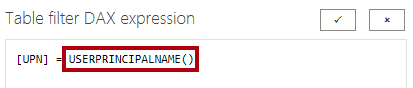

---
lab:
  title: Power BI での安全なデータ アクセス
  module: Secure data access in Power BI
---

# Power BI での安全なデータ アクセス

## ラボのストーリー

このラボでは、営業担当者が確実に自分の担当地域の売上データだけを分析できるように、行レベルのセキュリティを適用します。

このラボでは、次の作業を行う方法について説明します。

- 行レベルのセキュリティを適用する。
- 動的メソッドと静的メソッドのいずれかを選択する。

**この配信には約 20 分かかります。**

## 作業の開始

この演習を完了するには、まず Web ブラウザーを開き、次の URL を入力して zip フォルダーをダウンロードします。

`https://github.com/MicrosoftLearning/PL-300-Microsoft-Power-BI-Data-Analyst/raw/Main/Allfiles/Labs/11-secure-data-access/11-secure-data.zip`

フォルダーを **C:\Users\Student\Downloads\11-secure-data** フォルダーに展開します。

**11-Starter-Sales Analysis.pbix** ファイルを開きます。

> ***注**: **[キャンセル]** を選択すると、サインインを閉じることができます。 他のすべての情報ウィンドウを閉じます。 変更の適用を求めるメッセージが表示されたら、**[後で適用]** を選択します。

## 行レベルのセキュリティを適用する

このタスクでは、行レベルのセキュリティを適用して、営業担当者が自分の担当地域での売上のみを表示できるようにします。

1. データ ビューに切り替えます。

   

1. **[データ]** ペインで、**Salesperson (Performance)** テーブルを選択します。

1. データを確認すると、Michael Blythe (EmployeeKey 281) の UPN の値が **`michael-blythe@adventureworks.com`** になっています。
    
    > ''Michael Blythe の担当地域が、米国北東部、米国中部、米国南東部の 3 つであることを思い出すかもしれません。''**

1. **[ホーム]** リボン タブで、**[セキュリティ]** グループ内から **[ロールの管理]** を選択します。

    

1. **セキュリティ ロールの管理** ウィンドウの **[ロール]** セクションで、**[新規]** を選択します。

1. ボックスで、選択したテキストをロールの名前:**Salespeople** に置き換えてから、**Enter** キーを押します。

   

1. フィルターを割り当てるには、**Salesperson (Performance)** テーブルを選択し、**[データのフィルター処理]** セクションで **[DAX エディターに切り替える]** を選択します。

   

1. DAX エディター ボックスで、次の式を入力します。

    ```DAX
    [UPN] = USERPRINCIPALNAME()
    ```

   

    > "USERPRINCIPALNAME() は、認証されたユーザーの名前を返す Data Analysis Expressions (DAX) 関数です。*つまり、**Salesperson (Performance)** テーブルは、モデルをクエリするユーザーのユーザー プリンシパル名 (UPN) によってフィルター処理されます。"*

1. **[保存]**、**[閉じる]** の順に選びます。

1. セキュリティ ロールをテストするには、**[ホーム]** リボン タブで、**[セキュリティ]** グループ内から **[View As](表示方法)** を選択します。

   

1. **[ロールとして表示]** ウィンドウで **[その他のユーザー]** 項目を選択してから、対応するボックスに「**`michael-blythe@adventureworks.com`**」と入力します。

1. **[営業担当者]** ロールを確認してから、 **[OK]** をクリックします。
    
    > "この構成により、**Salespeople** ロールと、Michael Blythe の名前を借りたユーザーが使用されることになります。"**

   

1. レポート ページの上に、テストのセキュリティ コンテキストを説明する黄色のバナーが表示されていることに注目してください。

   

1. テーブル ビジュアルでは、営業担当者 **Michael Blythe** のみが表示されていることに注目してください。

   

1. テストを停止するには、黄色のバナーの右側にある **[表示の停止]** を選択します。

   

1. **[Salespeople]** ロールを削除するには、**[ホーム]** リボン タブで、**[セキュリティ]** グループ内から **[ロールの管理]** を選択します。

   

1. **セキュリティ ロールの管理** ウィンドウで、**Salespeople** ロールの省略記号 (...) を選択し、**[削除]** を選択します。 削除するかどうかを確認するメッセージが表示されたら、 **[はい、削除します]** を選択します。

   

"注: Power BI Desktop ファイルが Power BI サービスに発行されるときに、発行後のタスクを完了して、セキュリティ プリンシパルを **[営業担当者]** ロールにマップする必要があります。このラボでは行いません。"**

## ラボが完了しました
